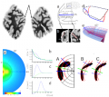
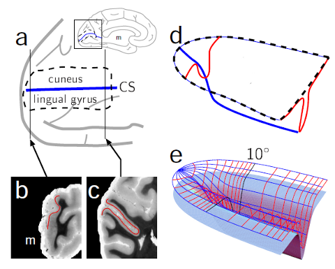
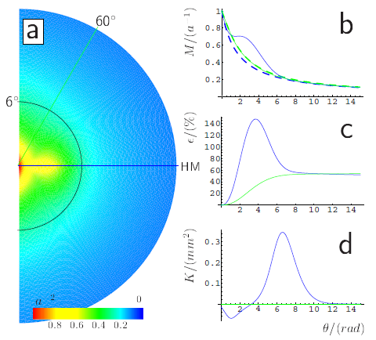
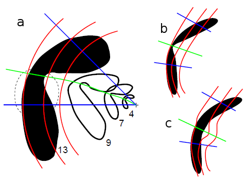
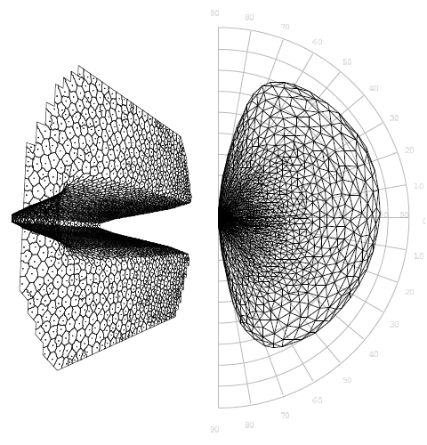
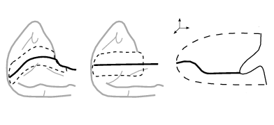

Warum ist die Großhirnrinde gekrümmt? Weil sie zu groß wurde und nicht mehr in den Schädel passte? Dieser Grund ist zumindest unzureichend. Denn dann hätte Mutter Natur sie ja auch einrollen können. Krümmung meine ich hier als intrinsische Eigenschaft einer Fläche; eine zylinderartig aufgerollte Hirnrinde ist in diesem Sinne nicht gekrümmt, denn auch ein flaches Blatt Papier kann sich so einrollen. Es bleibt intrinsisch flach. Warum ist die Großhirnrinde intrinsisch krumm, so dass sie, wenn man sie flach auslegt, aufreißt?

## Die Großhirnrinde im Schnitt (erstes Bild)

Hier sehen wir ein typisches Faltungsmuster der beiden Hemisphären der Großhirnrinde (Cortex Cerebri) im Schnitt. Dieser Schnitt liegt am Hinterhaupt, dem Occipitallappen, wo auch die primäre Sehrinde liegt, die die Fachleute am Gennari-Streifen hier im Bild (Pfeile) sofort erkennen.

Die primäre Sehrinde besteht aus zwei zusammengenommen kreditkartengroße Rindenfeldern in den beiden Hemisphären des Gehirns. Sie übernehmen zuerst die corticale Verarbeitung visueller Information, die aus Netzhaut zunächst weitergeleitet zum Thalamus schließlich in der Großhirnrinde ankommt. Jeweils ein primäres Sehrindenfeld für eine Hälfte des Gesichtsfeldes, rechts und links liegend vom Blickpunkt, dem Zentrum des Gesichtsfeldes.

## Die Sehrinde und der Sulcus calcarinus (zweites Bild)

Die Sehrinde liegt an einer Krümmungslandmarke, dem Sulcus calcarinus. Das ist bemerkenswert! Wenn die Krümmung nur Raumgewinn bedeutet, warum gibt es dann Korrelationen zwischen Windungsmuster und Lokalisation funktioneller Einheiten?

Diese Korrelationen sind allerdings selten exakt. Die Heschl’sche Querwindung ist z.B. auch eine gute Landmarke der Hörrinde, hier kann jedoch die Lage dieser funktionellen Struktur um etwa die Größenordnung jener anatomischen Windung selbst abweichen. Die Sehrinde liegt dagegen recht genau im Sulcus calcarinus, so dass der Horizont unseres Gesichtsfeldes ebenso recht genau im Fundus der Furche repräsentiert wird (steilster Abstieg, blaue Linie in (a) und (d)).

Warum ist der Horizont krumm?1

## Die Megapixel im Gesichtsfeld (drittes Bild)

Eine mögliche und – wortwörtlich –  in meinen „Augen großartige“ Antwort fand ich, als ich mich fragte, wie viel Großhirn verarbeitet die visuelle Informationen aus einem Grad Blickwinkel des Gesichtsfeldes? Dieser corticale Vergrößerungsfaktor*M* (*cortical magnification factor*) ist nicht konstant. Für das Zentrum nutzen wir mehr Hirn als für die Peripherie.

Wie groß der Vergrößerungsfaktor*M* ist, ist eine nur scheinbar einfache und längst gelöste Frage.

Ein typischer Wert für den Lupenfaktor im Zentrum des Gesichtsfeldes ist etwa *M*=20 mm/**°**, dass heißt 20 Millimeter der Hirnrinde verarbeiten Informationen aus einem Grad Sehwinkel im Zentrum. Nach außen nimmt dieser Faktor etwa invers linear ab, wie oben für das rechte halbe Gesichtsfeld (a) gezeigt durch den Farbverlauf von rot (Zentrum, Maximum von *M*, auf 1 normiert) nach blau (Peripherie des Gesichtsfeldes).

Aus zwei sehr plausiblen Symmetriebedigungen an den Verlauf des Vergrößerungsfaktors im Gesichtsfeld, kann ich schnell erkennen, warum und vor allem wie die Hirnrinde gekrümmt sein muss. Denn diese zwei Symmetriebedigungen stehen zueinander in Konkurrenz und eine der Symmetriebedigungen ist immer notwendigerweise verletzt, wenn im Zentrum des Gesichtsfeldes *M* nicht unendlich groß werden soll. Aus der Notwendigkeit einen Kompromiss zu finden, kann das Windungsmuster erklärt werden.

Die erste Bedingung ist Isotropie, also dass *M* Richtungsunabhängig ist. Die andere ist azimuthale Symmetrie, also dass *M* nur vom Abstand zum Zentrum, der Exzentrizität Θ, abhängt. Kurz gesagt: wir wollen bei festen Abstand vom Zentrum überall gleich gut sehen, das geht aber gar mathematisch nicht.2

Also habe ich mir das mal näher angeguckt. Denn Symmetrie ist des Physikers liebstes Werkzeug, wobei es immer eine Verbotsregel ist und nicht eindeutig eine Lösung vorgeben muss. Die Forderung nach Symmetrie schließt Unsymmetrisches aus, läßt aber oft noch Freiheiten.

Mit Hilfe eines stereotypisch geformten Sulcus calcarinus, in dem eine primäre Sehrinde liegt (Bild 2 (e), eine halbe Kreditkarte groß, da wir zwei primäre Sehrinde haben), habe ich abgeschätzt, dass der Horizont sogar cortical überrepräsentiert sein kann. Eine flache Großhirnrinde unterrepräsentiert den Horizont cortical. Das ist bisher wohl niemanden aufgefallen.3 Ist aber so. Ich vermute, dass Krümmung den negativen Effekt einer flachen Hirnrinde nicht allein kompensiert sondern sogar überkompensiert, da die Sulci im Occipitallappen besonders tief sind.

Das ist eine sehr klare und leicht überprüfbare Vorhersage. Wichtiger noch, die These ist plausibel.

Durch die vorhergesagte Überkompensierung entsteht ein virtueller „*visueller streak*“ (gelber Streifen in (a)). Als visueller Streak bezeichnet man eine erhöhte Dichte an Zapfen in der Netzhau, z.B. beim Wolf in Form eines horizontalen Streifen.4 Diese zusätzlichen ‚Megapixel‘, wie ein Kamera-Hersteller den visueller Streak wohl preisen würde, sind für den Horizont des Wolfes.

Einen ähnlicher Effekt könnte virtuell durch mehr corticale Fläche beim Menschen erzeugt werden. Wenn man länger darüber nachdenkt, kommt man vielleicht zu dem Schluss, dass die Lösung des Wolfes eine Hardwarelösung ist, die des Menschen dagegen eine Softwarelösung. Denn faktisch hat er ja keine dichteren Rezeptoren und sein potentieller Überschuss an corticaler Hardware muss letztlich algorithmisch genutzt werden. In beiden Fällen entsteht selektiv eine bessere Sicht am Horizont. Aber das ist eine Hypothese.

## Auf dem Prüfstand (viertes Bild)

Einen ersten Beleg für meine These fand ich – den regelmäßigen Leser dieses Blogs wird es nicht erstaunen – in der Migräneaura. Visuelle Halluzinationen ermöglichen eine sehr genaue Abschätzung des Vergrößeringsfaktors *M*. Bernhard Hassenstein und Otto-JoachimGrüsser haben dies zum Beispiel ausgenutzt, ohne allerdings verschiedene Meridiane zu vermessen. Hier sehen wir in (a) eine Zeichnung von Karl Lashley (1941). Lashley hat den Vergrößerungsfaktor nicht direkt bestimmt, dafür aber den Umriss seines Gesichtsfeldausfalls sehr genau gezeichnet, woraus auch Rückschlüsse möglich sind.

In (a) ist sein Migräneskotom (Skotom=Gesichtsfeldausfall) im linken halben Gesichtsfeld gezeigt, zu 4, 7, 9 und 13 Minuten. Geht man davon aus, dass die pathologische Ursache im Cortex eine längliche Form mit konstanter Breite ist (c), dann ist ein Meridian im Gesichtsfeld, der etwas oberhalb des Horizonts liegt (grün), cortical überrepräsentiert. Als eher unwahrscheinliche Erklärung könnte man auch annehmen, dass die pathologische Ursache ebenso eine Einschnürung hat, wie das Skotom (b).

Dank moderner nichtinvasiver Bildgebung ist es eine nicht allzu schwer überprüfbare Hypothese, ob die Sehrinde so gekrümmt ist, dass der Vergrößerungsfaktor am Horizont besser abschneidet. Qui et al. haben 2006 ähnliche Messungen begonnen. In wieweit sich die Idee der optimalen Ausnutzung auf andere funktionelle Einheiten in der Großhirnrinde übertragen lässt und wir es mit einem tiefgreifenden Merkmal des Strukturbildungsprozesses zu tun haben, ist eine andere Frage. Denn ich will gar nicht in Abrede stellen, dass zunächst die treibende Kraft war, Platz für mehr Fläche zu schaffen. Doch die Korrelationen zwischen Windungsmuster und Lokalisation funktioneller Einheiten bedürfen einer weiteren Erklärung. Warum keine kausale? Die Notwendigkeit einen Kompromiss zwischen sinnvollen aber im Flachen sich gegenseitig ausschließenden Symmetrien zu finden, kann einer kausalen Erklärung für das Windungsmuster zugrunde liegen.

---

**Literatur**

*(Auswahl)*

Aine, C. J., S. Supek, J. S. George, D. Ranken, J. Lewine, J. Sanders,  
E. Best,W. Tiee, E. R. Flynn, and C. C.Wood (1996). Retinotopic organization  
of human visual cortex: departures from the classical model.  
Cereb. Cortex 6:354–361.

Curcio, C. A. and K. A. Allen (1990). Topography of ganglion cells in  
human retina. J Comp Neurol 300:5–25.

Gruesser, O.-J. (1995). Migraine phosphenes and the retino-cortical magnification factor. Vision Res 35:1125–1134

Lashley, K. (1941). Patterns of cerebral integration inicated by scotomas of migraine. Arch Neurol Psychiatry 46:331–339.

Peichl, L. (1992). Topography of ganglion cells in the dog and wolf retina. J Comp Neurol 324:603–620.

Schwartz, E. L. (1977). The development of specific visual connections in the monkey and the goldfish: outline of a geometric theory of  
receptotopic structure. J Theor Biol 69:655–683.

Slotnick, S. D., S. A. Klein, T. Carney, and E. E. Sutter (2001). Electrophysiological estimate of human cortical magnification. Clin  
Neurophysiol 112:1349–1356. Clinical Trial.

Wassle, H., U. Grunert, J. Rohrenbeck, and B. B. Boycott (1989). Cortical magnification factor and the ganglion cell density of the primate retina.  
Nature 341:643–646.

Qiu, A., B. J. Rosenau, A. S. Greenberg, M. K. Hurdal, P. Barta, S. Yantis, and M. I. Miller (2006). Estimating linear cortical magnification in  
human primary visual cortex via dynamic programming. Neuroimage 31:125–138.

**Dieser Beitrag kann so zitiert werden:**

Markus A. Dahlem. Warum ist die Großhirnrinde krumm?. SciLogs. 2012-03-12. URL:https://scilogs.spektrum.de/blogs/blog/graue-substanz/2012-03-12/warum-ist-die-grosshirnrinde-krumm. Accessed: 2012-03-12. [(Archived by WebCite® at http://www.webcitation.org/666RjIYP3)](http://www.webcitation.org/666RjIYP3)

**Anmerkung**

Dies ist ein wissenschaftlicher Beitrag, der allerdings wie ein Vortrag auf einer Konferenz nur oberflächlich die noch unveröffentlichten Ergebnisse vorstellen kann. Die Details, die nötig sind, um alle Ergebnisse zu reproduzieren, sollen in einer Veröffentlichung mit Jan Tusch erscheinen und können bei mir jederzeit nachgefragt werden. Bei ersten Begutachtungen des Artikel in Peer review-Prozessen wurde er abgelehnt.

**Fußnoten**

1 Die Repräsentation des Horizontes im Cortex ist gemeint, was ich aber abgekürzt auch als Horizont bezeichne da keine Verwechslungsgefahr besteht. Der Clou ist natürlich, dass dieser Meridian des Gesichtsfeldes völlig gerade bliebt, also keine geodätische Krümmung durch sein ausgezeichnete Lage im Fundus bekommt. Die beiden Repräsentationen der vertikalen Meridiane hingegen haben selbst im Flachen eine geodätische Krümmung, was ihnen einen Längenvorteil verschafft, der durch das Windungsmuster ausgeglichen wird ohne den Horizont geodätisch zu krümmen.

2 Wenn die Abbildung vom Gesichtsfeldes zur Großhirnrinde (Retinotopie) isotrop ist, wir also zum Beispiel in allen Richtungen gleich gute Sehschärfe haben (der direkte Bezug zur Sehschärfe ist vereinfacht), dann folgt mathematisch sofort, dass der Vergrößerungsfaktor  der Retinotopie, *M,* ein Skalar ist, eine Zahl. Dann und nur dann kann ich *M*  als linearen Fakor eindeuig angeben. Allgemein ist der Faktor *M* ein Tensor 2ter Ordnung (die Jacobi-Matrix, vereinfacht gesagt).

Wenn dieser Faktor nun noch für alle Meridiane des Gesichtsfeldes gleich sein soll (azimuthale Symmetrie), folgt recht schnell aus diesen zwei plausiblen Symmetriebedingungen und den unumstößlichen Cauchy-Riemannschen Kriterium für komplexe Differenzierbarkeit, dass die Sehrinde entweder explodiert (d.h. *M*(Θ=0) = log(0) = ∞) oder die Sehrinde dann doch vielleicht besser durch Krümmung zumindest einen ausgleichenden Kompromiss schafft.

An dieser Stelle ist es vielleicht angebracht, auf weitere kritische Punkte hinzuweisen.

Das Problem wird durch unser Binokularsehen und die Augendominanz in der Sehrinde etwas verkompliziert. Man kann dies aber mit einer pseudokonformen Abbildung gut Abschätzen, wenn man Streifenlage der Augendominanz kennt.

Ein weiteres Problem kommt durch die Freiheit, mit der ich das retinotope Koordinatensystem bisher gewählt habe. Eigentlich müsste ich die Laplace-Gleichung auf der gekrümmten Domain lösen. Das habe ich noch nicht gemacht. Alternativ aber haben wir mit einem Kohonen-Netzwerk diese Abbildung sich selbst-organisiert ausbilden lassen. Hier gilt mein Dank an Jan Tusch: „[Self-Organized Retinotopic Maps on a Curved Cortical Surface to Predict Visual Field Defects](http://wwwisg.cs.uni-magdeburg.de/bv/files/pdf/thesis_tusch04.pdf)„. Dieses Ergebnis untermauert die Annahme.

Als letzte Anmerkung in dieser langen Fußnote des Für und Wider, sei auch angemerkt, dass die Krümmung des Suclus calacrina in sich (s. unten) noch abgeschätzt werden muss. Was nochmal die Situation nicht leichter macht und eine Asymmetrie zwischen oberen und unteren Quadranten möglich macht. So wie die Krümmung hier gezeigt, ist mehr Platz für das untere Gesichtsfeld.

3 Das es wirklich niemanden aufgefallen ist, stimmt nicht ganz. In dem Lehrbuch „Theoretical Neuroscience“ von Dayan und Abbot wurde ein Kommentar ([Comments concerning pg 57, eqns 2.13-2.171](https://backend1.spektrum.de/blogs/Comments%20concerning%20pg%2057,%20eqns%202.13-2.171)) hinzugefügt, nachdem Alex Loebel darauf verwies, das die dort angegebene retinotope Karte eben nicht isotrop ist. Die fundamentale Bedeutung dieser Aussage wurde aber meines Wissens bisher nicht weiter untersucht.

4 Mein Dank an Leo Peichl für den Hinweis auf den visual Streak.

© 2012, Markus A. Dahlem
