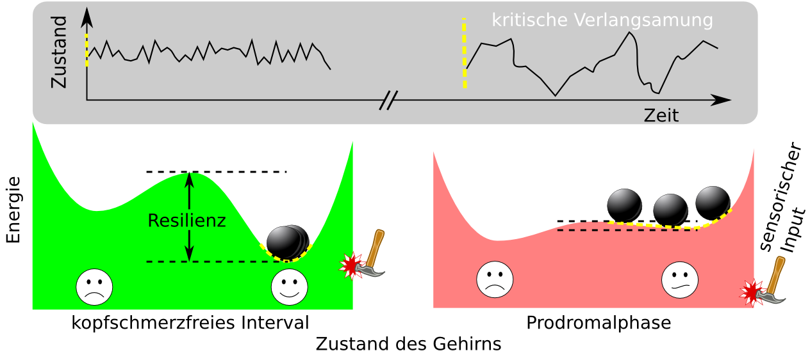
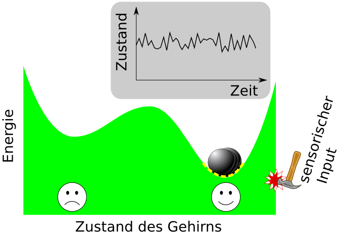
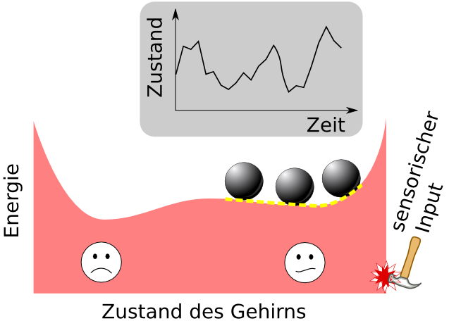

Das Wort „Kipppunkt“ ist mehrfach in den letzten Beiträgen über Migräne vorgekommen. Was genau es heißt, ein *Migränegehirn kippt*, wurde allerdings nicht beschrieben, sondern nur dessen Konsequenzen – ohne Erklärung – hingestellt. Nämlich zum einen, dass Kippprozesse sich durch Vorboten ankündigen und, zum anderen, dass diese Vorboten bestimmten Auslösern erst zu ihrer Gefährlichkeit verhelfen.

Als Beispiel wurde u.a. Lichtempfindlichkeit als ein Vorbote und grell wahrgenommenes Licht als ein dazu passender Auslöser angeführt. Da eine neue klinische Studien genau diese vorhergesagte Verbindung nun systematisch belegt, liefert die Kipppunkttheorie eine Erklärung der Migräneattacken. Es ist bisher nur eine von mehreren möglichen Erklärungen, wenngleich in meinen Augen die eleganteste. In diesem Beitrag soll die Kipppunkttheorie mechanistisch veranschaulicht werden.

Illustration eines Kippprozesses. Detaillierte Beschreibung folgt.

Folgende Umschreibung eines Kipppunktes führt den wohl wichtigsten Begriff ein: Ein Migränegehirn kippt um, wenn vor der Attacken seine Widerstandsfähigkeit langam abnahm. Der neue Begriff ist „Widerstandsfähigkeit“. Widerstandsfähigkeit will ich allerdings, wie in den Beiträgen zuvor, als “Resilienz” bezeichnen. Denn das ist im Rahmen der modernden Kipppunkttheorien die übliche Bezeichnung. Auch dass die Abnahme der Widerstandsfähigkeit langsam vor sich geht, ist ein zentraler Bestandteil der Theorie.

Die Wahl der Wörter „Kipppunkt“ und „Resilienz“ ist also nicht willkürlich. Sie bezeichnen eng zusammenhängende Konzepte, die vielfach Anwendung finden, insbesondere in der Ökologie, wo „kippen“ schon in der Umgangssprache Eingang gefunden hat. Fast jeder kennt die Bezeichnung „ein Fluss kippt“.

In diesem Beitrag will ich die drei wesentlichen Merkmale eines Kipppunktes benennen und dabei auch Resilienz genauer einführen. Alles in einer – zugegeben – abstrakten Darstellung. Diese ist gerade deswegen gut geeignet, sich die Vorgänge leicht verständlich zu visualisieren. Allerdings hat das auch einen Nachteil. Es fehlt in dieser Darstellung der konkrete Bezug zum Gehirn und seiner Erkrankung. Erst ein weiterer Beitrag soll diese Verbindung aufzeigen.

Die bildliche Darstellung könnte ich also eigentlich fast genauso gut mit „*Was bedeutet XYZ kippt?*“ überschreiben. Wobei XYZ das Migränegehirn, ein Fluss oder eins der vielen anderen komplexen Systeme, die heute durch Kipppunkttheorien beschrieben werden, sein kann. Diese Systeme aufzuzählen, wird wiederum Aufgabe eines eigenen Beitrages sein.

## Mit Schnappschüssen Langsames einfrieren

Einzeln herausstellen werde ich zwei Bilder, die oben schon zusammengefasst gezeigt sind. Eins für die kopfschmerzfreie Zeit und eins kurz vor dem Umkippen in den Migräneanfall. Der Zyklus von kopfschmerzfreier Zeit über die Prodromalphase zum Migräneanfall ist dann in einer dritten Abbildung nochmal zusammengefasst. Diese dritte Abbildung stammt aus einer [Publikation](https://scilogs.spektrum.de/graue-substanz/gurke-machen-nicht-schwanger/) vom letzten Jahr.

Schnappschüsse des Migränezyklus herauszustellen hat Methode. Gerade weil die Abnahme der Resilienz (also der Widerstandsfähigkeit gegen den Anfall) langsam voranschreitet, in der Regel über Tage und Wochen, repräsentiert jeder Schnappschuss einen Zustand im Gehirn, der über viele Stunden besteht und für eine Phase im Zyklus steht, nämlich die kopfschmerzfreie Zeit (im Durchschnitt 14 Tage) und die Prodromalphase (Phase der Vorboten, ~24 Stunden). Anders gesagt, würde die Resilienz schnell abnehmen, wäre eine Darstellung der Widerstandsfähigkeit mittels Schnappschüssen nicht hilfreich und es wäre auch kein Prozess, den man Kippprozess nennen würde.1

Die Art der Darstellung ist für Kipppunktprozesse also typisch – man nennt sie übrigens in der Fachwelt auch „slow-fast analysis“. Der langsame Prozesse der Abnahme der Resilienz wird in einem Schnappschuss eingefroren und damit lässt sich der schneller Prozess der Vorboten und Auslöser einfacher beschreiben. Die Schnappschüsse visualisieren dabei drei wesentlichen Eigenschaften einer Kipppunkttheorie.

## (1) Hohe Resilienz: sensorische Auslöser wirkungslos

Das erste Kennzeichen einer Kipppunkttheorie ist, dass in einer Phase hoher Resilienz vermeintliche Auslöser letztlich wirkungslos abprallen (vgl. lateinisch resilire: ‚zurückprallen‘). Das Licht ist grell, es richt penetrant oder es lärmt; es gibt Zeiten im Migränezyklus in denen all das zwar unangenehmer ist als für andere Menschen, doch diese Störungen führen nicht unbedingt zu einem Anfall. Wie im [Beitrag zuvor schon erwähnt](https://scilogs.spektrum.de/graue-substanz/vorboten-der-migraene-verschmelzen-mit-ihren-ausloesern/), gab es dazu eine [klinische Studie](http://www.neurology.org/content/80/5/428.abstract), die genau dies belegt. Eine wirklich beeindruckende Studie übrigens, die in einem [Nature News Artikel](http://www.nature.com/nm/journal/v19/n9/full/nm0913-1083.html) aufgegriffen wurde und für uns Anlass war, weiter an der Kipppunkttheorie zu arbeiten, denn sie liefert einen zentralen Beleg.

Visualisierung hoher Resilienz. Der momentane Zustand des Gehirns wird symbolisiert durch die Lage des Balls. Er befindet sich in einem sichern Zustand hoher Resilienz, symbolisiert durch die Tiefe der rechte Kuhle. Störungen von außen, wie z.B. sensorischer Input (Hammer), sowie auch körpereigene Schwankungen der Physiologie (nicht symbolisiert, man kann sich vorstellen, dass die grüne Landschaft leicht von allein bebt), führen zu kleinen Abweichungen aus der Ruhelage des Balls. Nach einer Störung wird er nur leicht versetzt und rollt schnell zurück in seine Ausgangsposition. In dem grauen Kasten ist dieses Wackeln des Balls über die Zeit aufgetragen. Die Ausschläge sind klein und schnell abgeklungen, selbst bei starken Störungen.

Übrigens verarbeitet das Migränegehirn in seinem Zustand weit entfernt von der nächsten Attacke – vielleicht Wochen oder doch zumindest mehrer Tage (>4) –, sensorischen Input nicht “normal” (was immer das heißt). Es gibt Hinweise, dass das Migränegehirn sich auch außerhalb der Anfälle durch eine verminderte Fähigkeit der Gewöhnung (Habituation) an sich wiederholende sensorische Reize auszeichnet. Diese Unterfunktion der Habituation ist selbst jedoch kein Auslöser, sondern wird langsam die Resilienz mindern, laut Kipppunkttheorie.

Wenn sich der Bereich des Kipppunktes nähert, geschehen zwei Dinge. Die nächsten zwei Kennzeichen eines Kipppunktes (B und C) gehören beide zu dem zweiten Schnappschuss, der diesen Bereich visualisiert.

### (2) Niedrige Resilienz: geringste Anlässe führen zur Attacke

Das zweite Kennzeichen sagt, dass in einer Phase sinkender Resilienz am Ende auch der geringste Anlass zur Attacke führt.

Visualisierung niedriger Resilienz. Das Gehirn (symbolisiert durch den Ball) gerät in einem störanfälligen Zustand (symbolisiert durch die nun flache, rechte Kuhle). Störungen von außen, wie z.B. sensorischer Input (Hammer), sowie auch körpereigene Schwankungen der Physiologie, führen zu sehr großen Abweichungen aus der Ruhelage. Der Ball rollte auch nur sehr langsam wieder zurück in seine Ausgangsposition – nun ist die Wahrscheinlichkeit, dass er in eine andere Kuhle überkippt sehr hoch. Ausschläge sind nicht nur hoch, sondern klingen auch nur sehr langsam ab, selbst bei geringsten Input.

In dieser Phase niedriger Resilienz werden sensorische Störungen verstärkt.

### (3) Die kritische Verlangsamung

Das dritte Kennzeichen ist ein anderes Phänomen beim Übergang von hoher zur verschwindenden Resilienz.

In dieser Phase niedriger Resilienz werden nicht nur sensorische Störungen verstärkt. Auch innere, körpereigene Störungen werden verstärkt. Mit anderen Worten: kommt das Gehirn in einen Zustand nahe seines Kipppunktes, tritt die *kritische Verlangsamung* auf (critical slowing down). Das Phänomen der kritischen Verlangsamung besagt, dass je näher sich das Migränegehirn am Kipppunkt zur Attacke befindet, desto größer werden bestimmte innere physiologische Schwankungen. Passend dazu werden auch externe Einflüsse verstärkt. Wobei gilt, je näher am Kipppunkt, desto langsamer (daher der Name) kehren diese Schwankungen in einen normalen Bereich zurück.

So tritt bei Migräneerkrankten eine extreme Überempfindlichkeit auf, die von ihnen als Vorboten ihrer Attacken wahrgenommen werden können. Kennzeichen für die Störanfälligkeit bei gesunkener Resilienz sind z.B. Licht-, Geruchs- und Lärmempfindlichkeit und passend dazu die entsprechenden Auslöser Licht, Gerüche und Lärm.

Einen Teil des Migränezyklus kann man nun in den folgenden fünf Schnappschüssen zusammenfassen. (Es fehlt die Rückbildungsphase, daher ist es nur eine Teil und nicht der gesamte Zyklus.1)

Zustand des Migränegehirns symbolisiert als zeitlicher Verlauf ein einer Tal- und Hügellandschaft. Über Zeit nimmt im Migränezyklus die Resilienz ab, das schmerzfreie Tal verflacht und das Gehirn kann so leicht in den Schmerzzustand umkippen. Vor dem eigentlichen Kipppunkt werden die Schwankungen unweigerlich größer und langsamer. Der Hammer symbolisiert möglicher Auslöser aber auch körpereigene Störungen werden charakteristisch verstärkt. [Modifiziert aus M.A. Dahlem et al., [Understanding Migraine using Dynamical Network Biomarkers](http://cep.sagepub.com/content/early/2014/09/15/0333102414550108.full), Cephalalgia 2014]

Vorangegangene Beiträge zur Kipppunkttheorie:

* [Vorboten der Migräne verschmelzen mit ihren Auslösern](https://scilogs.spektrum.de/graue-substanz/vorboten-der-migraene-verschmelzen-mit-ihren-ausloesern/)
* [Gibt es Auslöser der Migräneattacken und wenn ja, zu welchem Zeitpunkt?](https://scilogs.spektrum.de/graue-substanz/gibt-es-ausloeser-der-migraeneattacken-und-wenn-ja-zu-welchem-zeitpunkt/)
* [„Ein Roboter unter Speed, der mich als Trommel benutzt“](https://scilogs.spektrum.de/graue-substanz/%E2%80%9Eein-roboter-unter-speed-der-mich-als-trommel-benutzt%E2%80%9C/)

## Fußnote

1 Diese Überlegung führt schnell zu einem anderen Phänomen, das der stochastischen Resonanz. Dazu später mehr.
