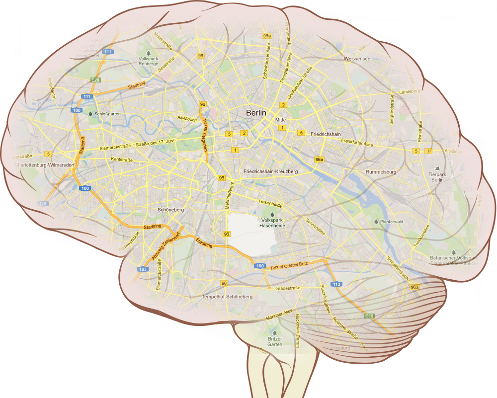
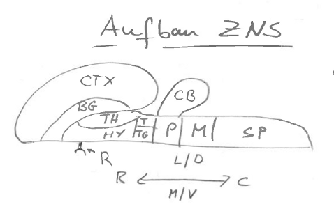

Das Gehirn ist nicht nur ein Haufen Gehirnzellen, aber was genau ist ein Gehirn eigentlich? Was macht ein Gehirn zum Gehirn und welche seiner Teile sollte man kennen?

„*What is the brain?*“ So titelt ein Übersichtsartikel aus dem Jahr 2000 in der Zeitschrift Trends in Neuroscience [1]. Der Titel hieße richtiger „Wie ist der Aufbau des Gehirns“, denn darum geht es.

In diesem Paper werden aus struktureller Sicht die grundlegenden Teile des zentralen Nervensystem des Wirbeltiers genannt, die in dieser Weise zusammengefasst angeblich nahezu universell als grundlegende Architektur des Gehirns gelten. Verschiedene Möglichkeiten der Unterteilung werden nebeneinander vorgestellt, um der Organisation des Nervensystems gerecht zu werden, angefangen von der historischen Entwicklung bis zu einer modernen Sicht, die über die Entschlüsselung des genetischen Programms versucht, das Ordnungsprinzip im Gehirn zu erklären.

Die Frage, was ein Gehirn ist, was es also mehr ist als ein Haufen Gehirnzellen – einem Ganglion –, ist damit indirekt schon beantwortet, es ist Architektur. (Eine detailierter Antwort ab wann ein Zellhaufen ein Gehirn wird, bekommen wir erst im Artikel „*When does a ganglion become a brain?*“ [2].)

## Wieviel Gehirn braucht ein Physiker?

Ich halte mich meist an diesem ersten Artikel [1] fest, wenn ich fachfremden Studiereden (meist aus der Physik) die Neuroanatomie nahe bringen und einen guten Einstieg geben will.

Ein typisches Problem aus der Hirnforschung, mit denen sich Physikerinnen und Physiker beschäftigen, ist zum Beispiel die Synchronisierung des circadianen Rhythmus mit Phasenoszillator-Modellen, um Jetlag, Winterdepression oder auch nur ihr Verschlafen mathematisch erklären zu können.

Ziemlich schnell stoßen Interessierte in einer Fachveröffentlichung auf den *suprachiasmatischen Nucleus*, der von der Netzhaut nach einigen Umschaltvorgängen die Signale über die Lichtverhältnisse bekommt und diese dann zur *Zirbeldrüse* weiter sendet. Dieses Netzwerk steuert unsere Verhaltensrhythmen im Verlauf des Tages.[^1] In der Vorlesung male ich Kästen mit Verbindungslinien. Keine halbe Stunde später sind phasengekoppelte Oszillatoren zur mathematischen Modellierung eingeführt und ein Modell steht an der Tafel, das Kuramoto-Modell, mit dem Jetlag und Winterdepression erklärbar werden.

Alle gucken zufrieden. Wenn ich dann frage, wo im Gehirn sich dies alles abspielt, weicht die Zufriedenheit. Die meisten haben nur eine graue, gewundene Masse vor Augen.

Die Studierenden nehmen es zunächst gerne hin, wenn Teile im Gehirn als Kästen hingemalt werden und Verbindungen zwichen ihnen bloß Linien sind.

Lange bevor ich in Berlin wohnte, nahm ich es auch hin, dass nach zweimal Umsteigen in Berlin es einen Hermannplatz gibt, dort irgendwo nahe die Ankerklause steht. Über wieder andere Verbindungslinien komme ich dann in die Eberswalder Strasse. Jeder Ort hat seine eigenen Rhythmen. Das reicht zu wissen. Ich hatte letztlich keine Ahnung, wo genau ich war.

Der Unterschied ist der zwischen einem Metroplan und einem Sadtplan. Jener ist zwar topologisch äquivalent zu diesem, stört sich aber nicht an genauen Abständen und Formen. Das mag manchmal zu seltsamen Vorstellungen führen, bemerkenswert ist aber, wie viel allein durch topologische Diagnostik herausgefunden werden kann.

## Friedenau in Böhmen am Meer

Irgendwann aber reicht diese Kästchen-Anatomie nicht mehr. Zum Beispiel, wenn man sich für recht genaue Laufzeitunterschiede interessiert wird der Abstand, die Metrik, wichtig. Aber auch die Formen sollt man kennen. Im Gehirn gibt es keine Kästen. Wo und wie fängt man an?

Als ich damals nach Berlin zog, kamen auch solche Fragen auf, von denen ich mir wünschte, dass sie sich jeder übertragen stellt (und irgendwann die Antwort kennt), der als Physiker in die Hirnforschung umzieht.

Berlin ist in zwölf Bezirke aufgeteilt, die unterschiedlich gut mit U- und S-Bahn vernetzt sind. Berlins Universitäten und Forschungseinrichtungen haben ihre Standorte in der ganzen Stadt verteilt. Schnell kennen sich die Zugezogenen halbwegs aus, in ihrem eigenen Stadtteil allemal. Ebenso sollten interdisziplinär Forschende auch die Bezirke des Gehirns kennen, die grobe Bedeutung dieser Teile und ihre wesentlichen Verschaltungen untereinander, selbst wenn sich jeder nur in einem bestimmten Bereich genauer spezialisiert.

Ich kenne nun ganz gut Friedenau, was der Schriftsteller Uwe Johnson in seiner Briefkopfadresse als „in Böhmen am Meer“ bezeichnete. Dies erinnert mich an meine anfänglichen Kenntnis des Gehirns. Man weiß vielleicht noch, das Uwe Johnson und Günter Grass Nachbarn waren. Heute kann ich meinen Kiez, der Dank Herta Müller wiederbelebten „Terra Literatura“, im Pars triangularis, dem mittleren Teil des Gyrus frontalis inferior verorten, an der Grenze des Sulcus lateralis.

So detailiert kann man aber nicht einsteigen. Zehn Teile des Gehirns sind aus struktureller Sicht nahezu universell. Ein guter Anfang.

Diese Zeichnung ist etwas mit Vorsicht zu genießen, sie entstammt dem oben zitierten Artikel, ist aber etwas grob abgezeichnet und diente als Übersicht, um in meiner Vorlesung, in der u.a. das zuvor erwähnte Kuramoto-Modell des suprachiasmatischen Nucleus behandelt wurde, einzuführen. Die Teile sind

* **CTX** [Cerebral Cortex](http://de.wikipedia.org/wiki/Gro%C3%9Fhirnrinde) (Großhirnrinde)
* **BG** [Basal Ganglion](http://de.wikipedia.org/wiki/Basalganglien) (Basalganglien)
* **TH** [Thalamus](http://en.wikipedia.org/wiki/Thalamus)
* **HY** [Hypothalamus](http://en.wikipedia.org/wiki/Hypothalamus)
* **T** Tektum
* **TG** Tegmentum
* **CB** [Cerebellum](http://de.wikipedia.org/wiki/Kleinhirn) (Kleinhirn)
* **P** [Pons](http://de.wikipedia.org/wiki/Pons) (Brücke)
* **M** [Medulla](http://de.wikipedia.org/wiki/Medulla_oblongata) (Medulla oblongata)
* **SP** [Spinal cord](http://de.wikipedia.org/wiki/R%C3%BCckenmark) (Rückenmark)

(Mit R habe ich die Retina (Netzhaut) bezeichnet, die in der Einteilung in [1] nicht erwähnt wird, ich aber selber in meiner Forschung oft brauche.)

* R Retina (die ich zusätzlich eingezeichnet habe)

Wann immer ich etwas neues zum Gehirn lese, versuche ich es zunächst in diesem System zu verorten. Nichts anderes würde ich machen, wenn ich von einem neuen Club, Restaurant oder sonstwas in Berlin höre. Erstmal den Stadtteil erfragen, in dem dieser supercharismatische Nachtclub und die Zwiebeldose sein sollen.

**Literatur**

[1] Swanson LW. (2000) What is the brain? *Trends Neurosci.* **23**,519-527. Review.

[2] Sarnat HB, Netsky MG. (2002) When does a ganglion become a brain? Evolutionary origin of the central nervous system. *Semin Pediatr Neurol.* **9**, 240-253.

[^1]: Siehe Kommentare von Helmut Wicht. Ich habe hier den Satz nachträglich abgeändert.

© 2012, Markus A. Dahlem
