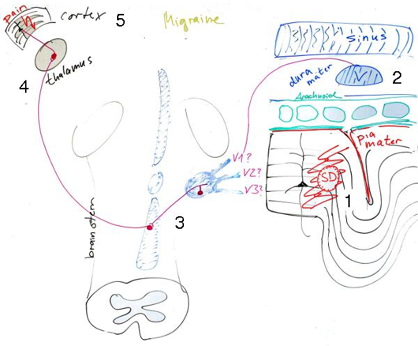

Bevor ich zum Kopfschmerz komme, frage ich allgemein: Was ist Schmerz? Eigentlich wurde ich dies gefragt und dabei erwartungsvoll angesehen.

   
 *Auch auf dem Kopfschmerzkongress* *werden neue Fragen gestellt.*

Es war so: Ich setzte mich gerade wieder an den Tisch. An das Kopfende. Links von mir ein Philosoph, rechts ein theoretischer Physiker. Nicht irgend ein Philosoph, ein Neurophilosoph, [Stephan Schleim von der Universität Groninge](http://www.rug.nl/staff/s.schleim/) und auch Blogger ([Menschen-Bilder](http://www.brainlogs.de/blogs/blog/menschen-bilder/content/about)). Auch der theoretischer Physiker ist Blogger ([Die Natur der Naturwissenschaft](http://www.chronologs.de/chrono/blog/die-natur-der-naturwissenschaft/physik/2011-03-13/was-kann-ein-philosoph-zu-einer-fachwissenschaft-beitragen)) und durch [zahlreiche Lehr- und andere Bücher](http://www.honerkamp-online.de/) bekannt. Es ist Josef Honerkamp von der Universität Freiburg (emeritiert seit 2006). Wir saßen beim [Jahrestreffen in Deidesheim](http://www.brainlogs.de/blogs/blog/menschen-bilder/2011-03-21/sci11-kein-sex-religion-klimawandel).

Als ich nach kurzer Abwesenheit also wieder an den Tisch kam, hörte ich nur „*… ah, er muss es doch wissen …*“ und, als ich saß, dann die Frage:

> **Was ist Schmerz?**

Erstmal einen kleinen Scherz machen. Zeit gewinnen. Und langsam ist alles wieder da. Schmerz sei ein Sinneserlebnis, letztlich nichts wesentlich anderes als Rot sehen, sagte ich (kurz zusammengefasst) und guckte auf Stephans roten Pullover. Josef war zufrieden, schien mir. In Wirklichkeit hatte ich in vielleicht knapp zwei Minuten meine Sicht erklärt. Also von Schmerzrezeptoren gesprochen, die am Anfang stehen, dann von der Schmerzleitung über die Zwischenstationen im Hirnstamm und Thalamus zum Cortex (Großhirnrinde), all dies ist Teil des Schmerzes, wie es bei anderen Sinneserlebnissen letztlich auch der Fall ist.\* Stephan war wohl nur halb zufrieden mit meiner Rezeptor-Zwischenstationen-Cortex-Reduktion des Schmerzes. Er meinte wir sollten mal in seine Vorlesung kommen.\*\*  Das muss warten.

Nun also zum Kopfschmerz. Wo im Kopf liegen die Schmerzrezeptoren? Es gibt nämlich keine direkt *im* Gehirn. Dieses Organ ist folglich völlig schmerzunemfindlich. Ein Chirurg kann in der grauen Substanz herum scheiden wie er will, weh tut das nicht. Wenn ich mich dagegen beim rasieren schneide, oder mir ein glühendes Bügeleisen gegen die Schläfe drücke, tut das schon weh. Nur macht letzteres niemand – und doch schmerzt der Kopf manchmal als ob es so wäre.

Das legt einen Verdacht nahe. Könnte es sein, dass zumindest bestimmte Kopfschmerzen nicht beim Rezeptor starten? Sondern innerhalb der Schmerzleitung etwas schiefgeht? Wir fühlen wie das Bügeleisen scheinbar den Kopf verbrutzelt, obwohl am Kopf selbst alles in bester Ordnung ist. Denn immerhin treten bei der Migräne ja auch [Sehstörungen](http://www.brainlogs.de/blogs/blog/graue-substanz/2009-12-01/migraenewellen) auf, ohne dass die Stäbchen und Zapfen in der Netzhaut je aktiviert wurden. Auch dort ist alles in bester Ordnung. Und Rot sehen ist wie Schmerz fühlen, behauptete ich ja oben.

**Gewitter im Hirnstamm oder Cortex?**

Sind die Kopfschmerzen bei Migräne eine Art sensorische Trugwahrnehmung wie die Migräneaura? Weniger schmerzlich wären sie dadurch nicht. Doch so einfach ist es nicht. Die Sehstörung, als Beispiel einer Migräneaura, ist in der Tat eine rein corticale Störungen, also eine Störung in der Endstation der sensorischen Leitung. Aber bei dem Migränekopfschmerz gehen viele Fachleute davon aus, dass es zu einem Gewitter im Hirnstamm, der Zwischenstation, kommt. Das heißt, sie gingen davon aus.

Forschungsergebnisse seit 2002 stützen nämlich die Möglichkeit einer vollständig intakten Schmerzleitung bei Migräne, die bei dem Rezeptor startet [1]. Eigentlich müssen wir dann aber fragen, wieso die Rezeptoren anspringen. Das ist die Frage nach dem Bügeleisen.

**Heute werden die Hirnhäute gebügelt**

  
 *Mir über die Schulter geschaut: Ein Tafelbild aus meinem Büro.*

Das Bügeleisen, also der schmerzauslösende Prozess, ist – so wird vermutet – eine Folge der *Spreading Depression* (SD), im Tafelbild mit (1) gekennzeichnet. Dieser Prozess ist ebenso ein Gewitter im Gehirn, das sich wie [eine Welle neuronale Übererregung im Cortex](http://www.brainlogs.de/blogs/blog/graue-substanz/2010-01-19/efg) ausbreitet. Eine laufende SD-Welle [verursacht zunächst die Aura und mit etwas Verzögerung reizt SD die Hirnhäute](http://www.brainlogs.de/blogs/blog/graue-substanz/2010-08-30/unbemerkte-aura) (2).

Das ist, wie gesagt, bisher nur eine Vermutung. Auf dem 15ten Kongress der Internationalen Kopfschmerzgesellschaft organisiere ich dazu ein Satelliten-Symposium „Migraine and Spreading Depression“. Dort werden die neusten Erkenntnisse und daraus folgende Therapieansätze besprochen. „*Brigding the Wall of Pain*„, das ist das Mottto dieses Kongresses in Berlin.

Langsam kommt Helmut ins Spiel. An ihn, den Neuroanatom und Blogger ([Anatomisches Allerlei](http://www.brainlogs.de/blogs/blog/anatomisches-allerlei)), hätte ich in Diedesheim eine Frage gehabt. Der Nervus trigeminus, der Drillingsnerv, innerviert neben anderem auch die Hirnhäute. Er ist der fünfte Hirnnerv und dreigeteilt, wie der Name schon sagt, deswegen die Kennzeichnung der Drillinge mit römisch fünf: V1, V2 und V3 in der Abbildung oben. Wie ist der räumliche Verlauf der Versorgungsgebiete des Nervus trigeminus in der Hirnhaut (Dura mater)? Ist dieser wie außerhalb des Schädels? Gibt es in der Dura mater analog zu den Sölder-Linien abgegrenzte Bereiche des Trigeminuskerns? Der Leser erlaube mir diese speziellen Frage. Als Blogger will auch ich von andern Bloggern lernen.

**Nachtrag**

Ähnliche Artikel:

[Qualen, Qualia und Querelen](https://scilogs.spektrum.de/blogs/blog/graue-substanz/2012-01-25/qualen-qualia-und-querelen)

[Physik des Schmerzes jenseits der Daumenschraube](https://scilogs.spektrum.de/blogs/blog/graue-substanz/2012-01-16/physik-des-schmerzes-jenseits-der-daumenschraube)

**Literatur**

[1] Bolay H, Reuter U, Dunn AK, Huang Z, Boas DA, Moskowitz MA.Intrinsic brain activity triggers trigeminal meningeal afferents in a migraine model. *Nat Med.* 2002 **8**:136-142. *Vgl*. David W. Dodick und J. Jay Gargus, [Migräne – leider keine Einbildung](http://www.wissenschaft-online.de/artikel/1005451), Spektrum 2009. (kostenfreie Leseprobe)

David W. Dodick ist Professor für Neurologie an der Mayo-Klinik in Arizona bei Phoenix. Er hat Medizin studiert und erforscht pathologische Prozesse des Zentralnervensystems, die Migräne und andere Kopfschmerzarten bedingen. J. Jay Gargus ist ebenfalls Mediziner. Er hat eine Professur für Physiologie, Biophysik und Humangenetik an der University of California in Irvine inne. Er befasst sich mit Krankheiten durch Ionenkanaldefekte wie Migräne.

**Fußnoten**

\*Es gibt nur eine Zwischenstation bei der Sinneswahrnehmung und die ist im Thalamus. Nur der Geruchssinn, unser Ursinn projiziert ohne Umwege direkt in den Cortex. Dieser wiederum wird hier als Endstation bezeichnet, allerdings sind es viele Areale im Cortex, die als Vereinfachung zusammengefasst werden.

\*\* Bitte Stephans Kommentar unten beachten. Ich habe seine Bemerkung auch nie belehrend verstanden, aber eben doch so, dass wir noch mehr von einander lernen können, als wir in Deidesheim schafften abzuhandeln.

**Nachtrag**

Ich fasse [hier einen Zwischenstand der bisherigen Diskussion zusammen](http://graue-substanz.posterous.com/was-ist-schmerz-die-bisherige-diskussion). Die 44 Kommentare (Stand 26. März) gehen in teilweise sehr unterschieliche Richtungen und der lineare Ablauf macht es dem Leser nicht gerade leicht. Bitte die Diskussion hier weiter führen.
