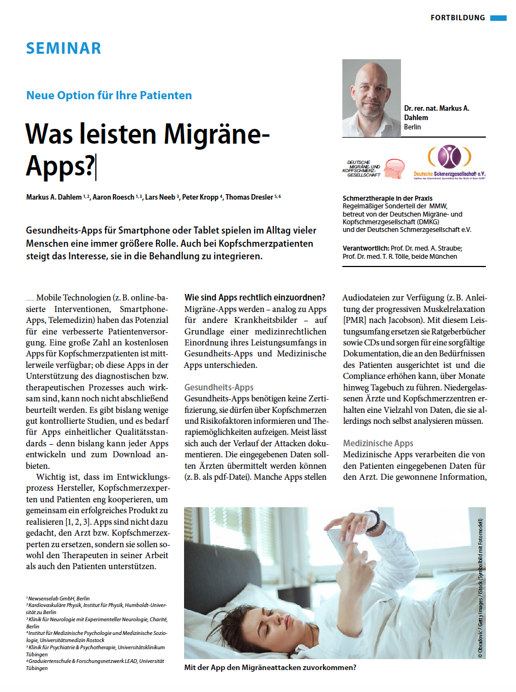

Fachartikel über Migräne-Apps

Apps spielen im Alltag vieler Menschen eine immer wichtigere Rolle. Migräne-Apps werden bisher noch selten genutzt: [Nur 0,2 % der Migränepatienten verwenden sie](https://research2guidance.com/an-underserved-market-only-0-2-of-migraine-sufferers-use-migraine-apps-mobile-digital-health/). Doch auch Kopfschmerzpatienten zeigen zunehmend Interesse daran, digitale Angebote in ihre Behandlung zu integrieren.

Es geht nicht allein um digitale Tagebücher. Kopfschmerzpatienten wollen beispielsweise mehr über ihre Krankheit erfahren und nutzen statt des Internets nun Apps. Sie wollen außerdem eine Therapie, die von ihrem Arzt auf ihre Erkrankung und Lebenssituation maßgeschneidert wird. Weit über hundert therapeutische Interventionen stehen zur Verfügung. 

Die Therapie muss dabei akzeptabel sein und tatsächlich die Lebensqualität verbessern. Nicht selten sind subjektiv empfundene Gesundheitszustände relevant. Dem Arzt fehlt in der Regel die Zeit, diesbezüglich alle relevanten Informationen zu filtern. Noch aufwendiger, als alles regelmäßig abzufragen, ist es für den Arzt, den Verlauf über die Zeit bis ins Detail zu kontrollieren. Ärzte dürfen jedoch Analysen und zusammengefasste Informationen aus Migräne-Apps für ihre diagnostische und therapeutische Arbeit heranziehen. Allerdings nur, wenn Apps gewissen Mindestanforderungen genügen, die Hersteller sicherstellen müssen – genau hier verläuft die Trennlinie zwischen Gesundheits-Apps und Medizinischen Apps.

Kopfschmerzpatienten verlassen sich auch nicht gerne allein auf Ärzte. Sie wollen zusätzlich Vergleiche mit größeren Patientengruppen und damit von dem Potenzial der Patientenerfahrung profitieren. Apps können Menschen, denen es ähnlich ergeht, leichter und mit höheren Anforderungen an den Datenschutz zusammenbringen als beispielsweise Foren im Internet.

Auch ganz neue Therapieoptionen sind abzusehen. Diese fallen in den Bereich der präemptiven nicht-medikamentösen Therapie. Sie führen das Beste aus den beiden Welten der Akuttherapie und Prophylaxe zusammen. Beispiele sind ein mobiles Biofeedback und in Apps integrierte Maßnahmen, die in der kognitiven Verhaltenstherapie verwurzelt sind. Es geht darum, genau zu den Zeitpunkten, an denen die Attacke bevorsteht, einzugreifen. Auch für die Annahme, dass die Attacke bevorsteht, kann eine Migräne-App die soliden Gründe ermitteln.

In der Fachzeitschrift für Ärzte »MMW – Fortschritte der Medizin« haben Kollegen mit mir diese aktuellen und künftigen Entwicklungen zusammengefasst.\*

## Diabetes-Apps als Vorbild für Migräne-Apps

Vieles des oben genannten liegt noch in der Zukunft. Dafür gibt es Vorbilder. Diabetes-Apps werden deutlich häufiger als Migräne-Apps genutzt. Man schätz das circa 20 % der Diabetiker Apps regelmäßig nutzen. Das ist also einhundert mal häufiger pro Patient. Wobei Migräne insgesamt häufiger auftritt als Diabetes, Epilepsie und Asthma zusammen. Trotzdem sind die Erkrankungen auch vergleichbar. Wenn man Krankheitsdauer und den Grad an Beeinträchtigung als Maß nimmt, rangieren laut Weltgesundheitsorganisation Diabetes und Migräne mit Platz 6 und 7 unter den „Top Ten“ der Krankheiten mit höchster Krankheitslast.

Was für Diabetes heute schon gut funktioniert, sollte auch für Migräne möglich sein. Drei Schlagzeilen der letzten Zeit, die ich mir auch für Migräne wünsche:

* [Apple stellt Diabetes-Spezialisten ein.](https://www.heise.de/mac-and-i/meldung/Apple-stellt-Diabetes-Spezialisten-ein-3227006.html)
* [Start-up Cardiogram erkennt frühzeitig das Risiko und Anzeichen einer Diabetes über Fitness-Tracker.](https://www.heise.de/mac-and-i/meldung/Apple-Watch-koennte-Anzeichen-von-Diabetes-erkennen-3962939.html)
* [Diabetes-App Virta kehrt ein Fortschreiten der Diabetes um (Typ-2).](http://www.mobihealthnews.com/content/study-virtas-monitoring-app-plus-low-carb-diet-reverses-diabetes-progression)

Im Prinzip geht es in den oben genannten drei Beispielen zu Diabetes sowie in den fünf von meinen Ko-Autoren und mir besprochenen Migräne-Apps um einen »digitalen Phänotyp« der Erkrankung. Als digitalen Phänotyp bezeichnet man ein Muster aus Lebensstil (beispielsweise Schrittzahl und andere Aktivitäten) und Vitalzeichen. Auf dieser Basis wird eine Analyse für betroffene Nutzer durchgeführt und die Therapie massgeschneidert begleitet, um einen optimalen Therapieerfolg mit etablierten und neuen Behandlungsstrategien zu erzielen. 

## Literatur

Dahlem, M.A., Roesch, A., Neeb, L. et al. MMW – Fortschritte der Medizin (2018) 160: 51. <https://doi.org/10.1007/s15006-018-0153-5>

### \* INTERESSENKONFLIKT

Ich (Markus A. Dahlem) bin einer der Gründer und Geschäftsführer der Newsenselab GmbH, die die Migräne-App M-sense entwickelt. Die anderen vier Autoren des erwähnten Fachartikels gaben keine Interessenkonflikte an.
