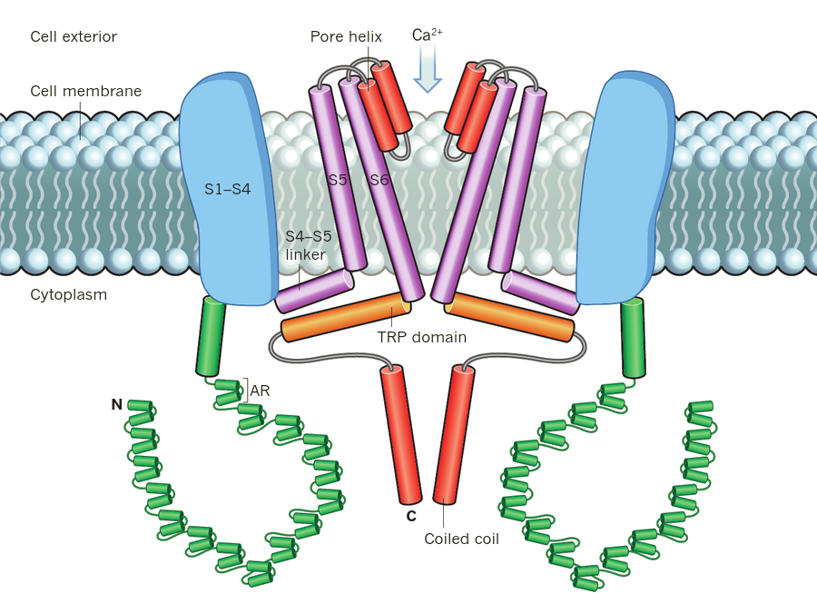

Gehirnzellen signalisieren Schmerz. Sie nutzen dazu bestimmte Proteine, die als Ionenkanäle dienen, darunter Natrium- und Kalium-Kanäle sowie sogenannte *Transient Rezeptor Potential* (TRP) Ionenkanäle. Von den letzteren gibt es insgesamt sieben Familien. Nur zwei sind für Schmerzen zuständig: der TRPV für Chilli-Schmerz und TRPA für Wasabi-Schmerz.

Strukturdetail des TRPA1-Kanals. © 2015 Macmillan Publishers Limited.

Zur TRPA Familie gehört bisher nur ein Mitglied. Dieser TRPA1 Ionenkanal detektiert Wasabi, genauer: scharfe ätherische Senföle und ähnliche, schädliche Substanzen. Die Substanzen, auf die TRPA1 anspricht, können aus unserer Umwelt stammen, aber auch durch innere Entzündungen bei Gewebeverletzung im Körper selbst produziert werden.

## Die Wasabi-Gischt des Großhirn-Tsunamis

Die Aktivierung des TRPA1 an Nervenenden in den Hirnhäuten steht zum einem in Verdacht durch Reizstoffe aus der Umwelt, Kopfschmerzen zu erzeugen. Beispielweise verursacht der stark stechende Duft des Kalifornischen Lorbeers (Umbellularia californica; auch Kopfschmerzbaum genannt) Kopfschmerzen. Zigarettenrauch könnte eventuell über einen ähnlichen Weg über die Hirnhäute Kopfschmerzen verursachen.

Der TRPA1 Kanal kann zum anderen auch zu *primären*  Kopfschmerzen beitragen, wie Migräne. Primär bedeutet, dass der Schmerz die vorrangige Krankheit ist und nicht bloß Symptom anderer Ursachen. Zumindest wird vermutet, dass TRPA1 auch bei primären Kopfschmerzen eine Rolle spielen kann [1]. Bei beiden Prozessen, dem Duft vom Kopfschmerzbaum und bei Migräne, wird das sogenannte trigeminovaskulärere System aktiviert. Das heißt, der Nervus trigeminus, der fünfte Hirnnerv, aktiviert über seine Nervenfasern die Versorgung der Blutgefässe der Hirnhaut.

Bei den körpereigenen Reaktionen reagiert TRPA1 vor allem auf oxidativen- und nitrosativen Stress, d.h. gesteigerte Konzentration reaktiver Sauerstoffverbindungen bzw. von Stickoxid. Beide Stressformen kommen u.a. durch die Spreading Depression Welle in der Großhirnrinde zustande. [Die Spreading Depression verursacht zunächst die Migräneaura und in Folge durch oxidativen- und nitrosativen Stress sowie weitere gewebeschädigende Mediatoren die Kopfschmerzen](https://scilogs.spektrum.de/graue-substanz/cortical-spreading-depression-migraene-letzte/).

Die Spreading Depression gilt auch als [Tsunamie im Kopf](http://www.bild-der-wissenschaft.de/bdw/bdwlive/heftarchiv/index2.php/?object_id=32705084). Etwas plakativ könnte man sich also Migräneanfälle als einen Großhirnrinden-Tsunamie vorstellen, der eine Wasabi-Gischt in die Hirnhäute spült. Das solche Ideen seit Jahren in der Wissenschaft bekannt aber kaum erforscht sind, liegt wohl auch an der [dramatisch geringen Forschungsförderung](https://scilogs.spektrum.de/graue-substanz/beziehung-zwischen-krankheitsspezifischer-forschungsfoerderung-und-krankheitslast/) im Bereich Migräne.

Ein weitere Hinweis kommt aus der Genetik. Einige der genetischen Risikofaktoren für Migräne liegen nahe zu Genorten, die die Empfindlichkeit für oxidativen Stress in Nervenzellen regulieren.

Diese Hinweise legen zumindest die Vermutung nah, der Wasabi-Kanal könnte auch bei Migräne eine Rolle spielen. Die Molekularstruktur des Wasabi-Kanals ist nun entschlüsselt worden [2]. Der Titel der neuen Veröffentlichung in der Fachzeitschrift Nature zeigt welche Bedeutung das haben könnte: die Struktur des TRPA1 Ionenkanals schlägt Regulationsmechanismen vor. Dazu gibt es in Nature auch ein „News and Views“ [3]. (Beide Artikel sind offen lesbar, allerdings nur durch die Links über SciLogs unten im Literaturverzeichnis.)

Schema der Struktur von zwei der vier Untereinheiten des TRPA1-Kanals. © 2015 Macmillan Publishers Limited.

## Literatur

(Hinweis: *open access* von [2] und [3] nur durch diese Links über Scilogs)

[1] Nassini, R., Materazzi, S., Benemei, S., & Geppetti, P. (2014). [The TRPA1 channel in Inflammatory and Neuropathic pain and migraine](http://link.springer.com/chapter/10.1007%2F112_2014_18). In Reviews of Physiology, Biochemistry and Pharmacology, Vol. 167 (pp. 1-43). Springer International Publishing.

[2] Paulsen, C. E., Armache, J. P., Gao, Y., Cheng, Y., & Julius, D. (2015). [Structure of the TRPA1 ion channel suggests regulatory mechanisms](http://www.nature.com/nature/journal/v520/n7548/full/nature14367.html). *Nature*. 520, 511–517

[3] Clapham, David E.(2015) [Structural biology: Pain-sensing TRPA1 channel resolved](http://www.nature.com/nature/journal/v520/n7548/abs/nature14383.html). Nature 520: 439-441.
