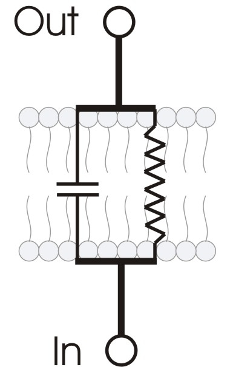

Jedes Jahr fordert uns [Edge mit einer Frage](http://www.edge.org/annual-question/what-scientific-idea-is-ready-for-retirement) heraus. „*Welche wissenschaftliche Idee ist bereit für den Ruhestand?*“ heißt sie dieses Jahr. Leider antworten auf Edge viele ausweichend, zumindest nicht in dem Sinn der Frage: Für welche wichtige Wahrheit finden Sie bei anderen nur wenig Zustimmung?

Die Frage ist also konkret. Gesucht wird eine wissenschaftliche Idee. Meine kurze Antwort: die Sprache der elektrischen Schaltbilder für Vorgänge an den Zellwänden.

Auf meinen Vorschlag, das will ich sofort gerne zugeben, wäre ich alleine vielleicht nie gekommen und es gibt Zustimmung bei anderen (s. [hier](http://membranes.nbi.dk/Kaufmann/), [hier](http://eu.wiley.com/WileyCDA/WileyTitle/productCd-3527611606.html) und [hier](http://www.bu.edu/phpbin/news-cms/news/?dept=666&id=59437)). Aber meist sind elektrische Schaltbilder für Vorgänge an den Zellwänden immer noch die erst Wahl bei der Beschreibung der Membranphysiologie.

Deswegen behaupte ich: Die elektrischen Ersatzschaltbilder der Elektrophysiologie (s. Bild\*) sind als wissenschaftliche Idee bereit für den Ruhestand.

Nicht dass ich diese Analogmodelle für falsch halte. Aber wie alle Theorien haben solche Ersatzschaltbilder einen eingeschränkten Geltungsbereich. Der Geltungsbereich der elektrischen Ersatzschaltbilder ist dabei nicht allein durch die Phänomenologie eingegrenzt sondern vor allem durch Methodik bestimmt. Der Unterschied ist dabei, dass ein Geltungsbereich eine bestimmte Art der Phänomene vollständig umfasst (z.B. alles, was deutlich langsamer als Licht ist und gleichzeitig makroskopisch, genügt der newtonschen Mechanik) oder aber, dass ein Geltungsbereich eine Bestimmte Art der Beobachtung umfasst (z.B. alles was mit einer Elektrode gemessen wird).

Wenn ich nur elektrische Potentiale messe, zum Beispiel bei der Ausbreitung einer Erregung im Nerv (Aktions*potential*), dann „sehe“ ich auch nur die Elektrophysiologie. Die Membranphysiologie der Ausbreitung einer Erregung im Nerv ist aber reichhaltiger.

Die Elektrophysiologie erklärt wesentliche Vorgänge nicht, die sich in und über der Membran abspielen. Weil sie unvollständig ist. Sie lässt Aspekte der Vorgänge komplett außen vor, die für eine „wahre“ (vollständig – inklusive neuer Vorhersagen) Beschreibung nötigt sind. Für mich steht fest, dass wenn wir in diesem Rahmen weiter die *Elektro*physiologie beschreiben, werden wir das Repertoire an funktionellen Verhalten nicht wesentlich erweitern. Um es anders zu sagen: Das elektrische Membranpotential versklavt nicht alle anderen relevanten Freiheitsgrade. (Das denk ich mir jetzt nicht aus, Physiker reden wirklich so.)

Für mich muss die Frage der Membranphysiologie in die Richtung einer physikalischen Theorie des Aktionspotentials [fern vom Gleichgewicht](http://www2.warwick.ac.uk/fac/sci/physics/research/cfsa/epsrc_networkplus/about/) gehen.

**Danksagung**

An dieser Stelle will ich [Konrad Kauffmann](http://membranes.nbi.dk/Kaufmann/) danken, der schon seit den frühen 1990er Jahren meine Aufmerksamkeit auf diese Problemstellung gelenkt und so meinen wissenschaftlichen Werdegang mitgeprägt hat.

**\*Bildquelle**: [Wikipedia](http://commons.wikimedia.org/wiki/File:RC_membrane_circuit.jpg), released under the [GNU Free Documentation License](http://commons.wikimedia.org/wiki/GNU_Free_Documentation_License "GNU Free Documentation License").
