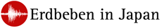

Es brennt nicht in Deutschland. Es brennt in Japan. Deutschland ist allerdings bisher das einzige europäische Land, dass als Reaktion sieben Reaktoren sofort still legte. Es sei eine Notsituationen. Jetzt muss geprüft werden, wie wahrscheinlich es ist, dass es auch hier brennen wird.

Der Bundestagspräsident Norbert Lammert hält die Aussetzung der Laufzeitverlängerungen ohne Zustimmung des Bundestages für rechtlich inakzeptabel. Das hat nichts mit der Frage zu tun, ob unsere Reaktoren modern und zukunftsfest sind und mit welchem Risiko wir leben wollen. Mit dem Sargnagel der Demokratie aber schon.

Präsident, modern und zukunftsfest. Da war doch was. Ach ja, unser Bundespräsident Christian Wulff versprach mit Hilfe einer Denkfabrik (Think Tank) dazu beizutragen gleich ganz Deutschland modern und zukunftsfest zu machen.

  
 *Wo ist eigentlich unser Think Tank, Herr Bundespräsident?*

Dürfen wir nun eine Wortmeldungen in Situationen wie dieser von ihm erwarten? Welche Brandstelle ist er berechtigt, ja verpflichtet zu melden? In Japan hat Tenno Akihito sich gemeldet. Der Himmlische Herrscher. So gesehen ist die Frage nach unserem Bundespräsidenten bescheiden.

Ich will ich mich aber zunächst noch viel bescheidener geben. Was ist mit Wortmeldungen der Wissenschaftsblogger? Dazu nämlich wurde gestern Abend in einem Kommentar zu meinem [letzten *Mode*-Beitrag](http://www.brainlogs.de/blogs/blog/graue-substanz/2011-03-15/ein-modeblogbeitrag) aufgefordert.[^1] Fünf Tage zuvor schon hat Michael Khan in seinem Kommentar [hier](http://www.wissenslogs.de/wblogs/blog/formbar/allgemein/2011-03-12/fukushima-i-eine-kurze-bersicht) kritisch zu solchen Wortmeldungen Stellung bezogen:

> Es wäre wirklich hilfreich wenn in einer solchen Situation auch mal diejenigen von einer Wortmeldung in Form eines Blogposts absehen würden, deren Kernkompetenz ganz offensichtlich woanders liegt. Ich finde es wenig hilfreich, wenn jetzt Physiker aller Couleur meine, sich zu Themen äußern zu müssen, zu denen ich lieber einmal die Meinung eines Kraftwerksingeneiurs hören würde. Es reicht schon, wenn im Fernsehen als Reaktorexperten alle möglichen Leute, von Ärzten bis hin zu Meteorologen präsentiert werden.

Kommentare an sich und gerade solche kritischen machen die Stärke der Wissenschaftblogs aus. Denn siehe da, [es meldet sich in dem kritisierten Beitrag prompt ein Kernkraftwerksingenieur](http://www.wissenslogs.de/wblogs/blog/formbar/allgemein/2011-03-12/fukushima-i-eine-kurze-bersicht#comment-24715), der nach eigenen Angaben 1980, also sechs Jahre vor der Katastrophe von Tschernobyl dort einige Wochen gearbeitet hat. Und er kommentiert mit Leidenschaft und Ausdauer seit diesen fünf Tagen. Der [letzte Kommentar kam vor wenigen Minuten, um 5:25 in der Früh](http://www.wissenslogs.de/wblogs/blog/formbar/allgemein/2011-03-12/fukushima-i-eine-kurze-bersicht/page/8#comment-25011). Wir schreiben also zeitgleich.

Wer dort mitliest und sich vielleicht sogar beteiligt hat, wurde sachkundig informiert. Es kamen weitere Beiträge bei den SciLogs, die alle nun [zusammengestellt](https://scilogs.spektrum.de/artikel/1066562) wurden. Auch dort sollte die Diskussion in den Kommentaren mitgelesen werden.

Wenn unser Bundespräsident nun also keinen Think Tank einberufen hat (zumindest keinen offen sichtbaren, vielleicht existiert ja einer hinter den Kulissen?), so wünsche ich mir doch zumindest seinen Hinweis, dass ein modernes und zukunftsfestes Deutschland durch eine kritische Diskussionskultur entsteht und nicht in dem wir Reaktoren schneller abschalten, als sich Fähnchen im Wind drehen können.

Denn letztlich sollen auch Bundestagesabgeordente ihre Entscheidungen durch vertrauenswürdige Erkenntnisse treffen. Dazu können sie Fachinformationen sowie Analysen von den Wissenschaftlichen Diensten in Anspruch nehmen. Sollten die aber gerade mit anderem beschäftigt sein, einfach mal Wissenschaftsblogs lesen und mitdiskutieren.

[^1]: Der Teil des Kommentars, auf den ich mich hier beziehe lautet

> Im Moment aber ist es vielleicht wichtiger, daß alle Blogger (gerade die Wissenschaftler) den Mut finden, einen Standpunkt zu beziehen, was die Lehren aus Fukushima und das kaum glaubwürdige, volatile Verhalten der Regierenden betrifft.
Jetzt einen *neuen* Standpunkt zu beziehen, welcher die Lehren aus Fukushima einbezieht, kann ich noch nicht. Denn eins hat mich Fukushima nicht gelehrt. Nämlich dass solche Unfälle mit einer gewissen Wahrscheinlichkeit passieren und es nur eine Frage der Zeit ist. Das wusste ich schon vorher. Ich kam mit diesem Beitrag aber gerne dem zweiten Teil der Aufforderung nach, der das volatile Verhalten der Regierenden anspricht. Hier hat mich Fukushima überrascht. Ich möchte nicht von unvorhersehbaren, in ihrer Ausdehnung auf keine Tatsachen beschränkten Winden regiert werden.
