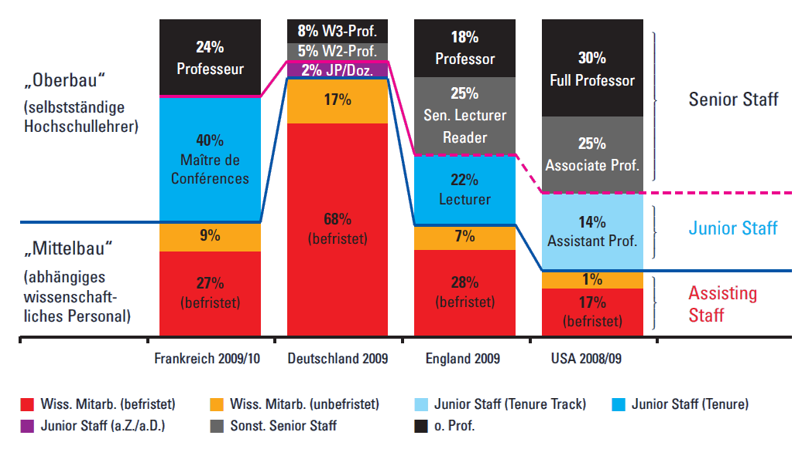

Über die fehlenden akademischen Juniorpositionen in Deutschland habe ich schon öfter gebloggt. Was das ist, eine akademische Juniorposition? Eben. Deutsche Unis nennen es bisher salopp Nachwuchs. Da fängt schon das Problem an. Denn wir unterscheiden beim wissenschaftlichen „Nachwuchs“ nicht zwischen frischen Dorktorandinnen und Dorktoranden einerseits und andererseits Juniorprofessorinnen und -professoren sowie Nachwuchsgruppenleiterinnen und -leiter, die beide noch nicht den Sprung auf eine unbefristete Stelle, die Professur, geschafft haben. Wir differenzieren nicht 12 Jahre Unterschied an Ausbildung und Arbeitserfahrung. Das hat Methode.

„Nachwuchs“ als Begriff wurde zurecht von [Andreas Keller von der GEW neulich in seinem Interview auf Bayern2](https://scilogs.spektrum.de/blogs/blog/graue-substanz/2012-04-20/lohnt-sich-karriere-an-der-uni-noch) als fragwürdig hingestellt und „ideologisch“ gesehen. Denn als Begriff dient „Nachwuchs“ dazu, Wissenschaftler als unselbstständig anzusehen und in einer abhängigen Position zu halten, so Keller.

An dieser Stelle will ich die [Empfehlung „Zur Qualitätssicherung in Promotionsverfahren“](http://www.hrk.de/de/beschluesse/109_6791.php) ([pdf](http://www.hrk.de/de/download/dateien/2012_04_23_Empfehlung_Qualitaetssicherung_Promotion.pdf)) des Präsidiums der Hochschulrektorenkonferenz ins Spiel bringen, denn sie hängt mit unserem ideologischen System, das Wissenschaftler systematisch abwertet – zunächst sprachlich aber auch faktisch durch fehlende Perspektive unabhängig von der erbrachten Leistung –, eng zusammen.[^1]

Schauen wir auf Punkt „4. Betreuung“. Die Betreuung des promovierenden „Nachwuches“ ist gemeint, also von den Wissenschaftlern, die man vielleicht als Nachwuchs bezeichnen kann, weil sie noch nicht selbstständig Forschen und Lehren (obwohl ich es auch da unpassend finde; ich denke immer an Babys):

> **Die Annahme von Doktorandinnen und Doktoranden verpflichtet die Universität zur wissenschaftlichen Betreuung.** Empfehlenswert ist, dass ein Doktorandenverhältnis von einer Promotionsvereinbarung flankiert wird, in der die grundlegenden Anforderungen an Betreuende und Doktorandinnen und Doktoranden festgehalten werden.
>
> Diese Vereinbarung enthält Aussagen zur Anzahl und Zuordnung von Fach-Betreuern (in der Regel zwei Betreuer bzw. Betreuerinnen, wobei eine/r die Hauptbetreuung übernimmt und die/der zweite als zusätzliche/r Ansprechpartner/in fungiert), zur Form der Betreuung (z.B. Statusgespräche, Arbeitsberichte, Kontakthäufigkeit) sowie zu weiteren Betreuungselementen. Eine gute Betreuung sichert auch die Fertigstellung der Promotion in einem angemessenen Zeitraum. Dabei sind disziplinspezifische Besonderheiten und Erfordernisse der Berufssituation der Doktorandinnen und Doktoranden zu berücksichtigen.
>
> Betreuerinnen und Betreuer und Doktorandinnen und Doktoranden achten darauf, dass die Arbeit an der Dissertation in der Regel in drei Jahren abgeschlossen werden kann. **Die Verantwortung dafür beginnt bereits mit der Themenstellung, setzt sich über regelmäßige Status- und Betreuungsgespräche fort und schließt die Notwendigkeit eines zügigen Promotionsverfahrens ein**.
>
> (Hervorhebungen sind von mir)

„Durch die Annahme … verpflichtet zur Betreuung“, das klingt unverfänglich. Ist es aber nicht so, dass viele Doktoranden auf Drittmittelstellen sitzen, die Wissenschaftler eingeworben haben, die selbst noch als „Nachwuchs“ gelten? Die Universität verpflichtet sich auch in diesen Fällen zur wissenschaftlichen Betreuung. Jetzt sollten wir fragen, wer denn diese „Fach-Betreuer“ sind, die sowohl Themen stellen als auch regelmäßig Status- und Betreuungsgespräche führen? Die Antwort folgt stehenden Fußes.

> Die Qualifizierung des wissenschaftlichen Nachwuchses gehört zu den grundlegenden Aufgaben von Professorinnen und Professoren. Neben ihnen sollten analog zu den Juniorprofessorinnen und -professoren auch Nachwuchsgruppenleiterinnen und -leiter Betreuungs- und Gutachteraufgaben übernehmen dürfen.

Was ist mit denen, die die Drittmittelprojekte, also die Promotionsstelle eingeworben haben, die also das Thema stellen und die auch tatsächlich die regelmäßigen Status- und Betreuungsgespräche führen? Promotionsstellen darf jeder Promovierte einwerben. Er muss es sogar, je früher desto besser, um überhaupt eine Karrierechance zu wahren.

Schauen wir von der anderen Seite. Wie ist das hauptberufliche wissenschaftliche Personal an promotionsberechtigten Hochschulen verteilt? Dazu schauen wir auf eine Graphik, die regelmäßige Leser meines Blogs kennen. Nur 15% gehören zum Oberbau, 13% davon gehören zur zuvor genannten Gruppe der Professorinnen und Professoren (Junior Staff) und nur 2% zur dem, was man eine akademische Juniorposition (Junior Staff) nennt oder, wenn man die oben erwähnte Ideologie gut heißt, schlicht auch Nachwuchs.

  
Klicken Sie auf das Bild, um eine größere Version zu sehen.

Über diese Graphik habe ich schon [hier](https://scilogs.spektrum.de/blogs/blog/graue-substanz/2011-02-25/die-dissertation-zwischen-auftragsarbeit-und-gesellenstueck) und [hier](https://scilogs.spektrum.de/blogs/blog/graue-substanz/2012-01-29/wissenschaftszeitvertragsgesetz-wisszeitvg) geschrieben (dort sind auch Quellenhinweise). Viele Fragen, z.B. ob der Ländervergleich sinnvoll ist, wurden diskutiert. Gucken wir allein auf das Verhältnis Senior Staff zu Junior Staff, dann spielen weder absolute Zahlen eine Rolle, noch ob Doktoranden als hauptberufliches wissenschaftliches Personal gelten. Denn wir beschränken uns auf den Oberbau der selbstständigen Wissenschaftler. Wir haben in Deutschland ein Verhältnis zwischen Senior Staff und Junior Staff von 6:1 wo andere Länder 1:1 bis 4:1 erreichen. Etwas ist schief bei uns im Oberbau, zwischen den Gruppen, die potentielle Betreuer von Doktoranden sind. Ganz abgesehen davon, dass das Betreuungsverhältnis Oberbau zu Unterbau auch nicht stimmt. Wo Nachwuchsgruppenleiterinnen und -leiter verortet sind, bleibt übrigens oft unklar. Arbeitsrechtlich sind sie meist Mittelbau (TV-L E15) manchmal aber auch als W2 mit Befristung im Oberbau. Unserem System mangelt es also auch hier an Transparenz.

Lesen wir weiter in den Empfehlungen.

> **Betreuerinnen und Betreuer** handeln bei der Wahrnehmung dieser grundlegenden Aufgabe verantwortungsvoll und **planen ausreichend Zeit für eine angemessene Betreuung. Dies wirkt sich zwingend auf die Zahl von Doktorandinnen und Doktoranden für jede einzelne Betreuerin und jeden einzelnen Betreuer aus und legt eine angemessene Anzahl nahe, um allen eine optimale Betreuung zu bieten.**
>
> Als unabdingbar wird eine Stelle angesehen, die im Konfliktfall vermittelnd und schlichtend aktiv wird. Dies kann z.B. eine Ombudsperson sein, die sich durch eine hohe Reputation auszeichnet und hinreichend neutral agieren kann. Eine Ombudsstelle zur Konfliktregelung für den Promotionsbereich steht allen Doktorandinnen und Doktoranden und Betreuerinnen und Betreuern offen.

Wenn es einen Bedarf an einem Beweis gegeben hätte, dass eine optimale Betreuung gar nicht möglich ist im deutschen Wissenschaftssystem, dann haben wir ihn [durch die Plagiatsfälle](http://deplagio.wordpress.com/) unlängst bekommen. Aber auch in den Naturwissenschaften, bei denen Plagiate kaum eine Rolle spielen, ist die Betreuung, wie hier von der HRK empfohlen, nicht die feste Regel.

Offizielle Gutachter und tatsächliche Betreuer sind zu selten identisch. Zu der ideologischen Bezeichnung „Nachwuchs“, die viele der tatsächlichen Betreuer zusammen mit ihren Betreuten in einem Topf wirft, gesellt sich damit zwangsläufig eine Perversion des Arguments der angeblichen „Qualitätssicherung“: Einerseits soll die Qualität der Betreuung und Begutachtung allein durch Mitglieder des qualifizierten Oberbaus gesichert werden, faktisch aber kann diese viel zu kleine Gruppe gar nicht eine Betreuung zeitlich sicherstellen und delegiert Pflichten (Betreuung) aber nicht Rechte (Begutachtung). So werden ungute Abhängigkeiten geschaffen unter denen die Qualität leidet.

Hier macht nun zum ersten mal ein zusammenfassender Begriff Sinn, denn beide, Promovierende wie deren oft tatsächlichen Betreuer, sind gleichermaßen betroffen von diesem Systemfehler. Doch nicht der Begriff „Nachwuchs“ bezeichnet diese Gemeinsamkeit sondern „Leidtragende“.

Ein Blick über die aktuelle Empfehlung der HRK hinaus zeigt, dass dies alles längst bekannt ist. Die [Richtlinien der DFG für gute wissenschaftliche Praxis](http://www.dfg.de/foerderung/rechtliche_rahmenbedingungen/gwp/index.html) untermauern, dass diese eigentlich unhaltbare Situation geändert werden muss. Auch hier wird gefordert (Empfehlung 3):

> Die Leitung jeder Hochschule und jeder Forschungseinrichtung trägt die Verantwortung für eine angemessene Organisation, die sichert, daß in Abhängigkeit von der Größe der einzelnen wissenschaftlichen Arbeitseinheiten die Aufgaben der Leitung, Aufsicht, Konfliktregelung und Qualitätssicherung eindeutig zugewiesen sind und gewährleistet ist, daß sie **tatsächlich wahrgenommen** werden.

Die Aufgaben können aber gar nicht von dem viel zu kleinen Oberbau wahrgenommen werden. Und so lesen wir weiter:

> Diese Forderung hat unmittelbare Folgen für die optimale bzw. die maximale Größe einer Arbeitsgruppe. Eine Leitungsfunktion wird leer, wenn sie nicht verantwortlich in Kenntnis aller dafür relevanten Umstände wahrgenommen werden kann. Die Leitung einer Arbeitsgruppe verlangt Präsenz und Überblick. Wo sie (z. B. auf der Ebene der Leitung großer Institute oder Kliniken) nicht mehr hinreichend vorhanden sind, müssen Leitungsaufgaben delegiert werden, was nicht zu komplexen hierarchischen Strukturen führen muß. Die „Führungsspanne“ darf nicht zu groß werden.

Leitungsaufgaben zu delegieren geht aber nur, wenn die Verantwortung mit delegiert wird. Unter dem Deckmantel des angeblichen „Nachwuchses“ werden aber nur Pflichten delegiert. So schafft man in der Tat komplexe hierarchische Strukturen. Das einfache Modell der Juniorprofessur, das man nur mit einer Perspektive (Tenur-Track Option) noch verbessern hätte müssen, um die notwendige Unabhängigkeit zu gewährleisten, wird heute stattdessen mit „Nachwuchsgruppen“ konterkariert. Man fragt sich, ob es nicht allein darum geht, diese Wissenschaftler aus dem Oberbau fern zu halten. Statt um deren Schutz, also um das vorgeschobene Argument, junge Wissenschaftler mit nicht zuviel akademischer Selbstverwaltung, die zum Oberbau gehört, zu belasten. Denn mit einem größeren Oberbau sinkt die Belastung der Selbstverwaltung für jeden einzelnen.

Um eins geht es ganz sicher nicht: um die Qualitätssicherung in den Wissenschaften. Denn Qualität kommt nicht von unklaren Abhängigkeiten und verworren hierarchischen Strukturen.

Wann reagieren die Hochschulen vor Ort auf ihren selbst gesetzten Anspruch der Qualitätssicherung und bauen die akademische Juniorposition mit einem einfachen Modell umfassend aus? Ohne dieses geht es nicht.

+++

Aktuelle Informationen über die akademische Juniorposition in Deutschland in der facebook-Gruppe [25% akademische Juniorpositionen](http://www.facebook.com/akademischeJuniorposition) (seit Feb. 2011) und auf google+ [25% akademische Juniorposition](https://plus.google.com/u/0/105372939966022141725/posts). Eine statische Website mit den zusammnegefassten Forderungen ist [hier](http://sites.google.com/site/25paju/manifest).

Bitte teilen!

[^1]: Übrigens ist auch mein Fall (beschrieben in „[Die Umgehung der Zwölf-Jahres-Regelung](https://scilogs.spektrum.de/blogs/blog/graue-substanz/2011-11-23/die-umgehung-der-12-jahres-regelung)„), der der Komplexität die Krone aufsetzt, von einem Sachverständigen im Bildungsausschuss zum Thema Wissenschaftszeitvertragsgesetz an die Geschäftsstelle der Hochschulrektorenkonferenz weiter geleitet worden. Man informierte mich, dass dort eine Sammlung der Fälle geführt wird, die die Argumentation der Hochschulrektorenkonferenz unterfüttern können. Es lohnt sich also Missbrauch offen aufzuzeigen, trotz einiger Repressalien, die leider nicht ausblieben.
