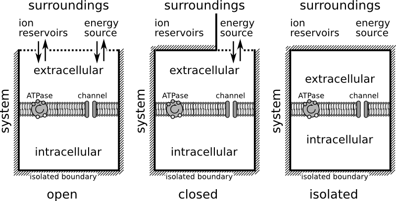

We put a [new manuscript on arxiv](http://arxiv.org/abs/1404.3031).

[Niklas Hübel](http://www.itp.tu-berlin.de/schoell/nlds/mitglieder/doktoranden/) and I investigate an extension to the classical theory by Hodgkin and Huxley ([Nobel Prize 1963](http://www.nobelprize.org/nobel_prizes/medicine/laureates/1963/press.html)) that in its original version describes nerve impulses (spikes). Spikes manifest communication between nerve cells. Their underlying mechanism is an all-or-non phenomenon, also called “excitability”. Excitability as a mechanism describes how a certain excitable state persists for some time following an input signal, a suprathreshold stimulation that, however, is terminated at some point long before the excitable system, the neuron in this case, relaxes back to its resting state.

A spike lasts only 1/1000 second. And even though during this period  ions are exchanged across the nerve cell membrane, the change in corresponding ion concentrations can become significant only in series of such spikes. Under certain conditions this change is dramatic and lasts minutes to hours. However, this cannot be described in the original Hodgkin-Huxley (HH) theory.

From the clinical literature, we know that such dramatic and lasting changes in cortical ion homeostasis establishes a new type of excitability (all-or-non phenomenon) underlying communication failure between nerve cells during migraine and stroke. See recent articles in [Nature Review Neurology for migraine](http://www.nature.com/nrneurol/journal/v9/n11/full/nrneurol.2013.192.html) and [Nature Medicine for stroke](http://www.nature.com/nm/journal/v17/n4/full/nm.2333.html).

To clarify the mechanism of this new type of excitability and recognize the relevant factors that determine the astonishingly slow time scales of ion concentration changes—up to 10,000,000 times slower, or seven orders—, we use an extended version of the classical HH theory.

While the ordinary view of this extended  theory (also called 2nd-generation HH) is still attached to the physical picture of electrical circuits with electrical currents, conductances (inverted electrical resistances), and batteries, we now suggest in the new manuscript that with regard to the new excitability another picture must be adopted, namely that of ideal thermodynamic cycles.

Ideal thermodynamic cycles are well known from steam engines describing the piston movement. This movement describes a cyclic path through the space of thermodynamic variables. Certain, often four, sections of the path are related to particular thermodynamic processes that are specified by holding certain variables constant.

We consider the neuron as an isothermal machine and identify a specific variable of importance, the ion gain (or loss) through some reservoirs provided by the nerve cell surroundings. This is not new at all. In the early 20th century the steam engine was seen as a prototype of muscles cells. It is, however, not the normal functioning of nerve cells that we describe in this terminology, but the dysfunction, when neurons let off steam. We calculated this, the release of Gibbs free energy, earlier [in a paper](http://www.ncbi.nlm.nih.gov/pmc/articles/PMC3526686/) for conditions of epilepsy, migraine, and stroke. In fact, although this was not the initial purpose of our model design, we also found in this model cyclic processes that are related to seizure activity (which we describe in the manuscript, but I put aside for this post).

We suggest to describe the new excitability in migraine and stroke as a sequence of two processes with constant ion content (red in the figure above) separated by loss and regain processes with approximately constant potassium ion concentrations, inside (blue) and outside (green) the cell, respectively.

One should therefore direct the attention in theoretical research of neural dysfunction towards a picture of thermodynamic cycles, in particular, the role of the surrounding ion reservoirs.

