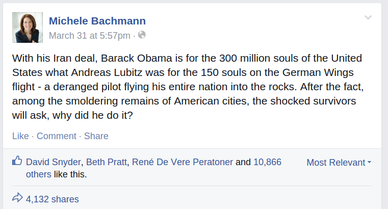

Michele Bachmann’s facebook post is not just sad. As new revelations start to unfold it becomes tragically ironic, moreover these revelations point to an increasingly important medical problem.

Guess whom I was reminded of as evidence began to emerge that Andreas Lubitz did not only suffer from severe depression but maybe also from migraine with aura, which can be brutally severe and disabling. The major German Sunday newspaper “*Bild am Sonntag*” said investigators had found evidence that Lubitz had vision problems, see [here](http://mobile.reuters.com/article/idUSKBN0MP0GF20150329?irpc=932) (link to Reuters in English). According to this newspaper, Lubitz also googled “*Migräne*” (migraine) and “*Sehstörungen*” (visual disturbances), see [here](https://de.nachrichten.yahoo.com/germanwings-copilot-loggte-sich-als-skydevil-auf-seinem-115040313.html) (link to Yahoo News in German). Also the Independent reports that Lubitz was seeing [an ‚astonishing‘ number of doctors](http://www.independent.co.uk/news/world/europe/germanwings-copilot-andreas-lubitz-was-seeing-an-astonishing-number-of-doctors-10157740.html).

Just three weeks before this tragic event, I created a computer simulation of the visual impairment during a migraine aura to raise awareness of his condition. The video is based on a neural network simulation ([Dahlem, et al. (2000). *Euro. J. Neurosci.*, **12**, 767-770.](http://onlinelibrary.wiley.com/doi/10.1046/j.1460-9568.2000.00995.x/abstract)) and it shows how the field of vision can be affected during a migraine attack. Replace the white wallpaper with an aircraft cockpit—or a picture of the White House Situation Room.

Watching that video you will understand—even without suffering from migraines—why [many civil aviation authorities say that pilots who experience migraines are not fit to fly.](http://flightsafety.org/hf/hf_nov-dec02.pdf) The scintillating zigzag patterns are typical but migraine aura can also take different forms. Migraine with aura affects all sensory modalities and cause motor symptoms as well as cognitive impairment. Lubitz also searched for the term “Knalltraume” (acoustic trauma), which may indicate [auditory aura symptoms](http://www.migraine-aura.com/content/e27891/e27265/e26585/e26596/index_en.html).

I admit, it is speculation, but the anticipated end of his job or other ways of discrimination might well have added to Andreas Lubitz‘ depression. It is known that anticipated discrimination can be a barrier to seeking help and to receiving effective treatment. It is also well known that major depression increases the risk for migraine, and migraine increases the risk for major depression ([Breslau, et al. (2003) *Neurology*, **60**, 1308-1312](http://www.neurology.org/content/60/8/1308).) Neither of this should and can, of course, explain why Lubitz did what he did.

Many of us remember well the discussions in 2011 whether or not [Michele Bachmann is fit for the presidency due to her migraine condition](http://www.nytimes.com/2011/07/22/opinion/22warner.html). Probably less known is that one year later, on the Lufthansa Flight LH403 from Newark to Frankfurt, [the co-pilot suffered from a severe migraine attack and was incapacitated](http://www.independent.ie/breaking-news/irish-news/offduty-pilot-helps-to-land-plane-28903749.html).1

Clearly, migraine with aura reduces fitness not only to fly but to operate any machine. It might be objected that Abraham Lincoln suffered from migraines and also from recurring depression. But the more our lives accelerated, being disabled, if only for 30 minutes during an episodic attack, gets a completely new quality.

This makes it all the more important that to state that today we can manage migraines far better than at Lincoln’s time or even 20 years ago. In conclusion, it is important to further raise awareness to this condition and prevent any stigmatization. Let me end by citing from the abstract of a recent paper on depression. This interpretation of the results certainly also holds for migraine:

> Discrimination related to depression acts as a barrier to social participation and successful vocational integration. Non-disclosure of depression is itself a further barrier to seeking help and to receiving effective treatment. [N]ew and sustained approaches are needed to prevent stigmatisation of people with depression and reduce the effects of stigma when it is already established.
>
> [[Lasalvia et al. (2013). *The Lancet*, **381**, 55-62.](http://www.thelancet.com/journals/lancet/article/PIIS0140-6736(12)61379-8/abstract)]

## Footnote

1 I blogged about both events, but these posts are currently unavailable, because the scilogs.eu domain vanished. Also my blog post on driving a car with migraine got lost. I’ll try to recover these posts. If you read German, here are the posts in my german blog: *[Eine US-amerikanische Präsidentin mit Migräne?](http://www.scilogs.de/graue-substanz/eine-us-amerikanische-praesidentin-mit-migraene/)*, *[Lufthansa-Ko-Pilot mit Migräne in Boeing 747](http://www.scilogs.de/graue-substanz/lufthansa-ko-pilot-mit-migr-ne-in-boing-474/)*, and *[Autofahren mit Migräne](http://www.scilogs.de/graue-substanz/autofahren-mit-migraene/)*.
