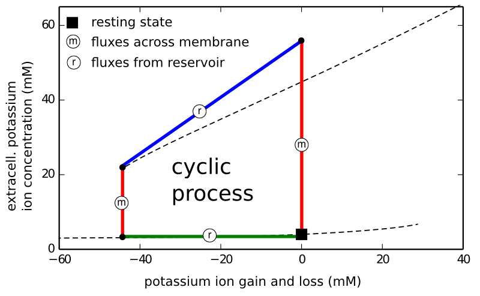

Niklas Hübel und ich untersuchen dort eine Erweiterung der klassischen Theorie von Hodgkin und Huxley (Nobelpreis 1963). Diese Theorie beschreibt in ihrer sprünglichen Fassung Nervenimpulse (Spikes). Spikes sind die Basis auf der die ganze Kommunikation zwischen Nervenzellen aufbaut, also die Bits und Bytes der Gehirnfunktionen. Der zugrundeliegende Mechanismus für einen Spike ist ein Alles-oder-Nichts-Phänomen, was man auch mit „Anregbarkeit“ bezeichnet.

## 10 Millionen mal langsamer

Ein Spike dauert nur eine tausendstel Sekunde. Und obwohl in diesem kurzen Zeitraum geladenen Teilchen (Ionen) durch die Nervenzellmembran hindurch ausgetauscht werden, kann eine Änderung der entsprechenden Ionenkonzentrationen nur signifikant werden, wenn viele Spikes aufeinanderfolgen. Unter bestimmten Bedingungen kann dann jedoch diese Veränderung der Ionenkonzentration dramatisch werden und sehr sehr lange, bis zu Minuten und Stunden anhalten.

Genau dies kann in der ursprünglichen Hodgkin-Huxley-Theorie (HH) nicht beschrieben werden.

Dabei wissen wir aus der klinischen Fachliteratur der letzten Jahre, dass solche dramatischen und anhaltenden Veränderungen in Ionenkonzentration (oder eleganter formuliert: der Ionenhomöostase) in der Großhirnrninde eine neue Art der Anregbarkeit (Alles-oder-Nichts-Phänomen) darstellen, eine Übererregung.

Diese Überrregbarkeit führt zu einem kompletten Verlust der normalen Kommunikation zwischen den Nervenzellen, z.B. während der Migräne in Form der Aura und bei Schlaganfall als Ausfallerscheinung. (Siehe Artikel in [Nature Reviews Neurology für den Zusammenhang mit Migräne](www.nature.com/nrneurol/journal/v9/n11/full/nrneurol.2013.192.html) und [Natur Medizin für Schlaganfall](www.nature.com/nm/journal/v17/n4/full/nm.2333.html).)

Um den Mechanismus dieser neuen Art der Anregbarkeit bzw. Übererregung aufzuklären und vor allem die relevanten Faktoren zu bestimmen, die die erstaunlich langsamen Zeitskalen erklärten, auf denen sich Ionenkonzentrationen ändern, nämlich um 10000000 (10 Millionen) langsamer als Spikes spiken, verwenden wir eine erweiterte Version der klassischen HH-Theorie.

## Dem falschen Bild verhaftet

Dieses erweiterten Theorie (auch als 2. Generation der HH-Theorie bezeichnet) ist allerdings leider immer noch hartnäckig dem physikalischen Bild des [elektrischen Ersatzschaltbildes](https://scilogs.spektrum.de/graue-substanz/welche-idee-ruhestand-elektrische-ersatzschaltbilder/) verhaftet. In diesem Bild dreht sich alles um elektrische Ströme, Leitfähigkeiten (invertierte elektrische Widerstände) und um Batterien (Nernst-Potentiale).

Wir schlagen nun in dem neuen Manuskript vor, dass hinsichtlich der neuen Übererregbarkeit ein ganz anderes physikalisches Bild angebracht ist, nämlich das der idealisierten thermodynamischen Kreisprozesse.

Idealisierte thermodynamische Kreisprozesse sind von den Dampfmaschinen bekannt. Sie beschreiben die Kolbenbewegung als einen Kreislauf durch den Raum der thermodynamischen Variablen. Einzelne, meist vier, Abschnitte dieses Kreislaufs sind durch bestimmte thermodynamische Prozesse gekennzeichnet, Prozesse in denen bestimmte thermodynamische Variablen konstant gehalten werden. Der Stirling-Kreisprozess z.B. besteht aus zwei Abschnitten mit konstanter Temperatur (Isothermen) und zwei mit Konstanten Volumen (Isochoren); der Otto-Kreisprozess, ein Vergleichsprozess zum gleichnamigen Verbrennungsmotor, hat sechs solcher Einzelprozesse mit konstanten Variablen.

## Die Gehirnzelle als Dampfmaschine

Wir betrachten die Gehirnzelle als eine solche Maschine und identifizieren eine bestimmte Variable von zentraler Bedeutung, die im Kreislauf der Übererregung zweimal konstant gehalten wird. Diese Variable beschreibt den Ionenzugewinn (oder Verlust) durch Reservoire, die die Nervenzelle umgeben (Gliazellen und Blutgefäße).

Die Grundidee ist nicht ganz neu.

Schon im frühen 20. Jahrhundert wurde die Dampfmaschine als Prototyp zur Beschreibung der Muskelzellen im Sinn einer isothermen Maschine gesehen (d.h. es wird keine Wärme in Arbeit umwandelt). Es ging damals um die normale Funktion dieser Zellen, nämlich Arbeit zu verrichten. Wir untersuchen jedoch nicht die normale Funktion der Gehirnzellen. Und um Arbeit im klassischen Sinne geht es auch nicht. Doch nutzen wir die Terminologie der Thermodynamik um Funktionsstörung zu beschreiben. Quasi was passiert wenn Neuronen – im übertragenen Sinn – ihren Dampf ablassen.

Wir berechneten dies, die Freisetzung der freien Gibbs-Energie, schon vorab. In einem Artikel berechneten wir für Bedingungen der Epilepsie, Migräne und des Schlaganfalls diesen Energieverlust. (Und obwohl es gar nicht der ursprüngliche Zweck unseres Modells war, haben wir sogar auch einen Kreisprozess gefunden, der neuronale Anfallsaktivität bei Epilepsie beschreibt, worauf wir im Manuskript eingehen, ich hier aber außen vor alle).

Wir schlagen vor, die Übererregbarkeit bei Migräne und Schlaganfall als Folge zweier Prozessen mit konstantem Ionengehalt (rot in der Abbildung oben) anzusehen, die wiederum durch zwei andere Prozesse getrennt sind. Ganz ähnlich dem Stirling-Kreisprozess. Diese anderen Prozesse halten einmal (annähernd) die Konzentration der Kaliumionen im Zellinneren konstant (blau), dabei verliert die Gehirnzelle aber insgesamt Kaliumionen aus ihrem Außenraum an ein Reservoir; und das andere mal wird die Konzentration von Kaliumionen in diesem Außenraum konstant gehalten (grün), dabei gewinnt die Gehirnzelle trotzdem insgesamt die Kaliumionen vom Reservoir zurück. Der Kreisprozess startet vom Ruhezustand (schwarzes Quadrat) durch eine äußere Störung und läuft dann entgegen dem Uhrzeidersinn. Insbesondere der letzte Prozess (grün) verblüffte uns, denn das Reservoir ist gar nicht an das Zellinnere angekoppelt! Kaliumionen werden also durch den Außenraum konstant hindurch gereicht. Dies ist der langsamste Prozess.

Fazit: Wir sollten in Zukunft mehr Aufmerksamkeit bei der theoretischen Erforschung der Gehirnfehlfunktionen diesem thermodynamischen Bild zuwenden.

