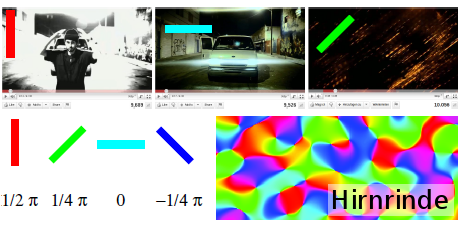
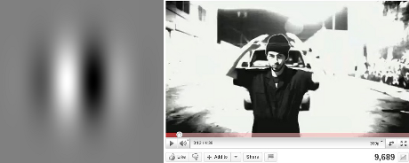
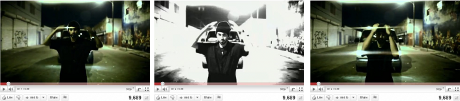
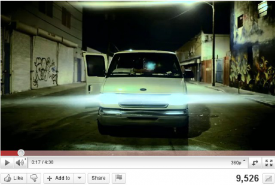
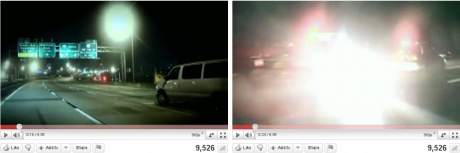
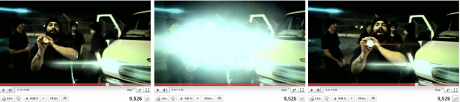

Die Gestalt visueller Migräneauslöser kann am Fallbeispiel eines Musikvideos einfach veranschaulicht werden.

Zu Erinnerung: im [vorletzten Beitrag dieser Serie](https://scilogs.spektrum.de/blogs/blog/graue-substanz/2011-10-04/satte-spezialisten-ueberreizen-das-gehirn) kamen Kantendetektoren im Gehirn zur Sprache und deren rezeptive Felder, daran schließe ich an. Ich rate diesen Beitrag zu lesen; wen nicht nur das kuriose Fallbeispiel interessiert, der wird dort weiteres zu den neurophysiologischen Grundlagen der visuellen Sinneswahrnehmung und Migräne finden. [Den letzten Beitrag](https://scilogs.spektrum.de/blogs/blog/graue-substanz/2011-11-29/kultur-optimaler-reiz-ueberflutung) schob ich aus aktuellem Anlass dazwischen – intensive, blutrote Lichtwechsel lösten im neuen Twilight Film „Bis(s) zum Ende der Nach“ epileptische Anfälle im Kinosaal aus –, ein vergleichender Blick zur photosensiblen Epilepsie lag sowieso nahe, aber gleich so aktuell wäre eigentlich nicht nötig gewesen. Ich nannte in diesem Beitrag die visuellen Auslöser für Migräne und Epilepsie *optimale* Reizüberflutung. Ein gutes Stichwort um nun anzuschließen.

Ein rezeptives Feld verkörpert genau das: den optimalen Reiz (Stimulus) einzelner Gehirnzellen (Neuronen), welcher zur maximalen Aktivität (Feuerrate) dieser führt. Im wahrsten Sinne des Wortes ist hier etwas verkörpert, nämlich die Struktur des Raums außerhalb unseres Körpers, in dem ein Stimulus, wenn präsent, das Feuern des betrachteten Neurons beeinflusst. Dieses Antwortverhalten auf den Stimulus entsteht natürlich erst durch die neuronale Vorverschaltung, beginnend bei den Rezeptoren und der Prozess endet am Neuron, dessen rezeptives Feld wir betrachten.1

Die entscheidenden Neurone werden im folgenden die in der Großhirnrinde (Kortex) sein, genauer: in der Sehrinde (visueller Kortex). Folglich ist der Stimulus Licht, die Rezeptoren sind lichtempfindliche Photorezeptoren in der Netzhaut (Stäbchen und Zapfen) und das rezeptive Feld ist quasi ein in der Vorverschaltung einzelner Neurone verkörpertes Referenzbild.

Zwei Aspekte des zugegeben immer noch etwas abstrakten Konzeptes eines kortikalen rezeptiven Feldes will ich deutlicher hervorheben, bevor das einfache Beispiel (nach drei Absätzen) folgt. Wer will kann auch ohne große Verständnisprobleme direkt zum Beispiel übergehen. In einem folgenden Beitrag aber, wenn wir über Halluzinationen reden, werden kortikale rezeptive Felde nochmal wichtig. Deswegen lieber gleich richtig erklärt.

a) Jedes Neuron im Kortex wird von einem begrenzten und zusammenhängenden Gebiet lichtempfindlicher Photorezeptoren in der Netzhaut mit Daten versorgt. Fällt Licht auf diese Rezeptoren, wird die Information durch ein neuronales Netzwerk an den Kortex weitergeleitet. Diese Information ist somit vorverarbeitet, wenn sie dort ankommt. Das führt dazu, dass ein kortikales Neuron mal mit einer geringen Feuerrate antwortet, ein anderes mal maximal, abhängig vom Stimulus. Letztere, also die Maximalantwort, folgt nur, wenn ein optimales Reizmuster, welches ich der Kürze wegen *auch* mit dem Begriff rezeptives Feld benenne, auf die Rezeptoren fällt. Wirklich verwechseln wird man die zwei Bedeutungen kaum, ich will aber explizit auf diese gebräuchliche Konvention hinweisen.2

b) Eine Region im Gesichtsfeld, ein Bild oder Bildausschnitt, wird also zusammengefasst und einzelne Neurone im Kortex repräsentieren immer den Inhalt ganzer Regionen auf der Netzhaut und damit im Gesichtsfeld. Diese Repräsentation der Neuronen wird im Kortex sortiert Anhand des Merkmals, für das ihr jeweiliges rezeptives Feld spezialisiert ist. Zum Beispiel, ob in dieser Region des Bildes eine Kante zu sehen ist und wenn ja, mit welcher Orientierung.

Vorab eine Warnung: Punkt (a) allein reicht nicht als Migräneauslöser, denn ein Neuron hat keine Migräne. Erst ein überempfindliches Netzwerk aus vielen Neuronen im Kortex, sobald „optimal“ überreizt, kann zur Migräne führen. Dieses Netzwerk ist nicht das oben erwähnte Netzwerk der *Vor*verschaltung einer einzelnen kortikalen Zelle, deswegen nenne ich es zur Unterscheidung das laterale Netzwerk. Es hängt zusammen mit der in Punkt (b) angesprochenen Sortierung anhand der Merkmale und besteht aus vielen dieser Merkmale bezüglich verschiedener kortikaler Neurone. Das jedoch gehört zum zweiten Schritt meiner Erklärung der „optimalen“ Reize. Auf diese Zweiteilung (a) und (b) – den Teil (a) haben wir komplett hinter uns – wollte ich vorab hinweisen.3 (Selbst Fans klassischer Musik fragen sich wahrscheinlich langsam, wann es mit Hip-Hop los geht.)

**Hip-Hop Neuroscience Fusion**

Ein rezeptives Feld, ein wirklich grelles Bild also, das grellste für ein einzelnes kortikales Neuron, wenn Sie es so einfach wollen und den Text oben einfach übersprungen haben, sieht zum Beispiel wie folgt aus.

Das Bild links meine ich. Dies ist ein als Gabor-Filter bezeichnetes Muster. Für manche Leser ist dieses Muster selbst ohne Flickern „irgendwie unangenehm“ anzusehen. Insbesondere wenn man gerade nicht ganz genau darauf sondern daran vorbei schaut. Und dann einmal scrollen, bitte. Es wackelt dann ganz von allein.

Diese Art der Muster, verkörpert durch die neuronale Vorverschaltung, dienen im Gehirn der weiteren Verarbeitung visueller Information. Aber nicht nur dort. Auch in der digitalen Welt werden diese Muster und dazugehörende Algorithmen zur Kantendetektion als Teil der Bildanalyse genutzt (Segmentierung).

Rechts davon sehen Sie einen Schnappschuss aus dem Hip-Hop-Musik-Video. Sehen Sie auch da die Kante in Form eines Gabor-Filters? In einer dunklen Gegend steht ein nicht minder dunkler Typ, der von Scheinwerfern eines hinter ihm wartenden Autos angeblitzt wird. Vergleichen wir die Muster rechts und links sehen wir: optimale visuelle Reizmuster – rezeptive Felder – müssen nicht abstrakt sein. (Wissenschaftliche Erklärungen übrigens auch nicht.)

Bestimmte Gehirnzellen feuern auf hochtouren, wenn sie etwas halbwegs ähnliches kurz sehen. Kurz ist perfekt, beim längeren Hingucken gewöhnen (adaptieren) Neurone sich daran. Das Bild rechts neben dem Gabor-Filter zeigt nur ein Einzelbild aus dem Video.

Es blitzt nur für einen Bruchteil einer Sekunde auf. Drei fast unmittelbar aufeinander folgende Einzelbilder (in der elften Sekunde des Musikvideos) verdeutlichen den blitzartigen Charakter.

Die grellen und schellen Lichtwechsel in dem Musikvideo der Hip-Hop Band ArtOfficial – mit dem passenden Titel „Migraine“, was sicher kein Zufall ist ([wie ich auf dieses Video fand](http://www.brainlogs.de/blogs/blog/graue-substanz/2011-05-06/ein-aktuelles-musikvideo-migraine-im-vergleich)) – sind nahezu perfekte Beispiele für eine resonante Reizüberflutung im lateralen kortikalen Netzwerk der neuronalen Verschaltungen. Das ist Schritt zwei meiner Erklärung.

Wir werden nun schauen, wie bestimmte Gehirnzellen, die unterschiedliche Aufgaben in diesem lateralen kortikalen Netzwerk der visuellen Wahrnehmung übernehmen, räumlich nebeneinander (lateral) in der Hirnrinde angeordnet sind.

Bisher feuern nur wenige, ganz bestimmte Gehirnzellen auf hochtouren, die vertikalen Kantendetektoren. Schon wenig später werden von einer horizontalen Lichtkante andere Gehirnzellen gereizt. Sie sind keine 0.1 Millimeter weg von denen, die gerade erst lichterloh Neurotranmitter verfeuerten.

In der Fachsprache sagt man, sie liegen in einer gegenüberliegenden Iso-Orientierungdsomäne (engl. Iso-orientation domain) der primären Sehrinde (V1).

Wer diesen Hip-Hop wertschätzen will, muss nun einen zweiten Grundkurs in funktioneller Neuroanatomie der Sehrinde belegen. Diesen bekommen Sie diesmal in einem Absatz, inklusive Bild: Areale der Sehrinde (visueller Cortex), die verschiedenen Funktionen der Informationsverarbeitung übernehmen, werden nach V1, V2, V3, u.s.w. benannt. Auch innerhalb dieser Areale gibt es eine Pazellierung in Basisfunktionen, z.B. die für die Funktion „Kanten einer bestimmten Orientierung sehen“. Das, die Sortierung in Iso-Orientierungsdomänen, ist Aufgabe des lateralen kortikalen Netzwerkes. Dieses Netzwerk verschiedener Domänen (farblich gekennzeichnet) sieht in V1 so aus:

Die genaue Bedeutung dieser Windrädchen-Farbgebung der Sehrinde wurde im Beitrag „[Satte Spezialisten überreizen das Gehirn](https://scilogs.spektrum.de/blogs/blog/graue-substanz/2011-10-04/satte-spezialisten-ueberreizen-das-gehirn)“ genau erklärt. Für diesen Beitrag reicht es zu verstehen, dass in Ihrer Sehrinde die Gehirnzellen der roten Domänen feuerten, als Sie die vertikale Kante sahen und später, bei der horizontalen Kante im Gesichtsfeld, feuerten die in den cyanen Domänen. Nochmal später werden die grünen feuern.

Sind die Hip-Hoper (oder sagt man Rapper?) aus Miami vielleicht Neurowissenschaftler?4  Egal, weiter geht’s. Ab ins Auto. Auf der Autobahn Nachts (oder im Tunnel) sind viele Lichter, denen wir uns schnell entgegen bewegen. Ein optischer Fluss entsteht. Der optischer Fluss wird im Gehirn sehr vielfältig genutzt, neben der Segmentierung auch für Tiefenwahrnehmung, also 3D sehen. Die Kanten verlaufen nun auch schräg nach außen und jetzt feuern vor allem Gehirnzellen in höheren Areale der Sehrinde, entlang des dorsalen Pfads (V5).

Auf der Autobahn gibt es sogar noch mehr zu sehen: zwei rotierende Blaulichter, die allerdings auch rot in den USA leuchten. Rot. Sie erinnern sich an den Vampirfilm? Wieder ist dies (rechts) nur ein Schnappschuss, der das Grelle mehr als das Rot verdeutlicht.

Am Ende flickert das Videos auffällig oft, nicht nur durch das handgemachte Stroboskop (unten), was wir sicher auch symbolisch verstehen dürfen.

Harte Jungs. Ich denke, die wussten sehr genau, was sie machen, wobei ich im Zweifel für den Angeklagten den pädagogischen Aspekt ihrer Arbeit in den Vordergrund stellen will.

Was immer die Rapper wussten, wer die Ordnungsprinzipien nach denen wir Sinneseindrücke wahrnehmen, auch Gestaltgesetze genannt, kennt, der hat in den Beispielen einiges sicher wiedererkannt und versteht nun, warum ich anfangs von der *Gestalt* visueller Migräneauslöser sprach. In Computersimulationen beschäftige ich mich mit der resonanten Anregung durch solche Gestaltmuster. Wie wird das laterale Netzwerk in der Hirnrinde gezielt angesprochen?

Viele der nun anstehenden Fragen sind meine aktuellen Forschungsfragen.  Wahrnehmung, nicht nur die visuelle, spielt bei Migräne eine Rolle und das legt natürlich eine Frage nahe: kann Licht oder andere Sinneseindrücke auch positiv, also therapeutisch nutzbar wirken?

Ich will es bei diesem Anschauungsmaterial belassen. Der Ausflug in die funktionelle Neuroanatomie der Sehrinde und Migräneauslöser begann [im vorangegangen Teil](https://scilogs.spektrum.de/blogs/blog/graue-substanz/2011-10-04/satte-spezialisten-ueberreizen-das-gehirn) und endet hier.

**Fast Vergessen: hier ist das Video. Augen zu, Ohren auf:**

**Bisher in dieser Serie:**

(0) Einführung: [Visuelle Trigger, Halluzinationen und Therapie](https://scilogs.spektrum.de/blogs/blog/graue-substanz/2011-10-01/visuelle-trigger-halluzinationen-und-therapie)

(1) [Satte Spezialisten überreizen das Gehirn](https://scilogs.spektrum.de/blogs/blog/graue-substanz/2011-10-04/satte-spezialisten-ueberreizen-das-gehirn)

(2) [Kultur optimaler Reizüberflutung](https://scilogs.spektrum.de/blogs/blog/graue-substanz/2011-11-29/kultur-optimaler-reiz-ueberflutung)

**Fußnoten**

1 Rückkopplungsschleifen will ich hier der Einfachheit halber unerwähnt lassen, ebenso „seitliche“ Einflüsse (*cross-modal perception*) und Top-Down Regulierung.

2 Eine Gefahr der Verwechselung besteht eigentlich nicht, wenn ich mit *rezeptives Feld* sowohl die Struktur des Raums der Sinneswahrnehmung einer Zelle als auch den optimalen Stimulus in eben jenem für diese Zelle benenne.  Ich benenne ja mit Fußball auch das Spiel (mit all seinen Regeln) sowie das konkrete Spielgerät (den Ball). Genauso ist das rezeptive Feld einmal die Verkörperung in Form neuronaler Verschaltungen bestimmter atomistischer Wahrnehmungselemente und eben auch das konkrete optimale Element als Referenz daraus. Und ja, ich fürchte, ich habe es soeben unnötig verkompliziert.

Die Wikipedia-Definition: „Unter einem rezeptiven Feld versteht man den Bereich von Sinnesrezeptoren, der an ein einziges nachgeschaltetes Neuron Information weiterleitet“, ist zwar einfach und gebräuchlich, dennoch falsch. Würde ich nicht noch auf Halluzinationen zu sprechen kommen, könnte ich wohl damit leben. So nicht.

3 Einfache Erklärungen der Entstehung von Migräne, die nur ganz unspezifisch von überreizten Nervenzellen sprechen, sind eigentlich tautologisch, es sei denn, sie nahmen zuvor an (was durchaus vernünftig ist) Migräne sei eine vaskuläre (die Blutgefäß betreffende) Erkrankung. Dann wäre der Hinweis auf überreizte Nervenzellen eine Information. Letztlich reduzieren einfach Erklärungen immer. Es ist eindeutig der Fall, dass Migräne eine vaskuläre *Komponente* hat. Von dieser mal abgesehen und angenommen die Ursache liegt im Gehirn, dann erklärt die Aussage: „die Nervenzellen sind übereizt“ wenig, eigentlich nicht mehr, als dass es auch eine neuronale Komponente gibt.

In den zwei Schritten die ich hier gehe, versuche ich die einfachste echte, im Sinne einer mechanistischen, Erklärung für visuelle Auslöser zu geben. Die Sache ist natürlich komplizierter und eventuell ist die Ursache der visuellen Auslöser auch im Hirnstamm und subkortikalen Netzwerken. Meine Erklärung hier ist eine, die, zum einen, allein auf visuelle Auslöser abzielt und damit nur einen Aspekt der vielfältigen Migräneauslöser betrifft und, zum anderen, eine die nur auf die Hirnrinde fokussiert.

4 Warum eigentlich nicht? Zumindest aber kennen sie Dwyane Wade, der in Miami Basketball spielt, wo auch ArtOfficial herkommen. Wades Spitzname: Flash (Lichtblitz). Als einer der bekanntesten Migräne-Leidenden in den USA spielte er auch schon mal mit getönter Sportbrille, um die Lichtreize abzumildern. Eine Nachricht, die es in alle US-Sportnachrichten schaffte. (In Deutschland kennt man ihn eher, weil er sich [gerne über „unseren Dirk“ lustig](https://scilogs.spektrum.de/blogs/blog/graue-substanz/2011-06-08/sehnenriss-fieber-oder-doch-lieber-migr-ne) macht.) Mit seinem Spitznamen hat das allerdings weniger zu tun. Trotzdem könnte dies die Entstehung dieses Titels erklären. Näheres weiß ich nicht, bin aber für Hinweise dankbar.

© 2011, Markus A. Dahlem,  © Bildausschnitte: ArtOfficial (zitiert, um die Gestalt der Migräneauslöser erklären zu können)
