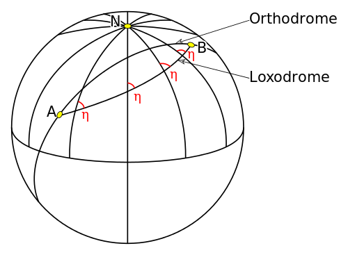

Hornhaut, Linse und Glaskörper des Auges werfen – einer Kamera gleich – ein Bild auf die Netzhaut. In diesem Moment zum Beispiel das Abbild dieser Zeilen, die Sie lesen. Die Netzhaut hat sogleich dieses Abbild an die Großhirnrinde weitergegeben. Dabei wird das Bild in Form elektrischer Signale kodiert. Die Nachbarschaft von zwei beliebigen Bildpunkten auf der Netzhaut bleibt bei dieser Kodierung zunächst auch in der Großhirnrinde erhalten. Wenn sie dieses „ü“ sehen, liegen die ü-Pünktchen auf der Netzhaut nebeneinander und auch noch auf der Großhirnrinde werden diese beiden ü-Pünktchen benachbart repräsentiert.

So wie das Gesichtsfeld zunächst auf die Netzhaut optisch projiziert wird, so wird auch ein Abbild auf die Großhirnrinde neuronal projiziert.

Man sagt auch, auf der Großhirnrinde liegt eine „Karte“ des Gesichtsfeldes, denn genau das resultiert ja aus einer Projektion. Diese Karte in der Großhirnrinde hat ganz ähnliche Eigenschaften wie eine Landkarte die erstmals von einem Kartenmacher im 16. Jahrhundert erfunden wurde. Die Rede ist von Gerhard Mercator und der nach ihm benannten Mercator-Projektion.

## Auf schiefem Kurs leicht ans Ziel

Ziel einer Landkarten-Projektion ist es, die runde Erde auf einer flachen Leinwand darzustellen. Was erstaunlich schwierig und vor allem sehr vielfältig lösbar ist. Mercators Karten waren nicht nur präziser als alle anderen zuvor, sie hatten auch ein Alleinstellungsmerkmal.

Mit Mercators Karten konnte man nach Kompasskurs segeln. Seefahrer konnten mit diesen Karten erstmals unter immer gleichen Winkel, den ihr Kompass anzeigte, die Meridiane schneidend ihr Ziel ansteuern. Diesen Winkel konnten sie leicht aus eben dieser Karte entnehmen.

Sie zogen mit einem Lineal eine gerade Linie von ihren momentanen Ort (den zu bestimmen ein ganz anderes Problem war, nämlich das „Längenproblem“) zu ihrem Ziel. Auf der Erdoberfläche ist dieser Kurs dagegen keineswegs gerade, also nicht die kürzeste Strecke. Der Segelkurs ist eine sogenannte Loxodrome, was aus dem griechischen kommt und einen „schiefen Lauf“ bezeichnet.

Dass der Kompasskurs in Form des Winkels zwischen Loxodrome und Meridian geradezu kinderleicht aus Mercators Karte abzulesen ist, kann man wirklich nur wertschätzen, wenn man weiß, dass eben dies nur mit Mercators Karte damals ging. Ohne das mathematische Verständnis muss dieses herausragende Alleinstellungsmerkmal seiner Karte, das man auch „winkeltreue“ nennt, geradezu magisch wirken.

Die Seereise entlang einer Loxodrome ist also nicht die kürzeste Wegstrecke von A nach B aber der einfachste Kurs unter den damals gegebenen Voraussetzungen. Der kürzeste Weg liegt auf einem Großkreiß oder auch Orthodrome genannt (s. Bild).

Die Frage ist: Wie kam Mercatos Karte ins Gehirn? Denn dort ist sie auch – zumindest in einer verwandten Art.

Was läuft also im Gehirn „schief“ und aus welchen mathematischen Gründen? Ist der Homunculus auch eine Art Sehfahrer, der auf schiefen Kurs leichter ans Ziel kommt?

[-> Fortsetzung.](https://scilogs.spektrum.de/graue-substanz/wie-mercators-karte-ins-gehirn-kam-2/)
