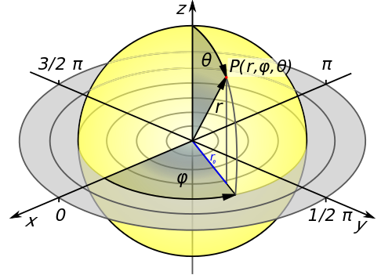

Was bisher geschah: Mercator fand eine praktische Lösung, die Kugel Erde auf einer flachen Karte darzustellen, [wenngleich seine Karte Seefahrer auf einen schiefen Kurs führte](https://scilogs.spektrum.de/graue-substanz/wie-mercators-karte-ins-gehirn-kam-1/). Welche praktische Lösung fand die Natur für ein ähnliches Problem? Und führt sie uns auch auf einen schiefen Kurs?

Wir können zumindest erahnen, dass das Großhirn vor Mercators Problem steht. Wie repräsentiert es das Gesichtsfeld auf seiner Rinde? Das Problem ist zunächst deswegen ähnlich, weil Kugelkoordinaten nicht nur die Erde auf natürliche Weise beschreiben sondern auch unser Gesichtsfeld. Während man vielleicht zuerst an die drei Dimensionen der Kugelkoordinaten denkt, ist schnell klar, dass das verkleinerte und umgekehrte Abbild des Gesichtsfeldes auf der Netzhaut zweidimensional ist. In guter Näherung liegt es auf der Oberfläche einer Kugel, denn die Netzhaut schmiegt sich an die hinteren Hälfte des Augapfels an. Auch hier erscheint wieder die Kugelform.

Mit Gesichtsfeld bezeichnen wir also eine zweidimensionale Kugelfläche, in der die direkte Tiefeninformation aufgrund der Projektion verloren ging. Die zwei Koordinaten sind der Polarwinkel θ oder auch Exzentrizität genannt und der Azimuthwinkel φ. Die verlorene Tiefe bezeichnet man als Koordinate *r* (s. Abbildung, die Blickrichtung wäre hier nach oben in die *z*-Richtung des kartesischen Koordinatensystem (*x,y,z*)).

## Gott liebt *depth cues*

Trotz Projektion ist Tiefeninformation dennoch in dem Gesichtsfeld enthalten. Nicht nur, weil wir zwei Augen haben. Diese Information wird meist überschätzt. Sie ist nur im Nahbereich der Hände signifikant.

Weitere zahlreiche, letztlich indirekte und rein monokulare Tiefeninformation, sogenannte “depth cues”, helfen uns die Tiefe von gesehen Objekten abzuschätzen. Zum Beispiel: Verdeckung, relative Größe, Schatten, Textur, …. Und auch motorische depth cues, wie die Information über die Augenmuskulatur, oder aufgrund der Eigenbewegung die Bewegungsparallaxe.

In der Wahrnehmungspsychologie heißt es Gott liebt Tiefeninformation, SIE gibt uns so viele Hinweise.

> God must have loved depth cues, for She made so many of them.

Einige dieser versteckten depth cues könnten durch eine optimale Wahl der neuronalen Karte des Gesichtsfeldes in der Großhirnrinde wieder sehr einfach extrahierbar sein. Dies ist auch in der Robotik ein spannendes Thema, denn natürlich geht die Tiefeninformation auch bei technischen Kamerasystemen verloren.

## Wie leicht bekomme ich eine Antwort auf die Frage: Wo?

Wo ist ein Gegenstand in der dreidimensionalen Welt, den ich zweidimensional projiziert im Gesichtsfeld sehe? Wie einfach diese Frage zu beantworten ist, hängt einerseits von der Art der vorhandenen depth cues ab aber auch von der Karte, die das Gesichtsfeld verzerrt abbildet und damit depth cues leichter oder schwieriger zugänglich macht! Dass ich die Robotik erwähne ist kein Zufall. Denn bei genauerer Betrachtung basiert das Argument für die letzte Aussage, dass depth cues extrahierbar sein sollen, zunächst auf der Annahme eines auf die Karte schauenden Homunculus, der etwas extrahiert. Darauf kommen ich später zurück.

Zumindest sollte nun klar werden, dass die Natur auf das gleiche Problem schaut, vor dem schon Mercator stand. Zumindest wenn unser Großhirnrinde flach wie eine Leinwand wäre. Mercator suchte eine Karte, um möglichst einfach navigieren zu können. Seine Karte musste die Frage der Seefahrer beantworten, nämlich wo müssen sie langfahren. Wie tief Gegenstände in der dreidimensionalen Welt liegen, ist nicht die gleiche Frage. Doch das Prinzip, dass eine Karte Wo-Fragen auf eine einfache Art beantworten muss, ist das gleiche.

Wir werden erst später wieder auf all diese zentralen, hier zunächst nur angerissenen Punkte – das Homunculus-Problem, ob die Karte selbst auch gekrümmt ist und welche Frage wird von der Karte in welchem Sinn „optimal“ beantwortet – zurückkommen können.

Vorab haben wir Begriffsdefinitionen vor uns, etwas Geschichte und Mathematik. Mit einigen Begriffsdefinitionen endet dieser Beitrag.

## Hemisphären, Halb- und Viertelkugeln

Die Hirnrinde ist natürlich nicht flach. An dieser Stelle will ich jedoch nur darauf hinweisen, dass die Großhirnrinde aus zwei Hemisphären besteht, also „Halbkugeln“. Hier ist offensichtlich nicht die Form gemeint. Wir nehmen die Hirnrinde zunächst als flach an – intrinsisch nicht gekrümmt, um genau zu sein. Das bedeutet, dass sie zumindest flach ausgerollt werden kann ohne Verzerrung der Längen. Dass ist gar keine schlechte erste Abschätzung. Doch soviel sei verraten: Die Natur wird dennoch später aus guten Gründen gezwungen sein, diese Annahme grundsätzlich für die Sehrinde aufzugeben.

Das Gesichtsfeld wiederum ist selbst auch eine Halbkugel. Zumindest fast. Wir können fast bis 90° seitlich sehen und etwa 60°-70° nach oben bzw. unten. In etwa entspricht das einer Halbkugel. Vom Nordpol (auf der *z*-Achse in der Abbildung oben) zum Äquator sind es z.B. genau 90 Breitengrade, die wir als Exzentrizität θ bezeichnen wollen. Meistens reden wir einfach von den Gesichtsfeldkoordinaten, den Azimuth φ, der die Meridiane kennzeichnet, und die Exzentrizität. Zusammen ergeben sie das Paar (φ,θ). Auch wenn wir nicht immer den Hinweis dazu geben, dass es Kugelkoordinaten sind, darf man diese nicht etwa mit den „flachen“ Polarkoordinaten verwechseln!

Das Gesichtsfeld teilen wir dann sinnvollerweise noch in das linke oder recht Gesichtsfeld auf. Das sind Viertelkugeln, die man sich am leichtesten als einen gevierteilten Apfel vorstellt.

Weil es so gerne verwechselt wird, ist es wichtig zu betonen, dass dies nichts mit den beiden Augen zu tun hat. Rechtes und linkes Gesichtsfeld ist eine Unterteilung relativ zu dem zentralen Blickpunkt. Fixieren wir z.B. den Punkt in der nächsten Zeile, liegt das Wort „rechts“  rechts und „links“ und links. Beide Wörter werden dabei auf beide Netzhäute projiziert.

links  •  rechts

Soviel zu den Bezeichnungen, merken sollte man sich, dass Hemisphäre einfach eine Großhirnhälfte meint und dass die Form des Gesichtsfeldes eine Halbkugel ist, die nochmal in rechtes und linkes Gesichtsfeld geteilt wird.

*[→ Fortsetzung Teil 3](https://scilogs.spektrum.de/graue-substanz/wie-mercators-karte-ins-gehirn-kam-3/)*

## 

## Bildquelle

Wikipedia: [Kugelkoordinaten](http://de.wikipedia.org/wiki/Kugelkoordinaten)
