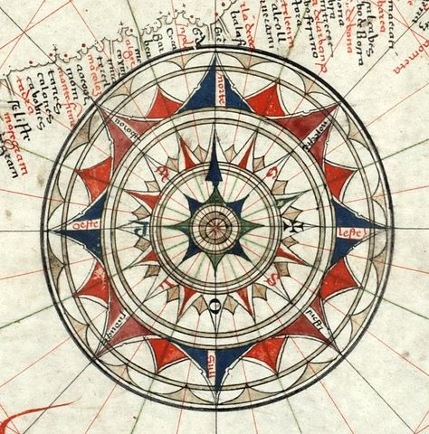
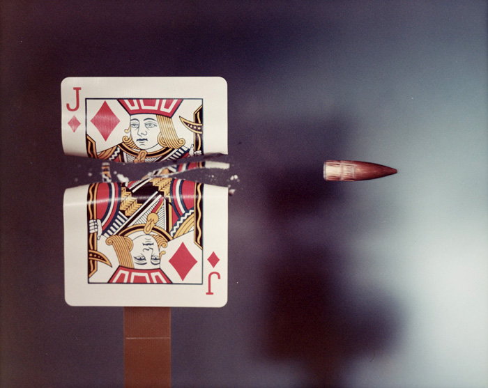

Es gibt verschiedene Methoden etwas über die neuronale Karte des Gesichtsfeldes auf der Großhirnrinde zu erfahren. Im Zentrum stehen zwei verschiedene mathematische Modellansätze. Doch zuvor in paar historische Zusammenhänge. Zur Erinnerung: [wir besitzen zwei Hemisphären des Großhirns und teilten im letzten Beitrag unser Gesichtsfeld in eine linke und rechte Hälfte](https://scilogs.spektrum.de/graue-substanz/wie-mercators-karte-ins-gehirn-kam-2/). Natürlich geschah diese Einteilung als Vorbereitung für das Kommende, denn die beiden Hemisphären des Großhirnrinde haben sich auf jeweils nur eine Gesichtsfeldhälfte spezialisiert.

Die Erkenntnis, dass sich unsere ca. einen viertel Quadratmeter große Hirnrinde überhaupt funktionell spezialisiert hat, kam auf Umwegen. Dass also jeweils kleinere Teilgebiete, Areale genannt, hauptsächlich mit nur einer Funktion beschäftigt sind, zum Beispiel mit dem Sehsinn, Hörsinn, Riechsinn, etc.

## Seelenblindheit links und rechts

Im 19. Jahrhundert erkannte man, dass wenn gewisse Areale der Großhirnrinde, die durch Schlaganfall oder Verletzungen geschädigt oder zerstört wurden, oft nur spezielle sensorische oder kognitive Funktionen ausfielen. Der deutsche Arzt Hermann Munk (1839–1912) nannte es „Seelenblindheit“, wenn die Ursache einer Sehstörung allein in der Großhirnrinde lag und Auge mit Netzhaut sowie deren Sehnerv (soweit erkennbar) völlig in Takt waren. Munk erkannte auch, dass eine partielle Seelenblindheit des nur linken bzw. rechten Gesichtsfeldes in der jeweils gegenüberliegenden Hemisphäre des Großhirns seine Ursache hatte.

## Kopfstand richtig, vorne-hinten falsch

Nachdem klar wurde, dass das Gesichtsfeld durch die beiden Hemisphären des Großhirn in rechts und links geteilt war, versuchte der schwedische Mediziner Salomon Henschen (1847-1930) noch die Himmelsrichtungen der beiden neuronalen Karten des jeweils halben Gesichtsfeldes festzulegen.

Er fand heraus, dass der in links und rechts vom Blickpunkt geteilte Horizont jeweils in einer großen Furche lag (*Sulcus calcarinus*) und dass auf den beiden seitlichen Wänden dieser Furche die zwei Quadranten des halben Gesichtsfeldes lagen. Und zwar auf dem Kopf stehend. Eine partielle Seelenblindheit z.B. im oberen, rechten Gesichtsfeldquadranten lässt folglich auf eine Schädigung auf der unteren Wand dieser Furche (*Gyrus lingualis*) in der linken Hemisphäre schließen. Die obere Wand ist der *Cuneus*.

Der Kopfstand sollte nicht erstaunen, da das Bild auf der Netzhaut ebenfalls auf dem Kopf steht. (Abgesehen davon, dass die Vorstellung eines Homunculus, der sich diese Karte auf dem Kopf stehend anschauen muss, unsinnig ist.)

Um die Karte vollständig einzunorden, musste Henschen noch herausfinden, in welcher Orientierung der Horizont liegt, ob also die horizontale Achse vom Zentrum zur Peripherie des halben Gesichtsfeldes in der Großhirnrinde nach vorne (vom Hinterhaupt zum Vorderhaupt) oder nach hinten zeigt. Henschen nahm letzteres an, dass also das Zentrum weiter vorne liegt (anterior) und die Peripherie des Gesichtsfeldes sich zum Hinterhauptpol legt. Damit lag er genau falsch.

## Vom Schlachtfeld ins Lazarett ins Lehrbuch

Dies wurde erst nach dem 4. Februar 1904 aufgeklärt. Im Russisch-Japanischen Krieg durchlöcherten erstmals kleine Projektile zunächst die Schädeldecke und dann auch die gesuchte Karte.

So erkannten die Lazarettärzte durch die Art der Sehstörung Überlebender die richtige Orientierung der Karte. Wurde nur der der Pol des Hinterhaupts durchschossen, fiel allein das Zentrum des Gesichtsfeldes aus, nicht die Peripherie, wie es Henschen vermutete.

Der japanische Augenarzt Tatsuji Inouye (1880-1976) war einer der Ärzte vor Ort und studierte detailliert die Karte des Gesichtsfeldes. Er ersann Methoden, die stark eingefaltete Karte flach darzustellen und erkannte so nicht nur die richtige Orientierung sondern fand auch heraus, dass das Zentrum deutlich größer repräsentiert ist als die Peripherie. Das heißt, der Maßstab der Karte variiert.

Henschen lag also falsch. Eine seiner anderen Entdeckungen bezüglich der funktionellen Spezialisierung der Großhirnrinde war umso weitsichtiger. Dieses Hirnrindenareal wird uns im Laufe der nächsten Beiträge hilfreich sein. Im Jahr 1919 beschrieb Henschen Dyskalkulie als Beeinträchtigung der mathematischen Fähigkeiten bei Menschen mit Hirnschäden. Im Umkehrschluss sollte es ein oder mehrere Areale in der Hirnrinde geben, die sich auf mathematische Fähigkeiten spezialisierten. Diese braucht es, wenn man die Karte nicht nur einnorden, also drehen und wenden will. Die Wahl des Maßstabes ist die eigentlich zentrale Aufgabe des Kartenmachers. Wie soll der Maßstab kontinuierlich variieren? Die optimale Wahl eines kontinuierlich variierenden Maßstabes war schon der zentrale Vorteil in Mercators Karte. Man entkommt diesem Problem auch nicht, denn ein konstanter Maßstab ist schlicht mathematisch unmöglich.

[→Fortsetzung](https://scilogs.spektrum.de/graue-substanz/wie-mercators-karte-ins-gehirn-kam-4/)

## Bildquellen

Windrose, Jorge de Aguiar 1492, [Wikipedia](http://de.wikipedia.org/wiki/Himmelsrichtung#Die_Windrose)

Jack of Diamonds playing card hit by a .30 calibre bullet, 1970, Dr Harold (Eugene) Edgerton,  
© Massachusetts Institute of Technology, National Media Museum
