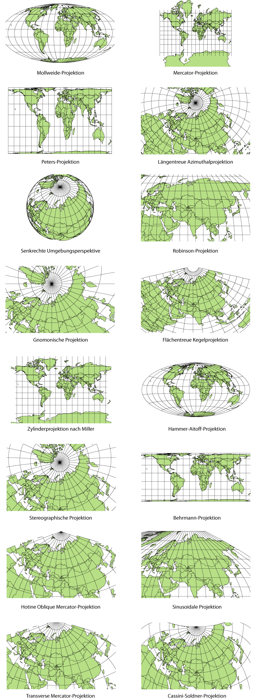
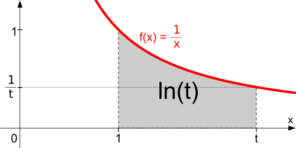

Das Gehirn steht [also](https://scilogs.spektrum.de/graue-substanz/wie-mercators-karte-ins-gehirn-kam-4/) vor der Aufgabe eine Viertelkugel flach abzubilden[.](https://scilogs.spektrum.de/graue-substanz/wie-mercators-karte-ins-gehirn-kam-4/) Welche Gebiete des runden Gesichtsfeldes werden auf der flachen Hirnrinde über- und welche unterrepräsentiert?

Viel kann frei gewählt werden. Die Auswahl der „Kartennetzentwürfe“ (s. Bild) ist unendlich – andererseits: wie immer im Gehirn das Gesichtsfeld neuronal repräsentiert ist, der Maßstab dieser Karte kann nicht konstant sein.

## Wie treu ist das Gehirn?

Es ist gar keine Frage. Natürlich soll das Zentrum des Gesichtsfeldes neuronal überproportional repräsentiert sein. Das Gehirn will gar keinen konstanten Maßstab. Denn im Zentrum können wir besonders scharf sehen. Folglich werden für einen Grad Sehwinkel mehr Gehirnzellen im Großhirn genutzt als für einen Grad Sehwinkel in der Peripherie des Gesichtsfeldes.

Eine flächentreue Karte scheint somit wenig sinnvoll. Man beachte: *flächentreu* kann die Karte sein (z.B. rechts, vierte von oben), nicht jedoch längentreu, was ich oben alternativ als Karte mit konstanten Maßstab bezeichnete. (Das in der Abbildung eine Karte als längentreu bezeichnet wird, ist eher verwirrend. Sie ist längentreu nur entlang bestimmter Linien.)

Die Mercator-Projektion dagegen ist – [wir erinnern uns](https://scilogs.spektrum.de/graue-substanz/wie-mercators-karte-ins-gehirn-kam-1/) – *winkeltreu.* Wichtiger erscheint in diesem Kontext nun, dass sie massiv die Pole vergrößert. Besonders gut sieht man diesen selektiven Lupeneffekt an der enormen Fläche, die die Antakrtis in dieser Karte einnimmt (rechts, obere Abbildung).

Wenn also die Kugelkoordinaten des Gesichtsfeldes so gewählt werden, dass das Zentrum in einem Pol zum liegen kommt, und die Peripherie dementsprechend bis (nahezu) zum Äquator reicht, dann scheint die Mercator-Projektion zumindest schon mal ein gutes Vorbild für die noch unbekannte neuronale Projektion zu sein.

## Für Stäbchen und Zapfen wieviele

## kortikale Gehirnzellen?

Ich erwähnte oben das scharf Sehen. Hier denkt man wahrscheinlich sofort an die Netzhaut und nicht zuerst an die Großhirnrinde (Kortex). In der Netzhaut (Retina) liegen die Stäbchen und Zapfen. Weder Stäbchen noch Zapfen sind anatomisch-funktionell betrachtet Gehirnzellen (Neurone). Beides sind Fotorezeptoren, die Licht aufnehmen und in elektrische Signale umwandeln und diese an Gehirnzellen weitergegen.

Es ist an der Zeit, die von den lateinischen Begriffen *Cortex* und *Retina* abgeleiteten und hilfreichen Adjektive *kortikal* und *retinal* einzuführen. Kortikale Zellen sind also Zellen im Kortex (in der Großhirnrinde). Retinale Zellen liegen in der Retina (in der Netzhaut).

Die Dichte retinaler Sinneszellen ist im Zentrum hoch. Das ist eine notwendige (aber nicht hinreichende) Voraussetzung, um mehr Sinnesdaten verarbeiten zu können, also z.B. um im Zentrum besonders scharf sehen zu können. Ihre Dichte ist hoch im Zentrum relativ zur Peripherie. Genau diese Eigenschaft der Netzhaut – die jedoch *a priori* keine Eigenschaft des Gesichtsfeldes ist (!) – machen wir uns zu nutze, um etwas über die Karte des Gesichtsfeldes im Großhirn zu erfahren.

## Zellgruppen der invertierten Netzhaut

Im 20. Jahrhundert vermaßen Anatome die Zelldichte in der Netzhaut. Dabei zählten sie nicht nur die Fotorezeptoren sondern auch die Gehirnzellen in der Netzhaut, insbesondere die sogenannten Ganglienzellen, die in der *inneren* Schicht der Netzhaut direkt am Glaskörper anliegen. Die innere Schicht ist eine von drei Zellschichten der Netz und sie ist die Ausgangsschicht, da die Rezeptoren an der Rückseite liegen.

Die Netzhaut ist also invertiert, so dass das Licht erst durch die drei Zellschichten durchlaufen muss, bevor sie die Stäbchen und Zapfen erreicht. Das ist nicht allein ein technisches Detail. Es zeigt zum einen, dass es ganz verschiedene Zellgruppen gibt, die für folgende Überlegung in Betracht kommen. Zum anderen entsteht durch die Invertierung die Notwendigkeit den Sehnerv als Fortsatz der Ausgangsschicht einmal durch die Netzhaut zu führen, was zu einem blinden Fleck führt. Wie dieser die Karte beeinflusst, ist eine interessante (spätere) Frage.

## Proporz

Man nimmt nun an, dass die Zelldichte der Ganglienzellen in der Netzhaut ein gutes Maß für die Karte des Gesichtsfeldes im Großhirn ist!

Es ist wichtig sich klar zu machen, dass dies eine Annahme ist. Sie kann falsch sein. Das heißt, obwohl die am Ende vorgestellte Methode datenbasiert ist, kann sie zu einer falschen Aussage über die Karte führen. Denn es ist eine indirekte Methode, die auf dieser Annahme basiert und nicht direkt die Karte vermaßt hat. Diese Annahme ist unter dem Begriff *M-scaling* bekannt, ein Konzept, das einen eigenen Beitrag (später) wert ist, hier jedoch schon genannt werden soll.

Kurz: Hinter dieser Annahme, d.h. der Gültigkeit des Prinzips *M-scaling**,*steckt ein Proporzsystem, worauf das englische Wort „scaling“ schon hindeutet (zum *M* unten mehr). Wendet man M-scaling konkret auf die Zelldichte in der Netzhaut an, besagt es, dass ein Proporz existiert zwischen Zellgruppen in der Netzhaut und deren Repräsentanten im „Entscheidungsgremium“ Großhirn. M-scaling können und werden wir noch vielseitiger geltend machen; das Prinzip ist nicht auf Sinneszellen beschränkt.

Gebiete im Zentrum der Netzhaut, in denen die Zelldichte der Netzhaut hoch ist, werden mit viel Fläche auf der Großhirnrinde repräsentiert, um die hohe Eingangsdichte an Sinnesdaten auch entsprechend neuronal kodieren und weiter verarbeiten zu können. Umgekehrt werden Gebiete weit in der Peripherie des Gesichtsfeldes, die von der Netzhaut mit einer niedrigen Zelldichte erfasst werden, entsprechend auch mit weniger Fläche auf der Großhirnrinde repräsentiert.

## Lupenfaktor im Gehirn vergrößert die Sinne

Man definiert nun einen kortikalen Vergrößerungsfaktor und bezeichnet diesen mit dem Buchstaben *M* für „*magnification*“. Diese Definition führt dann auch zu dem vorher beschrieben Proporzsystem. Der Vergößerungsfaktor *M* bezieht sich aber auf die Vergrößerung des Sehwinkels. Es ist also gerade nicht gemeint, auf viele kortikale Gehirnzellen eine retinale Zelle kommt. Auch hier gibt es einen Faktor, nennen wir ihn den RK-Faktor. Soweit mir bekannt liegt der RK-Faktor bei etwa 3-5, d.h. ungefähr eine Handvoll kortikaler Gehirnzellen pro retinaler Ganglienzelle.

Da dies wichtig ist, noch mal anders ausgedrückt. Wenn wir zuvor die Gültigkeit des Prinzips M-scaling für retinale Zellen annehmen, behaupten wir, dass der RK-Faktor konstant im gesamten Gesichtsfeld ist. Denn *M* gibt (per Definition) an, wie Sehwinkel im Gesichtsfeld kortikal vergrößert werden. Der Vergrößerungsfaktor *M* ist folglich nichts anders als das, was man sonst den Maßstab einer Landkarte nennt. Dass gilt insbesondere auch dann noch, wenn der Proporz zwischen Zellen nicht gilt, also das Prinzip M-scaling der retinalen Zelldichte verletzt ist. Wenn das Prinzip allerdings nicht verletzt ist (und somit der RK-Faktor konstant ist), können wir die Karte aus der retinalen Zelldichte eindeutig berechnen unter der weiteren und bisher immer stillschweigenden weil guten Annahme auch die kortikale Zelldichte in der Sehrinde konstant ist.

Das klingt kompliziert. Deswegen berechnen wir die Karte jetzt einfach. Meist wird bei dieser Rechnung klar, was gemacht wird und welche Annahmen dahinter stecken.

## Karte als Stammfunktion der Dichte

Wenn man die neuronale Karte als Funktion des Ortes *x* der Netzhaut (oder des Gesichtsfeldes, was hier das gleiche ist) zu einem Ort *y* auf der Großhirnrinde ansieht, ist der Vergrößerungsfaktor *M* die Ableitung dieser Funktion *y=f(x)*. *M* ist also Maßstab, Steigung oder Vergrößerungsfaktor. Alles nur Namen für eine mathematische Prozedur, nämlich die Ableitung *M(x)=f'(x)*.

Man kommt in drei Schritten zur neuronalen Karte des Gesichtsfeldes: (1) man misst eine Zelldichte an verschiedenen Orten auf der Netzhaut, (2) geht davon aus, dass diese Dichte proportional zum Vergrößerungsfaktor *M* ist, (3) integriert diese gemessene Dichtefunktion. So erhält man eine Gleichung für die Karte.

Die Zelldichte ist hoch im Zentrum. Das Zentrum wählen wir ohne Beschränkung der Allgemeinheit bei *x*=0. Die Zelldichte sinkt dann ab zur Peripherie. Es stellt sich heraus, dass die Zelldichte in sehr guter Näherung umgekehrt Proportional zu der Entfernung des Zentrums des Gesichtsfeldes abnimmt, also in etwa wie 1/*x* (s. Abbildung). So kommt man auf den Logarithmus als Stammfunktion von 1/*x*.

Die Funktion *log(x)* ist ein datengetriebes Modell der Karte, eine idealisierte Version der Rohdaten, die man aus der unmittelbaren Beobachtung gewonnen hat unter der zusätzlichen Annahme, dass die retinale Zelldichte ein Maß für die Karte ist.

Vielleicht fällt es jemanden sofort auf, dass das Zentrum bei *x*=0 nicht mehr in der Karte liegt. Genau wie der Nord- und Südpol nicht in Mercators Karte liegt. Für Seefahrer keine Problem. Für den Homunculus als Sehfahrer aber ein großes. Auf dieses Problem schauen wir erst nachdem wir die zweite Methode beleuchtet haben. Denn vielleicht ist es jemanden aufgefallen, wir haben bisher nur eine eindimensionale Netzhaut und ein eindimensionales Großhirn betrachtet. Was ändert sich, wenn wir zweidimensional werden?

[[→ Fortsetzung](https://scilogs.spektrum.de/graue-substanz/wie-mercators-karte-ins-gehirn-kam-6/)]

## Bildquelle

Wikipedia: [Kartennetzwürfe](http://de.wikipedia.org/wiki/Kartennetzentwurf) und [Logarithmus](http://de.wikipedia.org/wiki/Logarithmus)
