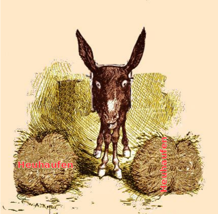

> Es gibt eine alte Parabel über Buridans Esel: Ein Philosoph names Buridan besaß einen Esel. Eines Tages legte der Philosoph – im Begriff mehrere Tage zu verreisen – zwei gleichgroße Haufen Heu vor den Esel; den einen rechts, den anderen links. Der Esel konnte sich nicht entscheiden, mit welchen Bündel er beginnen sollte zu fressen – und verhungerte.1

## Symmetrie und Treue

Symmetrie beschränkt sich nicht auf Heuhaufen. (Oder allgemein auf Gegenstände.) Auch mathematische Gleichungen, zum Beispiel in Form von Kartenprojektionen, können Symmetrien besitzen. Die Symmetrie ist dann zwar nicht unbedingt auf der Karte unmittelbar zu sehen. Doch äußert sich die Symmetrie durchaus anschaulich darin, welche Eigenschaften von Objekten in der Karte „[treu](https://scilogs.spektrum.de/graue-substanz/wie-mercators-karte-ins-gehirn-kam-5/)“ repräsentiert sind. Mercators Karte ist z.B. winkeltreu.

Wie Symmetrie in mathematischen Gleichungen formal auftritt, ist zwar nicht so *anschaulich* wie wir es von symmetrischen Objekten gewohnt sind oder wie sie sich auch in treuen Abbildungen abzeichnet. Doch Symmetrie in Gleichungen ist auch nicht wirklich schwierig zu verstehen. Zumindest gibt es einfache Beispiele. In der Physik spielt Symmetrie in Gleichungen eine fundamentale Rolle, um die vier Grundkräfte zu erklären. Wobei diese Beispiele durchaus sehr kompliziert sind. Unser einfaches Beispiel ist natürlich die mathematische Gleichung der Kartenprojektion vom Gesichtsfeld zur Großhirnrinde, die im letzen Beitrag hergeleitet wurde.

Dort, [im letzten Beitrag,](https://scilogs.spektrum.de/graue-substanz/wie-mercators-karte-ins-gehirn-kam-5/) haben wir die Kartenprojektion über ihren Vergrößerungsfaktor und gewissen Annahmen zur Zelldichte in der Netzhaut bestimmt. So stießen wir auf die Funktion

*y*=log(*x*).          (1)

Dabei ist *x* eine Ortskoordinate im Gesichtsfeld (oder auf der Netzhaut, [die Koordinatessysteme sind identisch](https://scilogs.spektrum.de/graue-substanz/wie-mercators-karte-ins-gehirn-kam-2/); ich wechsel zwischen Netzhaut und Gesichtsfeld hin und her, je nach dem, was mir gerade einfacher erscheint).

Mit *x* wird der Abstand vom Zentrum des Gesichtsfeldes gemessen; bei *x*=0 ist das Zentrum, bei x≈90° ist die Grenze des Gesichtsfeldes erreicht. Die Koordinate *y* bezeichnet einen Ort auf der Großhirnrinde.

## Von Linien zu Flächen

Nun sind *x* und *y* eindimensionale (1D) Koordinaten von Netzhaut bzw. Großhirnrinde. 1D heißt, es wird die Position entlang *einer* Linie bestimmt. Zum Beispiel kann *x* die Position entlang des Horizontes bestimmen. Die 1D Koordinate *y* dagegen könnte dann entlang des steilsten Abstieges einer Hirnfurche gewählt werden und *y*=0 am Eingang zur Furche. [Wobei wir uns zunächst die Karte flach vor uns liegend vorstellen](https://scilogs.spektrum.de/graue-substanz/wie-mercators-karte-ins-gehirn-kam-4/), was nichts weiter bedeutet, als dass wir die Lage von *y* in der „leeren“ Karte zunächst frei wählen dürfen.

Eine eindimensionale Koordinate bestimmt nun nicht *alle* Positionen auf einer zweidimensionalen Fläche. Dazu brauchen wir zwei Dimensionen (2D), also eine Kartenprojektion der Form: Netzhaut → Großhirnrinde: (*x*1,*x*2) ↦ (*y*1,*y*2).

## Wie von 1D zu 2D verallgemeinern?

Die zwei Dimensionen führen zu einem ähnlichen Problem, vor dem auch Buridans Esel stand als er zwei Haufen Heu hungrig betrachtet. Die Kartenprojektion ist etwas komplizierter, denn die Symmetrie, mit der der Esel nicht klar kam, war diskret (zwei diskrete Objekte), die der Karte werden kontinuierliche Symmetrien sein.

Eine erste (naive) Idee könnte folgende Projektion sein

(*y*1, *y*2)= log((*x*1, *x*2))≡( log(*x1*), log(*x2*) ).         (2)

Wir „überladen” die Funktion des Logarithmus. Das heißt, wir stecken in die Funktion nicht einen einzelnen Wert *x* rein sondern ein Tupel (*x*1,*x*2), also zwei Koordinaten, und wir bekommen auch zwei Koordinaten (*y*1,*y*2) wieder heraus. Wir werden solch eine Überladung später nochmal mit komplexen Zahlen wiederholen. Deswegen lohnt es sich vorab genau zu überlegen, was dabei eigentlich passiert.

## Nicht nur Esel kann man überladen

Vielleicht kommt das denjenigen bekannt vor, die schon mal mit Programmiersprachen wie Matlab gearbeitet haben. Solche Programmiersprachen nutzen gerne aus, Funktionen zu überladen. Dies macht das Erlernen der Sprache deutlich einfacher. Gleichzeitig muss man vorsichtig sein. Hier lauern Gefahren. Denn es ist nicht eindeutig, welche Funktion gemeint ist, wenn man eine im Reellen bekannte Funktion überlädt.

Wir führen oben eine neue Funktion log((*x*1,*x*2)) ein, von der wir also sogleich sagen müssen, was diese bedeutet. Naheliegend wäre eine Überladung, bei der die Operation einfach individuell für jeden Wert der beiden im Tupel (*x*1, *x*2) durchgeführt wird, also in dem konkreten Fall den Logarithmus einfach individuell zu ziehen, d.h. (log(*x1*),log(*x2*)).

Das kann man so machen. Die eigentliche Frage ist aber eine andere. Ist Gleichung (2) die richtige Verallgemeinerung, also die richtige Übertragung in 2D für eine Kartenprojektion vom Gesichtsfeld zur Hirnrinde, basierend auf der Projektion in 1D, die wir im letzten Beitrag als Gleichung (1) hergeleitet haben?

[**→*Fortsetzung*](https://scilogs.spektrum.de/graue-substanz/wie-mercators-karte-ins-gehirn-kam-7/)

## 

## Fußnoten

1 „Symmetrie, Symmetrie!“ von L. Tarassow, Spektrum Akademischer Verlag, 1993.

## Bildquelle

Wikipedia: modifiziert nach [New York Herald (Credit: The Granger Collection, NY)](http://commons.wikimedia.org/wiki/File:Deliberations_of_Congress.jpg) | public domain
