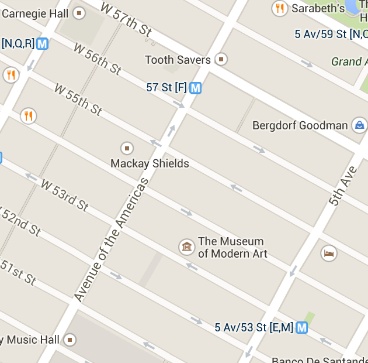
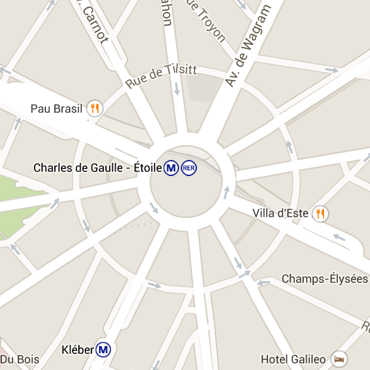

Manhattan ist kartesisch, also rechtwinkelig und geradelinig.

Koordinatensysteme sind regelmäßige Netze, mit deren Hilfe man die gekrümmte Fläche der Erde auf eine flache Karte überträgt. Regelmäßige Netze taugen gleichzeitig zur einfachen Positionsangabe. (Solche Netze nennt man auch Gitter, bleiben wir aber bei Netz.) Das Straßennetz von Manhattan ist so ein Koordinatensystem. Dem etwas abstrakten Teil dieses Beitrages kann man vielleicht leichter folgen, wenn man zwischendurch an so ein und auch an andere Straßennetze denkt.

Hier reicht die Angabe von zwei Zahlen, um eine Positionen eindeutig zu bestimmen, z.B. einen Treffpunkt Ecke 10th Avenue und West 44th Street. Avenuen und Streets stehen in Manhattan wie zwei rechtwinklige Koordinatenlinien senkrecht aufeinander. Ein anders Beispiel ist das Straßennetz rund um den Place Charles de Gaulle. Dort stehen die 12 Avenuen senkrecht auf der Rue de Presbourg bzw. der Rue de Tilsitt, die beide den Platz umrunden. Diese Rues sind also krummlinig.

## Manhattan oder Paris?

Bei der [Herleitung der Kartenprojektion *y*=log(*x*)](https://scilogs.spektrum.de/graue-substanz/wie-mercators-karte-ins-gehirn-kam-5/) lag weder dem Gesichtsfeld noch der Großhirnrinde ein Koordinatensystem zugrunde. Denn die Projektion war eindimensional von *x* nach *y*. Da brauchte man kein Netz. Im letzen Beitrag haben wir versucht, diese Kartenprojektion auf eine Fläche zu verallgemeinern, von Punkten auf der Netzhaut, die wir mit (*x*1,*x*2) bezeichneten, zu Punkten auf der Großhirnrinde, die wir mit (*y*1,*y*2) bezeichneten. Dabei haben wir uns allerdings keine Gedanken über die Koordinatensystem gemacht. Also ob Zahlenangaben der Form (*x*1,*x*2) sich wie die Straßen in Manhattan oder wie die in Paris verhalten und wie dies bei (*y*1,*y*2) ist.

Daher musste der Ansatz schief gehen. Im Gesichtsfeld und in der Großhirnrinde können wir die Koordinatensystem wie Stadtplaner wählen. Manhattan nennen wir kartesisch (das kommt von René Decartes nicht von Karte), Paris ist polar. Nach welchen Kriterien wählen wir nun die Koordinatensysteme sowohl im Gesichtsfeld als auch in der Großhirnrinde? Das Kriterium ist Einfachheit. Das heißt, wir wollen die Verallgemeinerung der Kartenprojektion *y*=log(*x*) von 1D nach 2D möglichst einfach aufschreiben können. Und das ist das einzige Kriterium.

Vom Place Charles de Gaulle laufen die Avenuen wie Meridiane.

Holen wir zunächst nochmal drei Paragraphen lang aus zur Erinnerung: Die Herleitung der Kartenprojektion *y*=log(*x*) nutzte experimentelle Daten über die Zelldichte in der Netzhaut entlang einer radial vom Zentrum nach außen verlaufenden Linie. Diese Linien nennen wir auch die Meridiane der Netzhaut bzw. des Gesichtsfeldes. Mit *x* bezeichneten wir den Abstand auf einem Meridian vom Zentrum ausgehend, also die Position oder besser noch die *Koordinate* auf Meridianen. Wir können auch an Hausnummern bei Straßen denken.

Da die Zelldichte näherungsweise wie die Funktion *1/x* abfiel und weil wir einen Proporz zwischen Zellen in der Netzhaut und Hirnrinde (deren Koordinate mit *y* bezeichnet wurde) annahmen, ist die gesuchte Kartenprojektion *y*=log(*x*), denn das ist die Stammfunktion der Dichte 1/*x*. Dass wir die Stammfunktion suchten, folgte aus dem Proporz, der im Prinzip die Ableitung der Karte beschreibt. Die Kartenprojektion *y*=log(*x*) ist also zwar ein datengetriebenes Modell aber mit einer zusätzlichen Proporz-Annahme. Das Modell basiert also auf keiner direkten Messung.

Das war der [vorletze Beitrag](https://scilogs.spektrum.de/graue-substanz/wie-mercators-karte-ins-gehirn-kam-5/) zusammengefasst. Im [letzten Beitrag](https://scilogs.spektrum.de/graue-substanz/wie-mercators-karte-ins-gehirn-kam-6/) haben wir dann diese Beschreibung entlang einer Koordinate (Linie, 1D) ansatzweise versucht auf zwei Koordinaten (Fläche, 2D) zu übertragen. Um diesen Ansatz korrekt durchzuführen, schauen wir jetzt auf die eingangs gestellt Frage.

## Ein *x* für ein θ vorgemacht

Wäre Buridans Esel selbst dann verhungert, wenn Buridan einen der beiden Heuhaufen gedreht hätte?

Diese Frage kann und muss nun mathematisch formuliert werden. Schwer ist das nicht. Noch etwas leichter wird es, wenn ich oben (und in den letzten zwei Beiträgen) statt einem *x* ein θ in der Kartenprojektion *y*=log(*x*) geschrieben hätte. Die Bezeichnung “*x*” war zwar naheliegend doch auch inkonsequent, hatten wir doch längst [zuvor](https://scilogs.spektrum.de/graue-substanz/wie-mercators-karte-ins-gehirn-kam-2/) die zwei Kugelkoordinaten (φ,θ) des Gesichtsfeld eingeführt, also den Azimuth φ und die Exzentrizität θ. Die dritte Kugelkoordinate, der Radius *r*, der die räumliche Tiefe beschreibt, geht durch die Projektion verloren.

Solange ich nur auf eine Avenue (1D) schaue, ist es egal ob diese in Manhattan oder Paris liegt. Von dem Flair abgesehen. Schaue ich auf ein Netz von Straßen bzw. Koordinatenlinien, wird es wichtig, ob die Avenuen parallel laufen oder strahlenförmig von einem Zentrum ausgehen. Die anderen Straßen würden dementsprechend auch geradlinig sein (Manhattan mit seinen Streets) bzw. krummlinig verlaufen (Place Charles de Gaulle mit seinen zwei Rues), wenn die Straßen sich rechtwinkelig schneiden.

Die Wahl des Koordinatensystems im Gesichtsfeld fällt natürlich auf Paris – wobei das nicht ganz stimmt; (φ,θ) sind Kugelkoordinaten und nicht Polarkoordinaten, eine Unterscheidung, um die wir uns nicht kümmern.

Die Wahl ist “natürlich” in dem Sinne, dass sie alles Folgende leichter macht. Wir können zum Beispiel das Wort Heuhaufen beliebig drehen, in dem wir es entlang verschiedener Meridiane schreiben. Diesen Drehwinkel nennen wir ja gerade den Azimuth, er ist also eine Koordinate. Hingegen ist Drehen mit kartesichen Koordinaten eher umständlich, aber unter Verwendung von Cosinus- und Sinus-Funktionen selbstverständlich auch möglich.

Blicken wir jeweils auf das „H“ in Heuhaufen, liegt das „euhaufen“ einmal auf dem rechten horizontalen Meridian und einmal auf dem oberen vertikalen Meridian unseres Gesichtsfeldes.

Der Azimuth φ verhält sich, wenn wir ihn um jeweils 30° hochzählen, wie die zwölf Avenuen in Paris (12 · 30° = 360°). Mit φ wählen wir also einen Meridian aus, z.B. bei φ=0° den Horizont und bei φ=±90° die vertikalen Meridiane des Gesichtsfeldes. Da wir nur das halbe Gesichtsfeld betrachten, sind übrigens die vertikalen Meridiane die Ränder der Karte.

Mit der Exzentrizität θ wählen wir den Abstand vom Zentrum. Und genau dieses θ wurde vor zwei Beiträgen zunächst zum *x*. Das geschah aus Bequemlichkeit und in der Hoffnung, niemand stört sich daran. Es geschah gleichzeitig nicht ganz grundlos. Ableitung und Stammfunktion lernen wir schon in der Schule mit eben jener Schreibweise f(*x*) für Funktionen. Ich fürchtete f(θ) könnte ungewohnt aussehen und in 1D ist die Wahl völlig egal – letzteres sich klar zu machen, ist vor allem auch lehrreich.

Die Exzentrizität verhält sich wie die Rue de Presbourg bzw. die Rue de Tilsitt. Beide haben den gleichen Abstand vom Zentrum, also gleiche Exzentrizität, von lat. „ex centro“ (aus der Mitte). Wir können uns leicht weiter Kreise mit größerer Exzentrizität vorstellen (runde Straßen, die es um den Place Charles de Gaulle allerdings nicht gibt).

Lassen wir die Straßen nun langsam beiseite. Zunächst benennen wir die Gleichung (1) aus dem letzten Beitrag einfach um

*y*=log(θ).          (1a)

Nichts hat sich bis hierhin geändert. Wenn nun sogleich Kugelkoordinaten in 2D genutzt werden, dann erscheint die Verallgemeinerung auf Gleichung (2, [letzter Beitrag](https://scilogs.spektrum.de/graue-substanz/wie-mercators-karte-ins-gehirn-kam-6/)) nicht mehr so sinnvoll. In der neuen Schreibweise lautet diese nämlich:

(*y*1, *y*2) = ( log(φ), log(θ) ) **???**         (2a)

Warum erscheint das nicht sinnvoll? Die Meridiane haben wir bei der Bestimmung der Zelldichte in der Netzhaut nicht getrennt betrachtet und d.h. bei festgehaltener Exzentrizität θ=θkonstant sollte die Kartenprojektion nicht von der Koordinate des Meridians φ anhängen. Tut sie aber: *y*1 = log(φ). Hier werden nicht alle Meridiane gleich behandelt! Wir haben stattdessen die beiden Scharen der Koordinatenlinien gleichbehandelt.

Wir dürfen nicht die Meridiane unterscheiden. Das ist eine Annahme, die wir bei der Datenerfassung gemacht haben. Sie könnte falsch sein. Wenn wir jedoch Zelldichte entlang verschiedene Meridiane messen und dann darüber mitteln, machen wir genau diese Annahme und müssen zunächst dabei bleiben, denn wir suchen ja ein datengetriebenes Modell.

Somit könnte unsere nächste (immer noch naive!) Idee sein, eine Funktion der Form

(*y*1,*y*2*)*= (φ, log(θ) )          (3)

zu wählen.

Die Exzentrizität θ entlang aller Meridiane wird unterschiedslos logarithmiert, so wie es die Zelldichte in der Netzhaut und der Proporz an Zellen in der Großhirnrinde vorgibt. Es werden also alle Meridiane gleich behandelt – eine Symmetrie wie bei den Heuhaufen.

Das Wort „Heuhaufen“ sieht dann in der Hirnrinde immer gleich aus, wenn wir auf das „H“ gucken, es also im Zentrum liegt, unabhängig, wie das Wort um „H“ gedreht wird. Etwa so (der Größenabfall ist unten leider eher linear und nicht logarithmisch):

Heuhaufen

Heuhaufen

Die beiden roten Wörter „Heuhaufen“ werden also gleich in der Großhirnrinde durch die Kartenprojektion abgebildet. Es ist egal, dass das eine Wort hochkant steht, also entlang des vertikalen Meridians ausgerichtet ist. Um es nochmal zu betonen: das ist die Annahme, die wir gemacht haben, um auf die Kartenprojektion *y*=log(*x*) in 1D zu kommen und bei der Verallgemeinerung zu 2D müssen wir zunächst dabei bleiben, da sich ja die Datenlage dadurch nicht ändert hat.

Der Esel verhungert trotzdem nicht! Der Mathematiker Augustin-Louis Cauchy wird ihn retten. Ein Hinweis zum Nachdenken bis zum nächsten mal. Liegen (*y*1,*y*2) in Paris oder Manhattan? Das haben wir immer noch nicht festgelegt!

*Fortsetzung folgt …*
