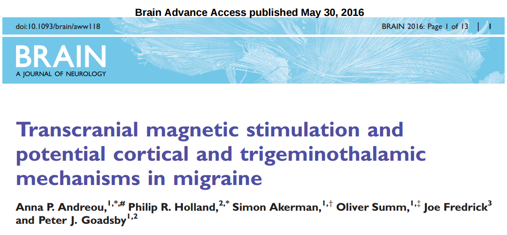
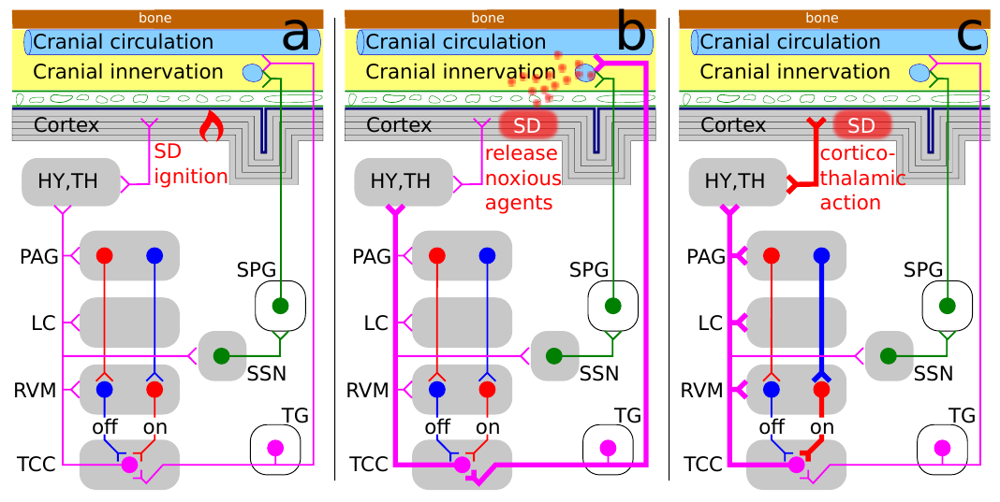

Anfang 2002 bekam der Migräneforscher Edward Chronicle (1966 -2007) von der britischen Stiftung Dr. Hadwen Trust für tierversuchsfreie Forschung £102,000. Mit diesem Geld sollte er etwas damals ungewöhnliches tun. Er sollte mit Magnetfeldern Migräne erforschen. Können Magnetfelder aufklären, was im Migränegehirn schiefläuft? In der Tat gelang es ihm, zu dieser Frage etwas beizutragen. Aber die Bedeutung seiner Forschung geht darüber hinaus. Edwards diagnostische Fragestellung war letztlich vor allem eine Brücke: Von der Grundlagenforschung führt sie über die Diagnostik zu neuen Formen der Migränetherapie.

## Migränegehirn mit TMS diagnostizieren

Magnetfelder durchdringen leicht Kopfhaut, Schädeldach, Hirnhaut und angekommen in der Großhirnrinde stimulieren sie Gehirnzellen, indem elektrische Ströme über die Zellmembran induziert werden. Diese Technik heißt transkranielle Magnetstimulation, kurz: TMS. (transkraniell = »den Schädel hindurch«)

TMS wurde seit den 1980er eingesetzt, zunächst in der Grundlagenforschung. Magnetfelder in der Großhirnrinde können Muskeln, zum Beispiel in den Fingern, zucken lassen oder auch Lichtwahrnehmungen erzeugen. Das hauptsächliche Interesse galt Anfangs der Größe der magnetischen Flussdichte (in der Einheit Tesla) als Schwelle, mit der man gerade noch solche Phänomen hervorrufen konnte.

Edward wollte Anfang der 2000er Jahre TMS zur Diagnose nutzen. Reagiert das Migränegehirn anders auf einzelne Magnetfeld-Pulse (single-pulse TMS) als es ein normales Gehirn tut? Ja, das tut es. Es reagiert schon auf geringere magnetische Flussdichte. Muskelzucken oder Wahrnehmungsstörungen werden also leichter hervorgerufen. Eigentlich rechtfertigt diese objektiv gemessene Überanregbarkeit erst im Nachhinein den Begriff »Migränegehirn«. Erwähnen sollte man allerdings, dass solche Nachweise nicht allein mit TMS gelangen. Wichtiger sind Studien einzuschätzen, die mit sensorischen Reizen und anschließenden elektrischen Messungen an der Kopfhaut das »Migränegehirn« durch besondere Erwartungspotenziale offenbaren. Aber das nur am Rande.

## TMS und Computermodelle – es kam anders

Mithilfe der magnetischen Pulse sah Edward quasi einen Schnappschuss des Verhaltens des Migränegehirns in der anfallsfreien Zeit. Er sah keinen Verlauf über die Zeit. Doch gerade der Zeitverlauf ist interessant, da das »Migränegehirn« ja nicht dauerhaft, sondern in wiederkehrenden Episoden die Krankheitssymptome zeigt. Die meiste Zeit – zum Glück – verhält es sich vielleicht nicht völlig normal, wie die Versuche mit TMS zeigten, aber doch zumindest symptomfrei, das heißt ohne Kopfschmerzen und ohne neurologische Reiz- oder Ausfallerscheinungen.

Edward und ich schrieben daraufhin 2004 gemeinsam [einen Übersichtsartikel](http://www.sciencedirect.com/science/article/pii/S0301008204001789). Denn uns beide trieb die gleiche Frage um. Kann unsere Forschung zusammengeführt werden, also können seine experimentellen Ergebnisse zur TMS-Forschung und meine theoretischen Arbeiten über Computermodelle der Migräne gemeinsam helfen, den zeitlichen Verlauf der Entstehung von Attacken besser zu verstehen?

In meiner Dissertation, die ich vier Jahre zuvor abgeschlossen hatte, beschrieb ich eine mathematische »Bewegungsgleichung«. Solch eine Formel reiht Schnappschüsse lückenlos aneinander, zumindest Computer können dies tun und so die Gleichung lösen. Doch eine [Migräneformel](https://www.youtube.com/watch?v=Aj7buaAViqY) muss man »parametrisieren«.  Das heißt, für die Beschreibung der Gehirnaktivität werden Parameter benötigt, die in einem bestimmten [Parameterfenster der Anregbarkeit frei gewählt wurden](http://onlinelibrary.wiley.com/doi/10.1002/andp.200410087/abstract), so dass eine Keimbildung (auch Nukleation genannt) modelliert wird. Mit dieser Keimbildung sollte der Entstehungsprozess einer Attacke im Computermodell nachgebildet werden. Wir fragten uns dabei, ob die nötigen Parameter durch Edwards TMS-Forschung empirisch gefunden werden können?

*Fast forward*: Erst neun Jahre später zeigten wir, dass Keimbildung wirklich ein entscheidender Teilprozess in der Großhirnrinde sein kann, den wir mittlerweile Dank neuer [Computersimulationen gut verstehen](http://mathematical-neuroscience.springeropen.com/articles/10.1186/2190-8567-3-7). Viele Forscher, mich eingeschlossen, glauben, dass die Keimbildung nicht wirklich der erste Prozess ist, der die Migräneattacke einleitet. Mittlerweile haben wir noch früher einsetzende, [dynamisch-vernetzte Biomarker](http://cep.sagepub.com/content/35/7/627) über Computermodelle definiert. Trotzdem erklärt die Keimbildung viel, nämlich nicht nur die Entstehung der Symptome, sondern eventuell auch eine mögliche Wirkungsweise von TMS in der Akuttherapie gegen Migräne. Wie so oft in der Forschung kam es also anders: TMS lieferte nicht die Parameter für die Migräneformel, sondern die Migräneformel lieferte Parameter für TMS gegen Migräne und liefert somit zugleich eine mögliche Erklärung für die Wirkung dieser Therapiemethode.

## Elektrozeutika ersticken Migräne im Keim

Das ist nämlich nochmal die viel bedeutendere Frage: können wir mit einzelnen Magnetfeld-Pulsen die Entstehung der Attacken verhindern? Also nicht diagnostizieren, sondern therapieren? Es muss nicht ein einzelner Magnetfeld-Puls sein. Vielleicht könnte es eine bestimmte digitale Serie von Pulsen sein, die hilft? Liefert unsere Migräneformel vielleicht eine präzise Anleitung, wie man die Entstehung der Migräneattacken mit magnetischen Feldern im Keim erstickt?

Wie sähe so eine Anleitungen aus? Es wäre im Prinzip ein Stimulationsprotokoll. Wobei solche Protokolle einen [geschlossenen Regelkreis aus Messen und Stimulation](http://grantome.com/grant/NIH/R01-EB014641-01) beschreiben können. In Analogie der Benennung chemischer Verbindungen als Pharmazeutika nennt man solche therapeutischen Steuerungstechniken *Elektrozeutika*.

Wir haben Rauschen (genauer: transcranial random noise stimulation, kurz: tRNS) als [Elektrozeutikum vorgeschlagen, um die Lebenszeit eines Keims zu reduzieren und damit die Symptome einer Migräneattacke mit Aura](http://scitation.aip.org/content/aip/journal/chaos/23/4/10.1063/1.4813815). Dieses tRNS-Elektrozeutikum würde also nur akut in der Auraphase aktiv wirken – aber die Wirkung entfaltet sich dann auf die anschließende Kopfschmerzphase und kann Kopfschmerzen lindern. Außerhalb der Auraphase eingesetzt, kommt es hingegen zu keiner Entfaltung. Über individuelle Computersimulation postulierten wir zudem [personalisierte Elektrozeutika als Prophylaxe bei Migräne mit und ohne Aura](http://journal.frontiersin.org/article/10.3389/fncom.2015.00029/full), die einem anderen Wirkmechnismus nachgehen.

## TMS gegen Migräne ohne Aura

Die neusten Forschungsergebnisse anderer Forschergruppen weisen nun aber nochmal in eine neue Richtung [1]. Es geht wieder um die Aktuttherapie, aber nun um die Aufklärung des Wirkmechnismus des ursprünglichen single-Puls TMS bei Migräne *ohne* Aura.

Das ist erstmal sehr praktisch. Denn der tragbare Stimulator, der heute klinisch getestet wird, muss nicht verändert werden, bekommt aber eine vier bis fünffach höhere Zielgruppe von Betroffenen, die von dieser Therapieform angeblich profitieren werden. Da sollte man erwähnen, dass die Studie von der Herstellerfirma finanziert wurde. Es wäre also gut, wenn sich die Ergebnisse nochmal unabhängig bestätigen lassen. Übrigens: Ein weiteres US-amerikanisches Medizintechnik-Unternehmen hat noch für knapp sechs Monate – in dieser Zeit wird solch eine Bestätigung wohl kaum erfolgen – eine [Kaufoption für die Herstellerfirma für 65 Millionen US-Dollar](http://www.baltimoresun.com/business/bs-bz-eneura-20150406-story.html).

## Wirkungsort im Zwischenhirn

Für plausibel halte ich die Ergebnisse. Denn das Argument ist denkbar einfach: Magnetfelder, die Kopfhaut, Schädeldach und Hirnhaut durchdringen, enden ja nicht einfach in der Großhirnrinde, dem ursprünglich angedachten Wirkungsort. Sie dringen natürlich auch noch weiter in das Zwischenhirn vor. Der Thalamus bildet den größten Teil des Zwischenhirns. Die neue Studie spekuliert nun genau auf diesen Wirkungsort, eine Interaktion im Zwischenhirn. Das Zwischenhirn verbindet Großhirn mit dem Hirnstamm. Dort, im Hirnstamm, treffen Schmerzsignale ein. Diese Interaktion zielt auf bestimmte, vermittelnde Gehirnzellen in den Schaltstellen der Schmerzleitung (sog. opioiderge Interneurone). Auch hier spielen wieder Computermodelle eine Rolle, die in Form eines Migräne-Generator-Netzwerkes formuliert werden und Anleitungen für Elektrozeutika liefern (siehe Abbildung unten).

Das Migräne-Generator-Netzwerk. (a) Entzündung eines Keims, (b) Schmerzentstehung und (c) Schmerzaufrechterhaltung, aus: [Encyclopedia of Computational Neuroscience](http://link.springer.com/referenceworkentry/10.1007%2F978-1-4614-7320-6_507-6), Springer, Autor: Markus Dahlem

## Wirknachweis: gehoffte Wirkungen überprüfen

Der nächste Schritt ist nun klar. Es wird wieder zurück zur ursprünglichen Idee von Edward Chronicle gehen, zurück zur objektivierenden Diagnostik mittels TMS oder auch anderen Methoden, um den Wirkungsgrad zu messen. Was ist der langfristige medizinische Therapiererfolg – der Outcome? Das ist die zentrale Frage.

Elektrozeutika, insbesondere tRNS-Elektrozeutika, verändern nämlich das Gehirn. Ziel wird es irgendwann zumindest mal sein, das Migränegehirn umzuprogrammieren – ohne dabei größeren Schaden anzurichten. Hier ist in der Tat eine Warnung angebracht. TMS wird als »nichtinvasiv« bezeichnet, doch [der Begriff ist unangebracht](https://scilogs.spektrum.de/graue-substanz/doch-nicht-nichtinvasive-hirnstimulation/). Er täusche Laien über die Wirkung auf das Hirngewebe, sowohl bezüglich der akuten wie auch der langanhaltenden Wirkung. Externe hochfrequente elektromagnetischer Felder werden [von der WHO als potenzielles Humankarzinogen eingestuft](http://www.iarc.fr/en/media-centre/pr/2011/pdfs/pr208_E.pdf).

Je nach Schweregrad der Erkrankung wird man abwägen. Stimulationen, die nicht das zentrale Nervensystem, sondern das periphere Nervensystem als Wirkungsort elektromagnetischer Felder ansteuern, erscheinen milder und sind deswegen eine Alternative zum TMS. Sie sollten an dieser Stelle zumindest kurz genannt werden (siehe Abbildung unten).

(a) Migräne-Generator-Netzwerk und die Stimulation des Nervensystems: (b) Vagusnerv, (c) TMS und (d) Trigeminusnerv. (e) Je nach Phase im Migränezyklus können Stimulationsprotokolle optimiert werden.

## Beyond the pill – Messen und Steuren

Wir verstehen heute, zumindest im Groben, wir transkranielle Magnetstimulation bei Migräne wirkt. Der heilige Gral der Migräneforschung ist und bleibt die Frage, wie das Gehirn seine Migräneanfälligkeit langfristig verlernen kann und nicht nur kurzfristig unterbindet. Ich bin sicher, diese Thematik wird die Forschungsansätze nicht nur der TMS in der Zukunft dominieren. Dabei geht es nicht mehr allein darum, die in klinischen Studien erzielten Ergebnisse in weiteren klinischen Studien zu reproduzieren. Das ist zwar bei Elektrozeutika nötig. Die Standards der Pharmabranche sind längt nicht erreicht. Doch langfristig geht es darum, diese unter streng kontrollierten und genormten Bedingungen erlangten Ergebnisse auch in der täglichen Praxis zu messen.

Messen und (Gegen)Steuern wird als das Grundprinzip der Elektrozeutika gesehen. Dieses Grundprinzip begegnet uns beim [Biofeedback gegen Migräne](https://scilogs.spektrum.de/graue-substanz/biofeedback-40-jahre-in-zeitschriften-populaer/). Und dieses Grundprinzip muss nun auf die gesamte Therapiezeit übertragen werden. Das ist der Kern einer digitalen Therapie »beyond the pill«.

Die transkranielle Magnetstimulation im Speziellen und Elektrozeutika im Allgemeinen sind nämlich nicht die einzigen digitalen Therapieformen. Und der Weg »*beyond the pill*« meint auch nochmal etwas anderes. Er bezeichnet jedwede digitale Therapieform, die medikamentöse Therapien nicht schlicht ergänzen, sondern selbst aktiv zur Therapie beitragen und *gleichzeitig*die Gesamttherapie (multimodale Therapie) überprüfen – es geht um das Messen und (Gegen)Steuern als Prozess. Das betrifft Gehirnzellen (mit Elektrozeutika), es betrifft das autonome Nervensystem (mit Biofeedback) und es betrifft ebenso den Versuch Gehirn und Körper (mit – etwas vage formuliert – [Outcomes Technologies](http://www.netzwoche.ch/de-CH/News/2016/03/09/IT_for_Health_01_2016_Ich-sehe-eine-Konsumerisierung-des-Gesundheitswesens.aspx), wie beispielsweise Wearables als Tracker sowie auch tragbare Stimulatoren) dauerhaft zu einer gesünderen Form zu verändern.

## Literatur

Andreou, A. P., Holland, P. R., Akerman, S., Summ, O., Fredrick, J., & Goadsby, P. J. (2016). Transcranial magnetic stimulation and potential cortical and trigeminothalamic mechanisms in migraine. Brain, aww118.

## Offenlegung

2013 beriet ich die Herstellerfirma eines zugelassenen TMS Gerätes (eNeura Therapeutics LLC), dafür wurden mir die Reisekosten in die USA erstattet.

Ich bin neben meiner wissenschaftlichen Tätigkeit Mitgründer und Geschäftsführer eines [Startups im Bereich der digitalen Migränetherapie](http://www.m-sense.de/).
