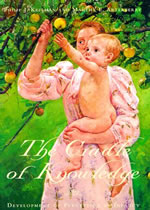
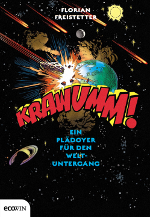
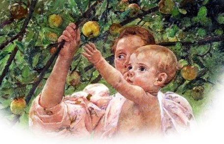
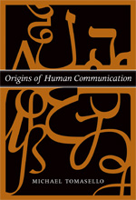

Entropie? Wie ich [letztes mal feststellte, ist das kinderleicht](https://scilogs.spektrum.de/blogs/blog/graue-substanz/2012-01-06/wiege-und-wege-des-wissen).

Gravitation? Dieser Apfel der Erkenntnis hängt sehr hoch.

Objekt, Raum, Bewegung? Liegt schon in der Wiege unseres Wissens.

Ich stellte durchaus etwas verwundert fest, wie leicht Entropie für einen Sechsjährigen zu verstehen ist. Auch das Konzept der Chiralität macht keine großen Probleme für Kinder, die mit Lego Star Wars spielen. Man denke nur an die Imperium-Klasse Sternzerstörer, die bekanntesten Schiffe der Flotte. Deren Flügel sind chiral wie viele Spielsachen und jedes Kind versteht schnell, wenn es den linken Flügel versucht rechts anzubauen, dass hier was besonderes passiert.

Mit Energie habe ich es ehrlich gesagt noch nie versucht. Mir fiele auch keine gute Transferleistung ein, um wirklich zu sehen, ob das Wort konzeptionell genutzt wird, [wie bei der Entropie](https://scilogs.spektrum.de/blogs/blog/graue-substanz/2012-01-06/wiege-und-wege-des-wissen), oder nur nachgeplappert.

## Gravitation? Kommt von Krawumm!

Ich will nun aber zuhause mit Gravitation beginnen. Ich denke, es kann nicht schaden, wenn ich behaupte Gravitation kommt von Krawumm und meinem Sohn dann abends aus dem neuen Buch von Florian Freistetter vorlese, sobald es endlich erscheint. Dort prallen Planeten aufeinander, Galaxien stoßen zusammen oder gar ganze Universen kollidieren, lese ich in der [Kurzbeschreibung](http://www.amazon.de/Krawumm-Ein-Pl%C3%A4doyer-f%C3%BCr-Weltuntergang/dp/3711000258/).

Meine Vermutung ist, dass dann eines Tages, wenn ein Apfel vom Baum fällt oder eine Tasse runterkracht, mein Sohn sagt sagt: „Papa, Krawumm! Das ist wie Gravitation“. Wenn ich also Gravitation ausschließlich für aufeinander prallende Objekte im Weltall nutze, wird er das dann richtig verallgemeinern?

Der Apfel bringt mich auf das Buch dessen Cover schon [im ersten Beitrag](https://scilogs.spektrum.de/blogs/blog/graue-substanz/2012-01-06/wiege-und-wege-des-wissen) und auch hier oben zu sehen war. Die Wiege des Wissens, so heißt das Buch auf deutsch, [The Cradle of Knowledge](http://mitpress.mit.edu/catalog/item/default.asp?ttype=2&tid=7454) (MIT Press) [1].

## Die Wiege des Wissens

  
Mary Stevenson Cassatt, Baby Reaching For An Apple (1893) Ausschnitt

Manche der Experimente in dem Buch sind nichts für Nervenschwache –  so durfte ich nicht meinen Sohn als Baby vom Tisch auf eine nahtlos anschließende, nicht allzu dicke Glasplatte krabbeln lassen, um seine Tiefenwahrnehmung zu testen (meine Schwiegermutter war dagegen, des Krawumms wegen …, ich bin kompromissfähig). Diese und viele andere tolle Ideen sind in diesem großartigen Buch beschrieben.

> *In this comprehensive treatment of infant perception, Philip Kellman and Martha Arterberry bring together work at these multiple levels to produce a new picture of perception’s origins. The emphasis is on perceptual knowledge—how one comes to perceive the world; what information, processes, and mechanisms produce this knowledge; and how perceptual processes change over time. They examine early perception in various domains, such as object, space, motion, intermodal, and speech perception and attempt to discover the starting points and paths of development of each. By focusing on individual experiments, they also give the reader a view of how research is conducted, including the interplay of data and theory.*
>
> [In dieser umfassenden Behandlung über die Wahrnehmung des Kleinkinds, stellen Philip Kellman und Martha Arterberry Arbeiten auf verschiedenen Ebenen zusammen, um ein neues Bild der Herkunft der Wahrnehmung zu zeichnen. Der Schwerpunkt liegt auf Wahrnehmungswissen – wie nimmt man die Welt wahr; welche Informationen, Prozesse und Mechanismen produzieren dieses Wissen; und wie ändern sich Wahrnehmungsprozesse im Laufe der Zeit. Sie untersuchen frühe Wahrnehmung in verschiedenen Bereichen, wie z,.B. Objekt, Raum, Bewegung, intermodale und Sprachwahrnehmung und versuchen, die Ansatzpunkte und Wege der Entwicklung eines jeden zu entdecken. Durch die Fokussierung auf einzelne Experimente, geben sie auch dem Leser eine Vorstellung davon, wie Forschung durchgeführt wird, darunter das Zusammenspiel von Daten und Theorie.]

Wie das Funktioniert? Experimente mit Babies, die nicht mal reden können? Mit einem Zitat zu den Ursprüngen des kooperativen Verhaltens will ich diesen Beitrag abschließen, aber zuvor noch den Hinweis an meine Leser weitergeben, dass wir hier auf BrainLogs ein neues Blog haben. Das [MPI-Forschungsblogs NeuroKognition](https://scilogs.spektrum.de/blogs/blog/neurokognition) vom Max-Planck-Instituts für Kognitions- und Neurowissenschaften. Dort wird in Zukunft noch mehr zu diesem Themenfeld zu lesen sein, denke ich.

Das Zitat unten stammt von Michael Tomasello, auch von einem Max-Planck-Institut in Leipzig, aber dem für Evolutionäre Anthropologie. Er hat bahnbrechende Studien zur Sprache und Kooperation bei Kleinkindern durchgeführt, für die er am 6. Januar den Klaus J. Jacobs Forschungspreis verliehen bekam. Er zeigte: Kinder sind kooperativ. Seien wir es auch und helfen ihnen die Welt zu verstehen.

> Offenbar bringen Kleinkinder gelegentlich eher individualistische imperative Gesten hervor, um Erwachsene zu veranlassen, als soziale Werkzeuge etwas für sie zu tun. Aber manchmal bringen sie auch eher kooperative imperative Gesten hervor, bei denen sie versuchen, die intentionalen/geistigen Zustände des Empfängers zu berücksichtigen – sein Verständnis und seine Motivationen –, und zwar auf eine Weise, wie es bei eher individualistische imperative Gesten  nicht der Fall ist. Es ist nicht völlig klar, welcher Art von Belegen hinreichend überzeugend dafür wäre, dass Kleinkinder solche kooperative imperative Gesten mitunter verwenden. Ein indirekter Beleg besteht darin, dass Kleinkinder schon sehr früh auf andere Weisen zeigen, die eindeutig kooperativ sind und die die intentionalen/geistigen Zustände des anderen eindeutig berücksichtigen, das heißt, sie benutzen sowohl expressive als auch informative deklarative Zeigegesten (wie oben beschrieben) ebenso früh wie imperative Gesten.\* Obwohl es nur Belege für etwas ältere Kinder von 30 Monaten gibt, könnte man etwas direkter sagen: Wenn Kinder von einem Erwachsenen etwas verlangen, der Erwachsene sie jedoch missversteht, sie dann aber durch einen glücklichen Zufall doch bekommen, was sie wollen, versuchen sie immer noch, das Missverständnis zu korrigieren.   
>  *Zitat aus [2] Fußnote hier imZitat* \*[Carpenter, Nagall und Tomasello 1998]

**Literatur** 

**Philip J. Kellman** (Autor)

**›** [Entdecken Sie Philip J. Kellman bei Amazon](http://www.amazon.de/Philip-J.-Kellman/e/B001HP2CGW/ref=ntt_athr_dp_pel_pop_1)

Finden Sie alle Bücher, Informationen zum Autor  
 und mehr.

[Suchergebnisse](http://www.amazon.de/s/ref=ntt_athr_dp_sr_pop_1?_encoding=UTF8&search-alias=books-de-intl-us&field-author=Philip%20J.%20Kellman) für diesen Autor

Sind Sie ein Autor? [Erfahren Sie mehr über Author Central](http://authorcentral.amazon.de/ref=ntt_atc_dp_pel_1)

[1] Philip J. Kellman , Martha E. Arterberry,  The Cradle of Knowledge: Development of Perception in Infancy (Learning, Development, & Conceptual Change) 

[2] Michael Tomasell,Die Ursprünge der menschlichen Kommunikation (suhrkamp taschenbuch wissenschaft)  2009

**Michael Tomasello** (Autor)

**›** [Entdecken Sie Michael Tomasello bei Amazon](http://www.amazon.de/Michael-Tomasello/e/B00458ITGA/ref=ntt_athr_dp_pel_pop_1)

Finden Sie alle Bücher, Informationen zum Autor  
 und mehr.

[Suchergebnisse](http://www.amazon.de/s/ref=ntt_athr_dp_sr_pop_1?_encoding=UTF8&search-alias=books-de&field-author=Michael%20Tomasello) für diesen Autor

Sind Sie ein Autor? [Erfahren Sie mehr über Author Central](http://authorcentral.amazon.de/ref=ntt_atc_dp_pel_1)
