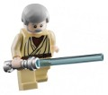
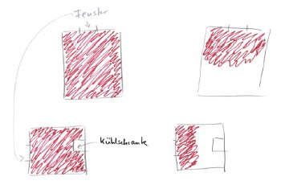

Entropie? Kinderleicht.

Gravitation? Dieser Apfel der Erkenntnis hängt sehr hoch.

Objekt, Raum, Bewegung? Liegt schon in der Wiege unseres Wissens.

In meiner Vorlesung [Statistische Physik](http://www.itp.tu-berlin.de/menue/lehre/lv/ws1112/wahlpflichtveranstaltungen/theoretische_physik_vi_vertiefung_statistische_physik_i/) vertrat ich gleich zu Beginn die These, dass das Konzept der Entropie um einiges einfacher sei als das der Energie. Während Entropie selbst ein Kind in der Grundschule leicht verstehen könne, im Sinne eines physikalisch sinnvollen Umgangs mit dem Wort, ist Energie in diesem Alter konzeptionell kaum zu vermitteln.1

Nicht dass es jetzt um Entropie gehen soll, aber interessanterweise tun sich Studenten der Physik anfangs manchmal schwer damit, so kam die Entropie zu unrecht in Verruf, kompliziert zu sein. Das ist interessant, bedauerlich aber interessant. Warum ist manches schwer zu verstehen? Die Frage liegt nahe, ob wir – vielleicht schon in früher Kindheit – gesellschaftlich konditioniert werden? Was liegt in der Wiege des Wissens und wie laufen die Wege von dort fort?

#### Entropie? Mittlere freie Weglänge im Spielzimmer.

Entropie versteht jedes Kind, soweit meine Vermutung. Die empirische Überprüfung stand nun an.

Ein einfaches (wenn natürlich auch kein signifikantes) Experiment mußte her: Ich fing an meinem Sohn, sechs Jahre alt, gerade eingeschult, ganz beiläufig das Wort Entropie in seinem Wortschatz unterzumogeln. Solche Experimente brauchen Geduld und verlaufen etwa so.

**Sohn** (*bittend*): Papa, weißt Du wo Obi Wan Kenobi ist?

**Ich** (*beiläufig*): Auf dem Sumpfplaneten Dagobah?

**Sohn**: Nein, da war doch Meister Yoda, ich meine meinen Lego Obi Wan Kenobi! Ich finde den nicht.

**Ich** (*v**ö**llig übertrieben den Überraschten mimend*): Ach so. (*Pause, dann nachdenklich*) Im Kühlschrank?

**Sohn** (*er nun echt* *ü**berrascht*): Nein! (*jetzt schon leicht böse – das ist wichtig, nun habe ich seine nötige, volle Aufmerksamkeit*) Da bestimmt nicht!

**Ich** (*erleichtert*): Na dann ist die Entropie ja nicht allzu groß, wir haben das ja schon eingeengt. Im Badezimmer (*durchaus möglich*)?

**Sohn** (*verwirrt*): Kann sein, was hast Du gesagt?

**Ich** (*beiläufig*): Die Anzahl der möglichen Orte, wo Kenobi sein kann, ist nicht mehr so groß. Wir brauchen im Kühlschrank nicht mehr zu gucken.

**Sohn** (*interessiert*): Wie heißt das?

**Ich** (*gelangweilt*): „A n z a h l“

**Sohn** (*jetzt noch mehr interessiert*): Nein, Entupi?

**Ich** (*gelangweilt*): „Entropie“, ich mal dir das mal auf.

Jetzt male ich mit ihm ein Bild, viel länger will er sowieso nicht mehr reden. Auf dem Bild (ich habe es nicht mehr, fertigte aber eine Kopie an) waren zwei Rechtecke nebeneinander. Küche und Spielzimmer. Beide wurden rot ausgemalt bis auf ein kleines weißes Quadrat in der Küche, der Kühlschrank. Da, in diesem weißen Quadrat ist Obi Wan Kenobi mit Sicherheit nicht. Mehr wissen wir nicht.

  
The quest for Obi Wan Kenobi und die Entropie in Küche und Spielzimmer.

Ich male zwei Striche an je eine Wand der Rechtecke, sage das sei ein Fenster, male die Rechtecke nochmal neu, also Küche und Spielzimmer nun mit je einem Fenster und schlage ihm vor, in Zukunft doch seine Star-Wars-Figuren immer in Richtung Fenster zu werfen, wenn er mit dem Spielen fertig sei, dann wüsste er wenigstens, dass sie nur in einer Hälfte der Räume seien können, in der hellen noch dazu (das fand er praktisch !) und, so wiederholte ich, die Entropie wäre geringer.

Wir malen nun die neuen Rechtecke nur zur Hälfte rot aus.

Alle paar Tage nutze ich das Wort Entropie, vermeide aber, es mit Unordnung in Verbindung zu bringen, sondern immer nur mit seiner Unkenntnis wo Dinge sind und der Anzahl der Orte, an denen wir suchen müssen. Ich könnte das Wort 10 mal am Tage nutzen. Papa wo ist …., Papa wo ist …., Papa wo ist …., …

Gehe aber eher sparsam damit um. Mehr oder weniger natürlich werfe ich es vielleicht ein zweimal pro Woche ein. Meine Frau verdrehte – nicht despektierlich eher vergnügt – anfangs die Augen.

Und dann zwei Monate später habe ich Bauklötze gestaunt! Wirklich, mich hat es umgehauen.

Ich stehe mit ihm vor seinem Spielzimmer, schimpfe über die Unordnung und er sagt: „Papa, guck mal“, dann schreitet er anfangs mit kleinen normalen, bald balancierend mit immer größeren, gewagten Schritten durch das Zimmer, bis er einen Meter vor dem Fenster keinen Platz mehr hat, noch einen Fuß zu setzen.

**„Papa, wenn ich bis hier hin komme, ist die Entropie noch nicht so groß!“**

Das war eine Transferleistung, die zeigt, dass er in einem physikalisch sinnvollen Zusammenhang3 mit dem Wort Entropie umgehen kann. Er suchte nichts! Sondern er erklärte mir, dass sein Zimmer nicht allzu unordentlich sei. Er verband diese (recht subjektive) Tatsache mit der Entropie und der mittleren freien Weglänge. Das fand ich letztlich überzeugend. Das Zimmer blieb wie es war.

Aus der Idee, dass Entropie keine physikalische Einheit inhärent trägt1 und aus einer Nebenbemerkung dazu in meiner Vorlesung, entstand ein wirklich nettes Ergebnis, ein stolzer Vater und die anschließende Vermutung, dass solch Experimentierfreude der gesellschaftlichen Wissenschaftsmüdigkeit Beine machen könnte. Kindesbeine.

…

(Fortsetzung folgt)

(Nachtrag 3. Feb.: sie folgt nun [hier](https://scilogs.spektrum.de/blogs/blog/graue-substanz/2012-02-02/wiege-und-wege-des-wissen-ii))

[In der Fortsetzung erzähle ich von meiner Erfahrung mit dem Wort „chiral“, meinen Pläne zu „Gravitation“, begründe warum es nicht darum geht, Kindern komische Wörter einzuimpfen sondern Konzepte zu erklären, stelle dann das Buch *The Cradle of Knowledge* kurz vor, das wir oben schon sahen und schließe dann mit einen Hinweis, wie Kleinkinder, die nicht mal reden können, Erwachsene mit Gesten zu ihren sozialen Werkzeugen machen.3 Wenn Kleinkinder so was tun, dann können wir auch mit ihnen experimentieren.]

**Fußnoten**

1 Das war zwar spontan dennoch nicht unüberlegt geäußert. Ich machte diese Vermutung zwar nicht allein, aber doch wesentlich daran fest, dass Energie eine physikalische Einheit hat, Entropie aber keine. Zumindest sollte Entropie keine haben, denn die Temperatur sollte in ihrer natürlichen Einheit der Energie gemessen werden, weg mit *kB*, ruft der Eingeweihte – ich will die Angelegenheit jetzt aber nicht durch historisch verwachsene Gegebenheiten komplizierter machen als sie ist. Kurz: Entropie ist eine monotone Funktion einer Anzahl und zählen kann jedes Kind. Energie ist Wirken, ist Aktion, ist  … ach je, Energie versteht kein Mensch wirklich. Sie ist schlicht [diejenige Erhaltungsgröße, die aus der zeitlichen Invarianz der Naturgesetze folgt](http://www.scienceblogs.de/hier-wohnen-drachen/2010/08/ist-die-klassische-physik-anschaulich-teil-1-energie.php). Zu Entropie und der freien Energie kann man [hier weiterlesen](http://www.scienceblogs.de/hier-wohnen-drachen/2010/12/entropie-und-freie-energie.php).

2 Die Transferleistung war nicht ganz korrekt. Es ist eigentlich die thermische Wellenlänge, die über die Ableitung der Entropie nach der Teilchenzahl, bei konstanten Volumen und Energie, mit eben jener über den Logarithmus der Dreierpotenz zusammenhängt. Sobald die thermische Wellenlänge mit der mittleren freien Weglänge vergleichbar wird, tritt die Quantennatur des Kinderzimmers zu Tage. Und spätestens dann müsste einer aufräumen. Aber ich habe noch keinen Weg gefunden, ihm das zu erklären.

3 Michael Tomasello, Direktor am Max-Planck-Institut für Evolutionäre Anthropologie in Leipzig, hat bahnbrechende Studien zur Sprache und Kooperation bei Kleinkindern durchgeführt, für die er heute den Klaus J. Jacobs Forschungspreis verliehen bekommt. Er zeigte: Kinder sind kooperativ. Seien wir es auch und helfen ihnen die Welt zu verstehen.

© 2012, Markus A. Dahlem
