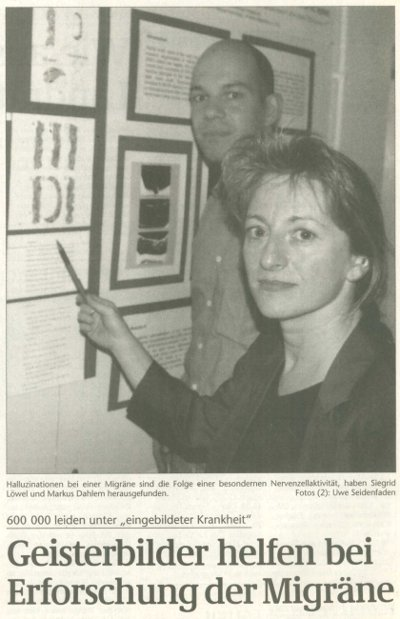
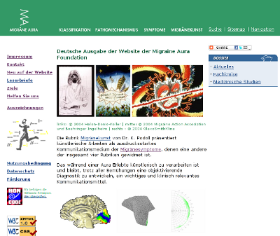
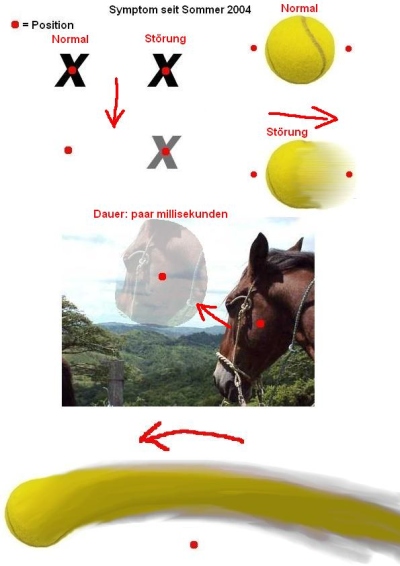
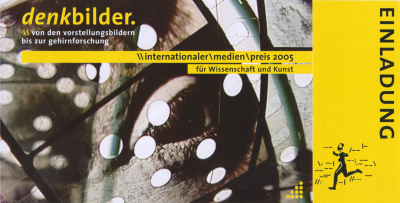
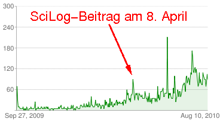

Ziemlich genau vor 10 Jahren, am 7. und 21. August 2000, berichteten „[Die Welt](http://www.welt.de/print-welt/article526821/Wie_im_Gehirn_Geisterbilder_entstehen.html)“ und die Magdeburger Volkstimme von „Geisterbildern“, die bei der Erforschung von Migräne helfen. Es waren Berichte über meine Dissertation, insbesondere über einen daraus resultierenden Artikel über Computersimulationen neuronaler Netzwerke, die Sehstörungen bei Migräne erklären können [1].

Ich bekam auf dem Postweg drei Leserbriefe weitergeleitet und zwei Zuschriften direkt an die Universität.

Mir war klar, dass solche Zeitungsberichte nur sehr lokal zur Kenntnis genommen werden und schnell verpuffen. Aber ich war überzeugt, dass viele Menschen Bedarf an solchen Informationen haben. Also entwarf ich eine [Website](http://www.migraine-aura.org/de/) zu dieser Thematik, um nachhaltiger den Dialog mit Betroffenen zu suchen. Denn auch ich brauche für meine weitere Forschung immer wieder neue Daten und Kontakt zu Patienten mit bestimmter Migräne-Symptomatik.

  
*Screenshot der deutschen Website.*

Früh gab es Resonanz auf die Website, die zeigte, dass Bedarf an solchen Informationen im Internet besteht:

> Herzlichen Dank für diese Website. Seit über 20 Jahren leide ich an Migräne mit Aura. Ich habe immer wieder versucht ‚Leidensgenossen/innen‘ oder eine Selbsthilfegruppe zu finden; bisher leider ohne Erfolg.

*(B. Eggert, Email an Markus Dahlem, 6 September 2001)*

> Meine Erfahrungen decken sich ziemlich mit den bereits veröffentlichten Erfahrungsberichten. Danke, man fühlt sich weniger allein, denn ich kenne niemand, der an ähnlichen Symptomen leidet.

*(Karin Lettner, Email an Markus Dahlem, 4 März 2002)*

  
*Logo der [Migräne-Liga](http://www.migraeneliga-deutschland.de/).*

Ich besuchte auch Foren in denen sich Menschen austauschen, die unter Migräne leiden. Sehr aktiv ist das Forum der [Migräne-Liga](http://www.migraeneliga-deutschland.de/), in dem ich bis heute ab und zu reinschaue und manchmal (sehr selten) dann auch selber etwas schreibe. Nicht zuletzt, um auch Werbung für meine Website zu machen. Und doch dauerte es einige Jahre bis Betroffene diese Website wirklich gut angenommen haben.

Der Durchbruch kam eigentlich erst 2004, als Dr. med Klaus Podoll, der seit vielen Jahren über [Migräne und Kunst](http://www.migraine-aura.com/de/Migraenekunst.html) forscht, mir half. Zusammen entwickelten wir die Website zweisprachig weiter ([engliche Version](http://www.migraine-aura.com/content/index_en.html)). Die Rückmeldungen hatten oft den gleichen Tenor:

> Um es kurz zu fassen: Ihre Seite trifft den Nagel auf den Kopf 🙂 … [ich bin] im Internet auf die Suche gegangen und unter anderem auf ihrer Seite gelandet und habe exakt das gefunden, was ich ’sehe‘, bzw. erlebe. Auf fast allen Internetseiten steht der Kopfschmerz im Mittelpunkt, für mich sind es die Ausfälle […] über die ich sehr gerne wenigstens mehr wüsste.

*(G.M., Email an Markus Dahlem, 6. Juni, 2006)*

> I searched on the web for information and your website was the first one that I came across. You can imagine my surprise when I saw the images that others has painted that are so similar to my experience. Thank you for creating a place where people can express themselves through art. It is incredibly helpful to see the similarities between the artwork and certainly helped me to feel like I was not going insane.

*(Stephanie D., Email to Klaus Podoll, February 6, 2006)*

Heute ist aus Zeit- und Geldmangel leider nur die englische Version immer auf dem neusten Stand. Auch dies lehrt die Erfahrung: Öffentlichkeitsarbeit am Feierabend ist nur begrenzt möglich.

Unzählige Rückmeldungen bekommen wir seitdem. Die Erfahrungsberichte über Migräne mit Aura reichen von Störungen des Körperschemas ([Alice-im-Wunderland-Syndrom](http://www.migraine-aura.com/de/Alice_im_Wunderland.html)), über [Sprachstörungen](http://www.migraine-aura.org/content/e27891/e27265/e26585/e26982/index_en.html) und [Zeitrafferphänomen](http://www.migraine-aura.org/content/e27891/e27265/e26585/e27105/index_en.html) bis zu den häufigen Sehstörungen. Gerade letztere werden von Betroffenen oft gut illustriert.

  
*Beispiel einer Illustration einer [Sehstörung](http://www.migraine-aura.com/de/See13.html) bei Migräne.*

2005 wurde die Website für den Internationalen Medienpreis für Wissenschaft und Kunst nominiert. Dieser wurde vom Südwestrundfunk (SWR) und dem Zentrum für Kunst- und Medientechnologie Karlsruhe (ZKM) in Kooperation mit dem Schweizer Fernsehen (SF DRS), ARTE und 3sat ausgelobt. Eine Anerkennung, die ebenso wie die Leserbriefe motiviert weiter zu machen.

  
*Nominierung der [Website](http://www.migraine-aura.com/de/Auszeichnungen.html) für den Internationalen Medienpreis für Wissenschaft und Kunst 2005.*

2006 hatte ich dann über diese Website einen interessanten Menschen kennengelernt, der unter Migräne mit visueller Aura litt. Das war ja der ursprüngliche Zweck: ein Austausch von Informationen in beide Richtungen.

Als Ingenieur hatte mein neuer Kontakt sorgfältig über 400 Zeichnungen seiner Sehstörungen angefertigt und sein Gehirn wurde an der Harvard Medical School mit Hilfe der funktionellen Kernspintomographie (fMRI) detailiert untersucht. Nach einem Anruf dort bekam ich Zugriff auf alle Daten und konnte damit Vorhersagen aus meinen Computermodellen testen [2].

Es folgten ruhige Jahre, in denen wir die Website weiter ausbauten, insbesondere wurden unsere Inhalte in ein [ePublishing-Content-Managment System](http://www.zms-publishing.com/index_ger.html) transferiert. Ein Schritt ins Web 2.0.

**Dann kamen die SciLogs**

2009 habe ich dann mit einem Blog angefangen, zuerst bei [Blogger](http://www.blogger.com/about). Als ich dort einen [Beitrag](http://grauesubstanz.blogspot.com/2009/09/kopfschmerzen-auch-wenn-man-keine-hat.html) schrieb, über einen Artikel ([Migräne – leider keine Einbildung](http://www.wissenschaft-online.de/artikel/1005451)) von den Kollegen David W. Dodick und J. Jay Gargus, im Oktoberheft der Zeitschrift *Spektrum der Wissenschaft,* kam plötzlich am 30. September eine Einladung von Lars Fischer doch zu den SciLogs umzuziehen. Diese nahm ich sehr gerne an.

Seitdem habe ich dort [sechs Beiträge zu Migräne](http://www.brainlogs.de/blogs/blog/graue-substanz/migrane) geschrieben und fünf über *Migraine* in meinen englischsprachigen Blog „Gray Matters“. Zusammen wurden diese insgesamt 15 894 gelesen. Ein Schnitt von 1445 Leser pro Beitrag. In einem dieser Blogbeiträge ([Ich sehe was, was du nicht siehst](http://www.brainlogs.de/blogs/blog/graue-substanz/2009-12-01/migraenewellen)) habe ich auch über die mittlerweile veröffentlichte Studie mit den Zeichnungen und fMRI-Daten des Ingenieurs berichtet.

Wobei mit 6326 Zugriffen der Beitrag Migraine and Chaos herausfällt, weil er über Stumbleupon verlinkt wurde und allein von dort 4582 mal aufgerufen wurde. Sie, liebe Leser, können also an einer Verbreitung dieser Informationen bedeutend mitwirken.

Gleichzeitig mit meinen ersten Blog richtete ich einen [Twitter-Account](https://twitter.com/markusdahlem) ein. Lohnt sich das, fragte ich mich? Nun ja, ich fand schon Hinweise zur Migränesymptomatik über Twitter und meine Tweets über Migräne werden auch vereinzelt weitergeleitet. Aber ich bin diesbezüglich eher skeptisch.

Trotzdem, ähnlich wie bei meinen Besuchen in Foren, es wichtig den Kontakt auf vielen Wegen zu suchen und zu halten. So habe ich mittlerweile einige Tausend Berichte über Migräne gelesen und ein Gespür entwickelt für die enorme Vielfalt der neurologischen Störungen bei dieser Volkskrankheit. Allein durch Lehrbücher lernt man dies nicht. Informationen aus erster Hand haben eine ganz andere Qualität und dies prägt meine Forschung.

**10 000 Views auf YouTube**

Am 27. September 2009 habe ich dann bei YouTube ein Video eingestellt, dass auf der Computersimulation, die ich vor 10 Jahren machte, basiert. Einmal mehr zeigte sich, dass sich nur mit der Zeit solche Informationen herum sprechen. Die ersten 6 Monate sahen sich pro Tag kaum über eine Handvoll Menschen das Video an. Als ich es am 8. April 2010 in einem Blogbeitrag ([Simulation einer Sehstörung bei Migräne](http://www.brainlogs.de/blogs/blog/graue-substanz/2010-04-08/simulation-einer-sehstoerung-bei-migraene)) bekannt machte, stieg die Anzahl kurz auf knapp 90 Views an.

Aber auch das war nur ein Tropfen der den Stein höhlt. Mittlerweile sehen durchschnittliche knapp 100 Menschen pro Tag das Video. Der Blogbeitrag ist nur 1055 mal bisher gelesen, das YouTube-Video aber über 10 000 aufgerufen worden.

Dazu kommen 43 Kommentare, der letzte von heute.

> Seriously, danger-close to what I get …

> Wow! Very close to what I get! Mine are black & white like this, but more sharply contrasting …

> Almost spot on for me, too! Thanks!

> Yup, gonna show my wife when she gets home what it’s like. Thnks.

Wieder ist der Tenor der gleiche. Gerade der letzte Kommentar, den ich zitiert habe, zeigt ein anscheinend wichtiges Bedürfnis für die Betroffenen: sie wollen ihren Mitmenschen zeigen, was eigentlich nur sie sehen können – denn sie wollen nicht als Verrückt gelten, weil sie seltsame Dinge in der Akutphase ihre Migräne erleben.

**Fazit:** Es ist ein langer Weg wenn Wissenschaft und Gesellschaft miteinander in einen Dialog treten sollen. Und dieser Web muss mehrspurig begangen werden, soll er erfolgreich sein. Wichtiger aber ist mir noch, darauf hinzuweisen, dass das Web2.0 dem Leser eine aktive Rolle zukommen lässt. Sei es in Form eines Kommentars oder einer Weiterleitung.

Der Wert dieser Art der Rückmeldung ist kaum zu überschätzen. Denn – wie ich schon oben schrieb – auch ich brauche für meine weitere Forschung immer wieder neue Daten und Kontakt zu Patienten mit bestimmter Migräne-Symptomatik!

**Literatur**

[1] [Dahlem et al. (2000) Does the migraine aura reflect cortical organization? European Journal of Neuroscience, **12**: 767 – 770](http://dx.doi.org/10.1046/j.1460-9568.2000.00995.x)

[2] [Dahlem and Haddjikhani (2009) Migraine Aura: Retracting Particle-Like Waves in Weakly Susceptible Cortex, Plos ONE, e5007.](http://www.plosone.org/article/info%3Adoi%2F10.1371%2Fjournal.pone.0005007)
