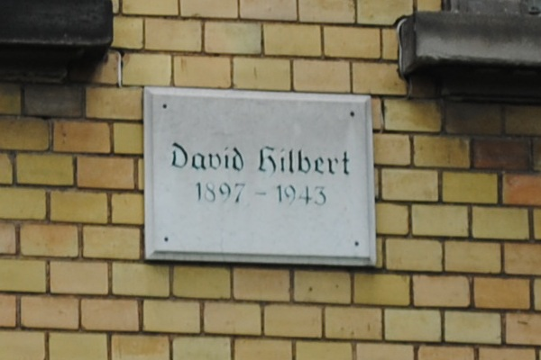
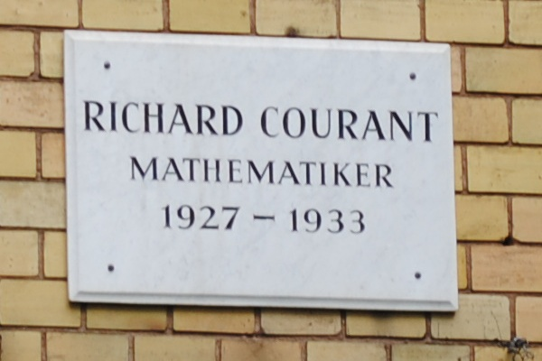
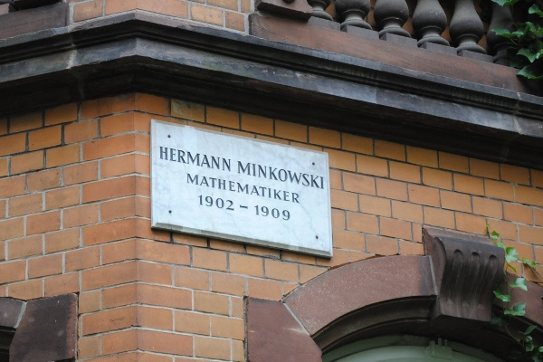

In diesem und einem zweiten Beitrag will ich über Wissenschaftsblogs nachdenken. Dies ist eine Fortsetzung zu meinem Beitrag [Interessenkonflikt beim Bloggen – Brauchen wir einen Verhaltenskodex?](http://www.brainlogs.de/blogs/blog/graue-substanz/2010-08-18/verhaltenskodex) Wie schon damals sind dies keine Gedanken, die spezifisch für die SciLogs gelten. Und es sind nur erste Gedanken, die ich gerne weiter diskutieren würde.

  
*Nicht Lobbyismus, sondern Mathematik dem ersten Mann auf der Straße klar zu machen, war Hilberts Anspruch.*

Wissenschaftsbloggen ist zum einen die Vermittlung der Wissenschaft als kulturelle Leistung. Begeistern soll wissenschaftliche Arbeit nicht nur den Wissenschaftler, ein Funke soll überspringen. – Zum andern ist es Lobbyismus.

Lobbyismus für oder auch gegen einen Wissenschaftszweig, welcher als Bedrohung empfunden wird (z.B. Gentechnik, Kernenergie, oder Chemie (sic)). Oder für einen Wissenschaftszweig, der eine Bedrohung erforscht (z.B. Lernforschung nach dem PISA-Schock, Klimaforschung, Artensterben). Oder für einen Wissenschaftszweig, der mit gesellschaftlichen Vorurteilen zu kämpfen hat (z.B. Religion-Virus-Metapher, Migräne als Einbildung). Selbst wenn nur ein Funke überspringen soll für Wissenschaft deren Zweck als Grundlagenforschung nicht unmittelbar erkennbar ist (z.B. Kosmologie, Stringtheorie, Chaosforschung, Paläogenetik) oder allgemein für die Wissenschaft als kulturelle Leistung an sich:

Es ist Lobbyismus, und das ist auch gut so.

Als Lobbyisten wollen Forscher künftig leichter Fördermittel bekommen, im allgemeinen wollen sie Forschungsausgaben mit einen Anteil von 3% (oder mehr) des Bruttoinlandsprodukts. Es geht aber auch darum wie der 3%-Kuchen verteilt wird. Jeder hätte gerne ein großes Stück für seine Fachrichtung.

Spezielle Programme der Projektträger des BMBF entscheiden in welche Projekte Mittel fließen. Auf europäischer Ebene gibt es Rahmenprogramme. Die Vorbereitungen für das achte Programm laufen gerade an. Kurzum, Wissenschaftler konkurrieren um begrenzte finanzielle Mittel und müssen selbst den Nachweis erbringen, dass ihre Forschung lohnt. Dies geht insbesondere auch über den Umweg des gesellschaftlichen Dialogs. Denn wer sonst sollte entscheiden, wieviel wofür ausgegeben wird?

Andere wollen gesellschaftliche Akzeptanz erreichen, die für eine Gesetzgebung notwendig ist (Beispiel Präimplantationsdiagnostik), die der Vermarktung hilft (Solarenergie) oder die schlicht Vorurteilen begegnet (Weltuntergang für günstige drei Milliarden Euro mit dem Large Hadron Collider). Und wieder andere mögen nur nach gesellschaftlichen Ansehen streben, für sich selbst oder für Ihre Fachrichtung. Ich halte all diese Ansätze für legitim. Viele Gründe mögen gleichzeitig zutreffen. Andere Beweggründe mögen fehlen.

Ich nehme es jedem gerne ab, der sagt, nein er ist einfach Wissenschaftsblogger aus Leidenschaft. Selbst in diesem Fall sollten wir uns über diese Art der fünften Gewalt Gedanken machen und unsere Leidenschaft dahingehend hinterfragen. Wem nützt es? Es ist nichts verwerfliches daran, solange der Vorgang transparent ist ([siehe](http://www.brainlogs.de/blogs/blog/graue-substanz/2010-08-18/verhaltenskodex) [Interessenkonflikt beim Bloggen](http://www.brainlogs.de/blogs/blog/graue-substanz/2010-08-18/verhaltenskodex)). Es geht ja nicht darum als Spin-Doctor einer Sache den richtigen Dreh zu geben und damit bewusst zu manipulieren. Dies wird eher verhindert durch Wissenschaftsblogs oder auch deren Kommentatoren!

**Interdisziplinäres Gespräch**

Natürlich gibt es auch weitere Gründe warum Wissenschaftsblogs geschrieben werden sollten.

Für mich konnte ich zum Beispiel feststellen, dass es meine Sicht erweitert, über meine wissenschaftlichen Fachthemen auch für Laien zu schreiben. Auch wenn dies Anfangs kaum ein Grund für mich war, ist es heute mir sehr wichtig. Wie der Mathematiker David Hilbert schon sagte:

> *Eine mathematische Theorie ist nicht eher als vollkommen anzusehen, als bis du sie so klar gemacht hast, daß du sie dem ersten Manne erklären könntest, den du auf der Straße triffst.*

Nun sollte man wissen, dass David Hilbert wenige Häuser neben Richard Courant und nur eine Ecke von Hermann Minkowski entfernt wohnte. Der erste Mann, den Hilbert morgens auf der Wilhelm-Weber-Straße traf, war also vielleicht nicht immer der Durchschnittsbürger sondern Mathematiker.

 Bei den Lesern von Wissenschaftsblog mag es ähnlich sein. Die Rückmeldungen, die wir in Form von Kommentaren bekommen, sind eher interdisziplinäres Gespräch, wie Arnd Zickgraf in seinem Beitrag [Blogs: Die Hintertür der Naturwissenschaften](http://www.heise.de/tp/r4/artikel/31/31880/1.html) auf Telepolis bemerkt. Bei hochgradig interdisziplinärer Forschung sind Blogs aus erster Hand geschrieben vielleicht sogar wirklich ein guter Weg der Wissensvermittlung unter Forschern. In diesem Fall dienen also Wissenschaftsblog gar nicht dem Dialog mit der Öffentlichkeit.

  
*Auf der Straße aber traf Hilbert Minkowski.*

Außerdem, so lehrt mich meine Erfahrung, zählt allein der Versuch Wissenschaft auf das Wesentliche herunterzubrechen, um eigene wissenschaftliche Theorien danach klarer sehen zu können. Wissenschaftsbloggen ist also auch Selbstzweck.

Letztlich führt mich dies auf die Frage, was ein Wissenschaftsblog eigentlich ausmacht? Autor, Leser oder Thema können bei Wissenschaftsblogs den Kontext zur Wissenschaft herstellen. Dazu später mehr.

**Nachtrag**

Auf das [Interview](http://www.wissenschaft-online.de/artikel/1046636&_z=859070) „Wissenschaftler müssen wahrhaftig kommunizieren“, vom 22. Sept. mit Wissenschaftssoziologen Peter Weingart möchte ich nun noch verweisen. Gefragt nach der Bedeutung von Wissenschaftsblogs antwortet Weingart

> Ob die Wissenschaftskommunikation in Zukunft mehr über Blogs laufen wird, hängt auch davon ab, wer die Öffentlichkeit solcher Blogs ist. Die meisten solcher Blogs werden wohl nicht von Leuten gesehen oder gelesen, die normalerweise in die Zeitung gucken oder auch im Internet Presseerzeugnisse studieren, will ich mal unterstellen.

Das unterstützt meine Vermutung, dass das Hilberts-Nachbarn-Phänomen existiert.

**Die Diskussionen werden woanders geführt** (Nachtrag vom 21. Okt. 2010)

Marco Althaus, Politikwissenschaftler, berichtete am 20. Okt. in [seinem Blog](http://pamanager.blogspot.com/2010/10/wissenschaftsbloggen-ist-lobbyismus.html) über diesen Beitrag.

In einem Editoral „[Science Blogs and Caveat Emptor](http://pubs.acs.org/doi/full/10.1021/ac102628p)“ der Zeitschrift Analytical Chemistry schrieb Royce Murray zu diesem Thema am 12. Okt:

> Who are the fact-checkers now? There are no reviewers in a formal sense, and writing can be done for any purpose—political, religious, business, etc.—without the constraint of truth.

Daraufhin antwortet David Kroll am 17. Okt. in dem PLoS Blog: „[Royce Murray and the problem of science bloggers.](http://blogs.plos.org/takeasdirected/2010/10/17/royce-murray-and-the-problem-of-science-bloggers/)„
