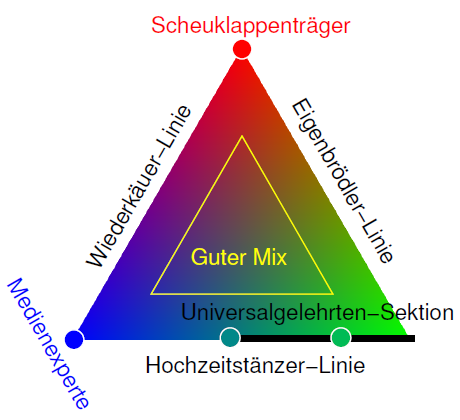

Wen erreicht die Wissenschaft mit Blogs wirklich? Diese Frage ~~stellt~~ stellte Martin Ballaschk ~~heute~~ gestern auf der re:publica. Dazu hat er mein Wissenschaftsblogverortungsfarbdreieck ausgegraben in dem sich Hochzeitstänzer, Wiederkäuer, Eigenbrödler und (hoffentlich) deren Mischformen unter den Wissenschaftsbloggern verorten und neu ausrichten können.

~~Ich stelle später noch das Video hier ein. Vorab~~ Das Video ist nun verlink, Zusätzlich der Hinweis auf meinen Blogbeitrag vom 25. April 2011, den der ein oder die andere vielleicht vorab lesen wollen. Das war eigentlich der dritte in einer Serie von drei zusammenhängenden Beiträgen:

1. [Wissenschaftsbloggen ist Lobbyismus](https://scilogs.spektrum.de/graue-substanz/wissenschaftsbloggen-ist-lobbyismus/)
2. [Vom Idealtypus zu konkurrierenden Merkmalen](https://scilogs.spektrum.de/graue-substanz/vom-idealtypus-zu-konkurrierenden-merkmalen/)
3. [Das Wissenschaftsblogverortungsfarbdreieck](https://scilogs.spektrum.de/graue-substanz/wissenschaftsblogverortungsfarbdreieck/)

Das Wissenschaftsblogverortungsfarbdreieck

Zu Martins Vortrag geht es [hier](http://re-publica.de/session/wen-erreicht-wissenschaft-blogs-wirklich). Er ~~fängt~~ war schon gestern um 15:30 ~~an und geht bis 15:45~~.
