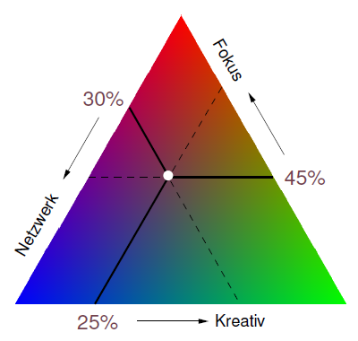
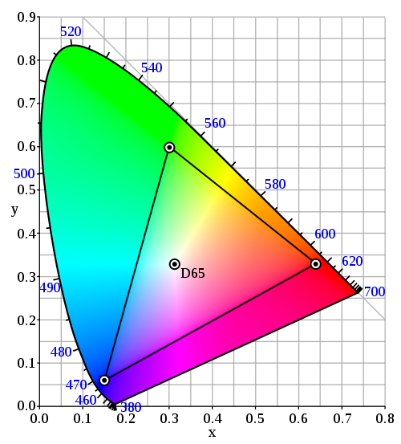
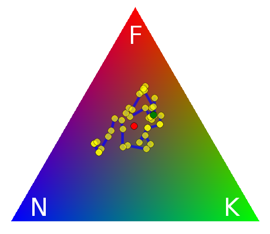
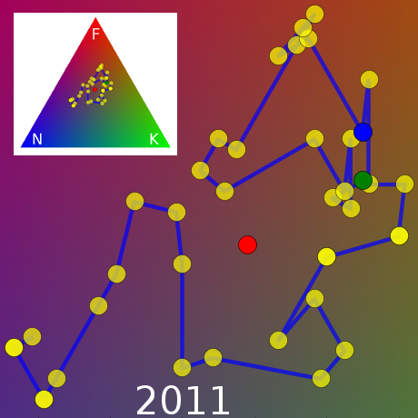
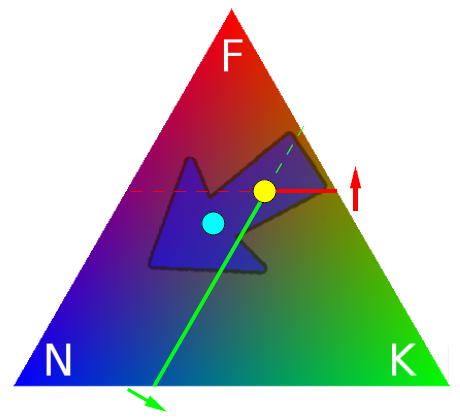
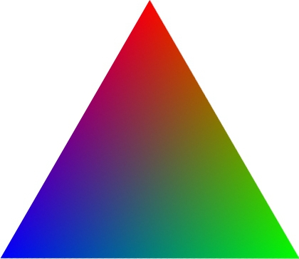

Dies ist Teil II meines Beitrages zur Verortung von Wissenschaftsblogs. [Teil I begann als Antwort auf die sozialwissenschaftlich geprägte Anwendung von Idealtypen](http://www.brainlogs.de/blogs/blog/graue-substanz/2011-04-23/vom-idealtypus-zu-konkurrierenden-merkmalen). Die erste Analyse mit meiner neuen Methode, deren Grundlage ich nun im Detail erkläre, ergab, dass die Graue Substanz dunkelhimbeerrosenfarben ist. Die Farbe ist natürlich nur Platzhalter. Drei Analysen können mit dieser Methode durchgeführt werden:

1. [Verortung eines Blogs relativ zu vorgegebenen Hauptmerkmalen](#Verortung-relativ-zu-den-Hauptmerkmalen)
2. [Vergleich mehrerer Blogs oder ganzer Portale in Bezug auf Hauptmerkmale](#Vergleich-mehrer-Blogs)
3. [Veränderungen eines Blogs in der Zeit bezüglich der Hauptmerkmale](#Verlauf-ueber-die-Zeit)

Der Beitrag ist dementsprechend in diese drei Abschnitte eingeteilt, umrahmt mit einer Einleitung zur Definition der Hauptmerkmale und einem abschließenden Blick auf [die merkmalspezifischen Charaktereingenschaften der Randlagen im Verortungsdreieck](#Randlagen-im-Verotungsfarbdreieck), dem Raum in dem die drei Analysen stattfinden.

**0. Definition der Hauptmerkmale**

Die Methode ist weder auf die folgenden drei Hauptmerkmale festgelegt noch auf die Anzahl drei; die gewählten drei halte ich aber für sinnvoll für das Genre Wissenschaftsblogs und mehr als drei Merkmale ermöglichen keine einfache bildliche Darstellung. Die Merkmale sind: Fokus (**F**), Kreativität (**K**), Netzwerk (**N**). Damit ist die abgebildete Blogosphäre ein FKN-Merkmalsraum analog zum RGB-Farbraum (Rot, Grün und Blau). 

Was die Merkmale im einzelnen bedeuten:

* **F**: Wie stark ist das Blog auf ein Thema fokusiert?
* **K**: Wie sehr stehen die eigenen wissenschaftlichen Ideen im Vordergrund oder werden Themen in ein neues Licht gesetzt?
* **N**: Wie sehr ist der Gedanke der Vernetzung gegeben?

Als Einschränkung werden diese definierten Merkmale derart kombiniert werden, dass einer der drei Werte (*Kanäle*) seinen Maximalwert 1 nur dann haben kann, wenn die zwei anderen null sind. Kurz gesagt: F+K+N=1.

**1. Verortung relativ zu den Hauptmerkmalen**

Ich habe alle meine 52 Beiträge seit November 2009 daraufhin eingeteilt. War der Beitrag in meinen Blogfokus? Habe ich über meine eigene Forschung geschrieben oder eigene Ideen eingebracht? Und habe ich den Beitrag mit anderen vernetzt oder auf andere reagiert? Die 52 Zahlentupel (F,K,N) habe ich zeitlich gemittelt, dann grob gerundet und fand folgende Merkmalsanteile: 45% waren im Fokus, 25% haben eigene Ideen ausformuliert (oft aus schon veröffentlichten Arbeiten, aber auch neue) und 30% haben Netzwerk-Funktionen erfüllt. Übersetzt in RGB ist das dunkelhimbeerrosenfarben.

  
 *Das Wissenschaftsblogverortungsfarbdreieck kurz: WBVFD*

---

**Anleitung**:   *Wissenschaftsblogverortungsfarbdreieckmethode.*   
 (Kann mein ersten Lesen übersprungen werden.)

In dieser Anleitung wird erklärt, wie ich ein Blog in das Wissenschaftsblogverortungsfarbdreieck eintrage, nachdem ich vorab dessen drei Durchschnittswerte F,K,N, also z.B. mein Tupel (0.45, 0.25, 0.3), aus den Einzelwertungen ermittelt habe. Die Einzelwertungen der Posts kann z.B. der Blogger selbst einschätzen oder andere bitten dies zu tun.  
    
 Die Durchschnittswerte F,K,N ergeben per Konstruktion addiert eins (F+K+N=1).  Nun werden diese drei Werte auf den drei Rändern (Achsen) des Dreiecks der Reihe nach eingetragen.   
 – Zunächst zum **F**-Wert: Dieser Wert wird am Grün-Rot-Rand (von rechts unten zur Mitte oben laufend) eingetragen, wobei Grün 0 und Rot 1 entspricht. Ein Wert von 0.45 wäre also etwas unterhalb der vertikalen Mitte des Dreiecks. Dann zieht man parallel zum Grün-Blau-Rand, d.h. horizontal, eine Linie durch den F-Wert. Auf dieser und anderen horizontalen F-Koordinatenlinien bleibt F konstant.   
 – Nun zum **K**-Wert: Dieser Wert wird am Blau-Grün-Rand (von horizontal links nach rechts laufend) eingetragen, wobei Blau 0 und Grün diesmal 1 entspricht. Ein Wert von 0.25 wäre also nach einem Viertel der Strecke von links gemessen. Dann zieht man parallel zum Blau-Rot-Rand, d.h. diagonal nach oben, eine K-Koordinatenlinie durch diesen K-Wert.  
 – Nun zum **N**-Wert: Dieser Wert wird am Rot-Blau-Rand (von oben nach links unten) eingetragen, wobei Rot 0 und Blau 1 entspricht. Ein Wert von 0.30 wäre also nach einem Drittel der Strecke entlang dieser Achse gemessen. Dann zieht man parallel zum Rot-Grün-Rand, d.h. diagonal nach rechts unten, eine N-Koordinatenlinie durch diesen N-Wert.

Die drei Linien treffen sich in einem Punkt (wenn nicht, ist F+K+N ≠ 1). Dort wird das Blog verortet. Man nennt diese Koordinaten auch [baryzentrische Koordinaten](http://de.wikipedia.org/wiki/Baryzentrische_Koordinaten).  

---

**Die Graue Substanz ist dunkelhimbeerrosenfarben**

Für die Einzelwertungen eines Beitrages habe ich es mir recht leicht gemacht (dies kann und sollte fundierter durchgeführt werden, hier dient es mehr der Illustration).

Mein Blogfokus ist eng definiert Migräne und etwas weiter die Verbindung zwischen Physik, Neurologie und Medizintechnik. Zum Beispiel ist dieser Beitrag, den Sie jetzt lesen, klar außerhalb des Fokus, d.h. F=0. Wann immer ein Beitrag in meinem Fokus lag, habe ich geschaut, ob ich allein über meine eigene Forschung berichte. Dies entspricht dann der Einzelwertung (F=0.5, K=0.5, N=0). Oder ob ich nur andere wissenschaftliche Arbeiten begutachte, was wiederum dann zur Einzelwertung (F=1.0, K=0.0, N=0.0, ein Beispiel wäre der Beitrag "[Genetik der Migräne](http://www.brainlogs.de/blogs/blog/graue-substanz/2010-10-01/genetik-der-migraene)") führt. Eine Wertung (F=0.5, K=0.0, N=0.5) bedeutet, ich habe über meine Fokusthema geschrieben und zwar mit Sicht auf andere Blogger und/oder Twitterer, ohne dass eigene Forschungsergebnisse aufgegriffen wurden (ein Beispiel wäre der Beitrag "[Zeitfresser für Hypochonder](http://www.brainlogs.de/blogs/blog/graue-substanz/2011-02-06/zeitfresser-fuer-hypochonder)"). Wenn der Beitrag im Fokus lag und ich sowohl über eigene Forschung berichte als auch Bezug auf andere Blogbeiträge nehme und diese vernetze, lag die Einzelwertung bei (F=0.33, K=0.33, N=0.33, ein Beispiel wäre der Beitrag "[Was ist Schmerz?](http://www.brainlogs.de/blogs/blog/graue-substanz/2011-03-23/was-ist-schmerz)").

Meist habe ich mich an diese groben Werte gehalten und nur selten diese feiner abgestimmt.

Allein alle 52 Beiträge zu bewerten, hat mich viel über mein eigenes Blog gelehrt. Ich habe z.B. einen zeitlichen Verlauf gesehen – denn dunkelhimbeerrosenfarben ist ja nur mein Durchschnittswert und zunächst sicher noch nichtssagend, dazu gleich mehr im dritten und vierten Abschnitt.

**2. Vergleich mehrerer Blogs oder ganzer Portale**

Die zweite Analysemöglichkeit habe ich bisher ausgelassen, da ich nur mein eigenes Blog mir angeschaut habe. Das bringt mich auf eine Idee: Die ersten 3 Blogger, die diesen Beitrag in einem eigenen Post kritisch beleuchten, ihn verlinken und mir eine Liste mit ihrer eigenen Einzelbewertung aller ihrer Posts (>30) bezüglich meiner (oder beliebige andere) Hauptmerkmale zusenden,\* bekommen die Analyse von mir geliefert.

Außerdem an dieser Stelle der Hinweis, dass drei Dinge zu beachten sind. Erstens, Merkmale wie Fokus, Kreativität und Netzwerk schließen sich nicht gegenseitig aus (ebenso wenig wie Farben rot und blau). Zweitens, die Merkmale Fokus, Kreativität und Netzwerk sind, wie Farben, keine Idealtypen. Und drittens, in der Blogosphäre existieren noch viele andere Merkmale, so wie es größere Farbräume gibt z.B. **C**yan, **M**agenta, **Y**ellow und der Schwarzanteil **K**ey als Farbtiefe ergeben den CMYK-Farbraum.

**3. Verlauf**  **eines Blogs** **über die Zeit im WBVFD**

Genauer habe ich mir den Verlauf über die Zeit angeschaut. Ich war selbst verblüfft, wie sich die Verschiebung meiner Schwerpunkte visualisiert hat und dies präzise mit gewissen Umständen korreliert. Angefangen habe ich bei den SciLogs im November 2009, markiert mit einem grünen Kreis, der Startpunkt. Der zeitliche Mittelwert über alle 52 Posts ist rot markiert.

Ich habe den Startpunkt und die anderen Markierungen allerdings nicht auf die Einzelwertung gesetzt sondern nehme für alle gezeigten Punkte immer den lokalen Mittelwert aus den letzten 12 Posts. Was bis Mitte 2010 genau einen Zeitraum von einem halben Jahr entspricht. Danach verdoppelte sich meine Postfrequenz ungefähr (3.6 Posts pro Monat). Hochaufgelöst sieht der Verlauf so aus.

Zur Erinnerung: Veränderungen gehen nur auf Kosten anderer Merkmale, es sind baryzentrische Koordinaten. Wobei maximal ein Merkmal konstant bleiben kann, nämlich entlang der Koordinatenlinien, die immer parallel zum Dreiecksrand laufen (s.o.).

Nach dem Start bewegt sich die Graue Substanz langsam etwas nach links auf einer F-Koordinatenlinie, wandert bis Juni 2010 senkrecht hoch – keine Koordinatenlinie (!), der Fokus steigt auf Kosten beider anderer Merkmale. Diese Aufwärtsbewegung endet mit einen Beitrag [Karrieremodellen in der Wissenschaft](http://www.brainlogs.de/blogs/blog/graue-substanz/2010-06-24/karrieremodelle-in-der-wissenschaft), markiert durch den blauen Kreis. Danach hat sich nicht nur meine Postfrequenz verdreifacht. Auch der Schwerpunkt geht hin zu einer stärkeren Vernetzung. Nur Anfang 2011 ging es nochmal kurz Richtung Blogfokus.

An der relativen Lage der zeitlichen Mittelwerte vor (gelb) und nach dem Juni 2010 (cyan) ist zu erkennen, dass beides, der Anteil der Beiträge über meine eigene Forschung (K) und der Grad der Fokussierung (F) abgenommen haben.

Es gibt sicher mehrere Gründe für die stärkere Vernetzung meiner Beiträge. Der Hauptgrund aber liegt offensichtlich in der höheren Frequenz, die mir Dank deutlich mehr Zeit seit dem Juni 2010 ermöglicht wurde. (Ich bekam von der TU Berlin nach Ablauf der Höchstbeschäftigungszeit einen Lehrauftrag als "Vollzeitbeschäftigung" angeboten, mit einem Gehalt das ca. 70% des TV-L Tarifes entspricht. Das verschiebt die Interessenlage. Ich nenne es den 12-Jahresknick. Ein eigenes Blogthema.)

**4. Randlagen im FKN-Verortungsdreieck**

Um Veränderungen in der Lage im Verortungsdreieck besser interpretieren zu können lohnt ein Blick auf dessen Randlagen.

Nehmen wir die drei Grenzgänger, die eine Eigenschaft rigoros verneinen, d.h. entweder F, K oder N sei Null.

* Der Hochzeitstänzer (F=0): "Ich will keinen Fokus, ich tanze auf jeder Hochzeit", sagt sich dieser Bloggertyp. Sein Spektrum reicht von ausschließlich vernetzen beliebiger Themen (blau) bis zu exklusiven Berichten über seine vielfältigen eigenen Ideen (grün). Auf dieser Linie bewegt er sich, rot (einen Fokus) kennt er nicht.
* Der Wiederkäuer (K=0): "Ich habe keine eigenen Ideen", bekennt dieser Bloggertyp. Sein Spektrum umfasst das Vernetzen beliebiger Themen (blau) bis zur Fokusierung auf ein Thema ohne zu sehen was in Blogs um ihn herum geschieht (rot). Grün, einen Beitrag zur Wissenschaft, möchte er nicht liefern (eine Trennung, die im journalistischen Bereich notwendig ist, insofern ist die Bezeichnung zu bösartig).
* Der Eigenbrödler (N=0): "Er nimmt nichts außerhalb seiner wahr", sagen andere über diesen Bloggertyp, denn er selbst spricht mit niemanden.  Sein Spektrum reicht von allgemein verständlicher Übersetzungen und zugleich Archivierung sämtlicher Erkenntnisse eines wissenschaftlichen Themas (rot, sein Fokus) bis zu allen möglichen wissenschaftlichen Themen, die er selbst neu erfindet (grün). Blau (Netzwerk) kennt er nicht.

Schauen wir auf ausgezeichnete Punkte, insbesondere in die Ecken:

* Der Scheuklappenträger (F=1): Sein Fokus ist klar. Er kümmert sich nicht darum, was andere dazu geschrieben haben, Kommentare interessieren noch weniger (N=0) und er will auch nicht selbst Ideen einbringen (K=0); was er zu seinem Fokusthema liest schreibt er nieder, in seinen gut verständlichen Worten.
* Der Medienexperte (N=1): Sein Kredo: "Alles geht und war schon mal da (Link hier und hier und hier), ich hab’s auch schon getwittert." Er ist kein Experte in der Wissenschaft, und hält sich auch nicht dafür, aber er kennt sich aus in der Blogosphäre. Blogger aus dem Online Community Management der Portale sind in dieser Ecke zu finden. Ich könnte auch vom Sascha-Lobo-Punkt reden, siehe das Fraunhofer Portal [www.forschungs-blog.de](http://www.forschungs-blog.de/).

Den grünen Eckpunkt (K=1) lasse ich unbenannt. Ich vermute eher einen gewissen Trolltypus dort, nicht den Blogger. Zur Erinnerung: im ersten Teil, hatte ich den Universalgelehrten [Gottfried Wilhlem Leibniz](http://de.wikipedia.org/wiki/Gottfried_Wilhelm_Leibniz) erwähnt und sein hypothetisches Blog im aquamarin verortet. Denn ein Universalexperte (F=0, d.h, kein Fokus) und ohne Netzwerk (N=0, so dass K=1) finde ich undenkbar.

Das will ich zum Abschluss mit einer Warnung verbinden. Die Wissenschaftsblogverortungsfarbdreieckmethode kann leicht verfälschte Ergebnisse liefern. Nämlich wenn die Einzelwertungen der Posts von verschiedenen Personen getroffen werden und dann nicht auf einer fundierten Grundlage. Ich würde zum Beispiel Issac Newton, wieder hypothetisch, zwischen aguamarin (die Mitte zwischen blau und grün) und grün verorten, d.h. auf der Universalexperten-Sektion. Allerdings ist Newton für mich grünverschoben zu Leibniz (geringerer Netzwerkfaktor). Eine andere Person würde diese relative Ortung zueinander von Leibniz zu Newton vielleicht ebenso einschätzen. Würde aber jeder von uns nur einen dieser Gelehrten verortet, und dies mit anderen Wertungsgewichten der Merkmale, wird ein direkter Vergleich sinnlos. Fazit: Will man z.B. alle Blogs in einem Portal vergleichen, sollte die Einzelwertung der Posts nicht von jedem Blogger getrennt ohne klare Vorgaben erfolgen.

Mein Zirkelmord am Idealtypus ist kein Abschied. (Wenn er die Angriffslust der Sozialwissenschaftler stärkt, würde ich dies in Form von Kommentaren begrüßen.) Es sollte ein Miteinander geben. In meinen Augen können praktische Anleitungen, wie diese hier, helfen das relative junge Genre der Blogs innerhalb eines Portals zu strukturieren.

**Fußnoten**

\* Das Format der Einzelwertungen sollte mir in diese Form zugeschickt werden

01 0.5 0.5 0.0  
 02 0.60 0.30 0.1  
 03 0.333333 0.333333 0.333333  
 04 0.5 0.5 0.0  
 05 0.5 0.5 0.0

Also eine fortlaufende Post-Nummer gefogt von drei Wertungen, die zusammen 1 ergeben.

**Dank**

An Thomas Isele für die Hilfe mit pythons großartiger [matplotlib](http://matplotlib.sourceforge.net/) und an Anatol Stefanowitsch für die Verortung des "s" in *Wissenschaftsblogverortungsfarbdreieckmethode.*

**Bildquelle**

Das kleine Insetbild ist ein CIE-1931-xy-Chromatizitätsdiagramm, [Urheber](http://de.wikipedia.org/wiki/Datei:CIExy1931_sRGB.svg).
