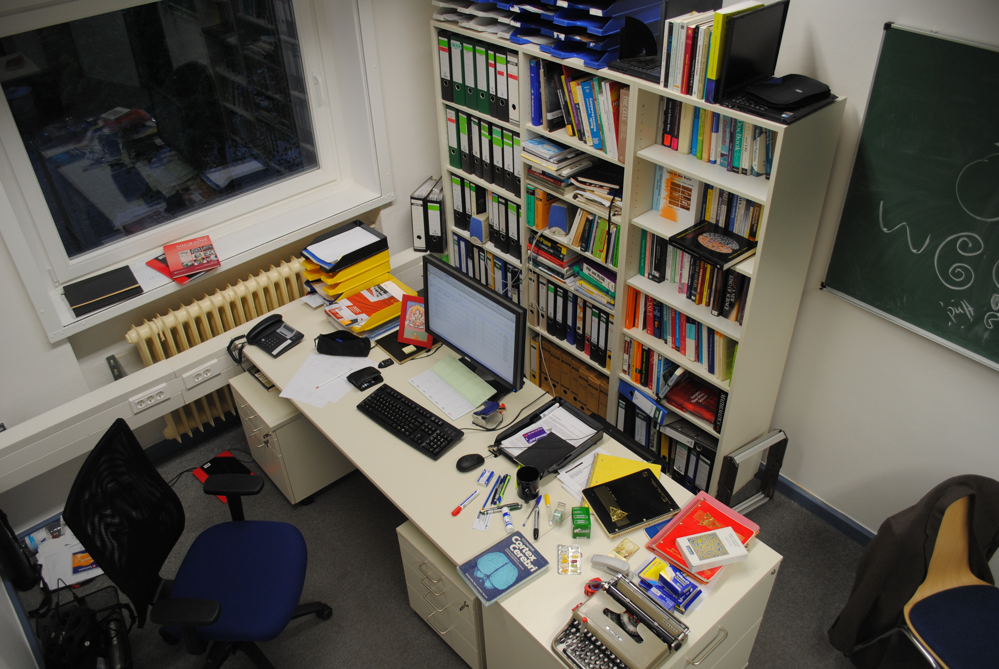

Wenn Sie das nächste mal einen Universitätscampus betreten und neue Architektur bestaunen können, derartig, dass Sie sich eingeladen fühlen, denken Sie folgendes: In diesen Gebäuden sitzt vielleicht – nur vielleicht – ein Wissenschaftler der bloggt und der ihnen wahrhaft einen Einblick in seine Arbeit mit einfachsten Mitteln verschafft, der einen echten Mehrwert der Gesellschaft bringt. Wenn dort aber keiner über seine Arbeit bloggt, muss man dann die Architektur nicht verlogen nennen?

Es wird gerade wieder viel diskutiert, was Wissenschaftskommunikation eigentlich heißt. Den Anlass kann man bei [Markus Pössel](https://scilogs.spektrum.de/relativ-einfach/bloggende-wissenschaftler-und-wissenschaftskommunikation/) und ~~(angekündigt\*)~~ [Lars Fischer](https://scilogs.spektrum.de/fischblog/was-wollt-ihr-ueber-wissenschaft-wissen-und-wie/) nachlesen. Ich kann mich deswegen hier kurzfassen.

Wer Wissenschaftskommunikation nur als Journalismus und PR definiert, deckt einen dritten Bereich nicht ab, der auch mit Wissenschaft und moderner Kommunikation zu tun hat.

> Endlich! "Wir WissenschaftlerInnen kommunizieren doch alle die ganze Zeit!" Watzlawick hatte so recht. <http://t.co/GFcdv0sFup> [#wowk14](https://twitter.com/hashtag/wowk14?src=hash&ref_src=twsrc%5Etfw)
>
> — G. A. Schifferdecker (@GSchifferdecker) [July 1, 2014](https://twitter.com/GSchifferdecker/status/483951111867752449?ref_src=twsrc%5Etfw)

Weil Wissenschaftler untereinander kommunizieren und dass wiederum so selbstverständlich ist, kommt man vielleicht gar nicht auf die Idee, dies auch als einen Aspekt extra unter den Begriff Wissenschaftskommunikation zu fassen. Kommunikation *unter* Wissenschaftlern gehört seit Beginn zur Wissenschaft, sie ist Wissenschaft. Man könnte also meinen, dass, wenn man dies unter Wissenschaftskommunikation versteht, wir dann eine Wissenschaftskommunikationskommunikation bräuchten.

Solange die Kommunikation unter Wissenschaftlern *geschlossen* läuft, ist darin auch wirklich nichts Neues zu sehen und es gäbe wohl keinen Grund, diese Art der Kommunikation gemeinsam mit dem Wissenschaftsjournalismus und der Arbeit der PR-Abteilungen der Universitäten unter einem Begriff zusammenzufassen. Nun haben wir aber das Internet und dann das WWW schon eine Weile. Letzteres geboren aus der Wissenschaft heraus um effizienter zu kommunizieren. Das ändert alles.

Ich bin überzeugt, dass nun, seit dem Web 2.0,  Wissenschaftskommunikation *neben* Journalismus und PR auch die *offene* Kommunikation *unter* Wissenschaftlern beinhaltet. Alle drei Bereiche wechselwirken und stehen in einer synergetischen Beziehung. Betont werden muss hier: offen, unter und neben. Weil (und wenn) sie offen ist, gehört die Kommunikation unter Wissenschaftlern dem Journalismus und PR nebengestellt und nicht vorangestellt. Es sind drei Säulen der Wissenschaftskommunikation (siehe S2L und S2S [hier](http://wijo.wordpress.com/eine-art-blog/29-06-14-was-ich-bei-der-diskussion-um-wissenschaftskommunikation-vermisse/) und [hier](https://scilogs.spektrum.de/graue-substanz/science-to-science-kommunikation-der-blinde-fleck-der-wissenschaftskommunikation/)).

Wissenschaftskommunikation kann zum Beispiel eine offene Arbeitsgruppe sein, d.h. insbesondere einen Wissenschaftsblog in dieser Weise zu nutzen.

> Ich habe allein durch die Tweets zum [#wowk14](https://twitter.com/hashtag/wowk14?src=hash&ref_src=twsrc%5Etfw) was gelernt: noch mehr über Wissenschaft bloggen. [#ausÜberzeugung](https://twitter.com/hashtag/aus%C3%9Cberzeugung?src=hash&ref_src=twsrc%5Etfw)
>
> — Markus A. Dahlem (@markusdahlem) [July 1, 2014](https://twitter.com/markusdahlem/status/484001324200374272?ref_src=twsrc%5Etfw)

Man mag fragen (auch wenn ich von allein wirklich niemals auf so eine Frage gekommen wäre), ist das gut für die Wissenschaft, schafft dies einen gesellschaftlichen Mehrwert?

Natürlich wird man nicht alles aus der Arbeitsgruppe offenlegen. Doch es gibt ja einen Grund, warum Flure in modernen Universitäten nicht mehr so aussehen, wie vor einem Jahrhundert.

Wir geben eine Menge Geld aus, die Gebäude offen zu gestalten, damit Wissenschaftler sich treffen und kommunizieren.

Der Mehrwert für die Gesellschaft ist ebenso offensichtlich. Warum haben wir denn einen Wissenschaftsjournalismus und PR? Es sind die selben Gründe.

Mir ist unverständlich, wie man auf die Idee kommen kann, offene Kommunikation durch Architektur anzuregen aber nicht zu fördern, wenn sie im Internet stattfindet.

Der Blick auf meinen Schreibtisch wird zumindest hier im Blog in Zukunft noch offener werden. Ganz ohne besonderes Fensterformat, dafür nach dem Motte: Mehr Blog, mehr Kommunikation.

## Fußnote

\*Ich habe den Beitrag schon gestern Abend geschrieben, sobald Lars seinen Beitrag online hat, wird er verlinkt.
