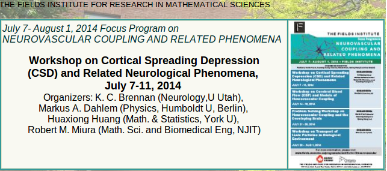
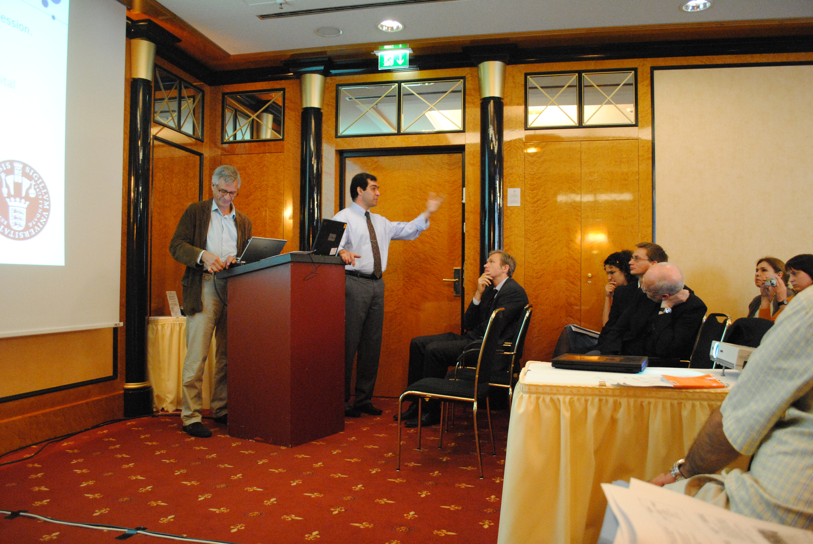

Am Wochenende geht es los nach Kanada zum Workshop über *Cortical Spreading Depression* (CSD) und verwandte neurologische Phänomene. Kurz gesagt ist CSD ein wichtiges pathophysiologische Phänomen des Hirns. Kortikale Gehirnzellen “[verhungern](https://scilogs.spektrum.de/graue-substanz/wenn-gehirnzellen-kein-brot-haben-sollen-sie-doch-kuchen-essen/)” kurzzeitig und diese Depression breitet sich aus. Ich hatte über CSD, Migräne und die letzten offenen Fragen schon im [November 2013 geschrieben](https://scilogs.spektrum.de/graue-substanz/cortical-spreading-depression-migraene-letzte/).

Wir hoffen einige davon nun angehen zu können. Wir werden diese nicht in einer Workshopwoche lösen, aber vielleicht doch eine Road Map für die kommenden Jahre abstecken können. ([Link zum Programm](http://www.fields.utoronto.ca/programs/scientific/14-15/neurovascular/depression/index.html))

Es wird hoffentlich eine arbeitsintensive Woche. Wir haben einiges dafür im Vorfeld getan. Zum Beispiel beschränken wir uns auf nur 16 Vorträge und die Nachmittage halten wir überwiegend frei für Diskussionen. Zwar sollte das bei einem Workshop immer so sein. Doch fast alle Workshops, auf denen ich war, unterschieden sich kaum von Konferenzen.

Wir können uns so eine Struktur, in der ein Vortrag den nächsten jagt, gar nicht leisten. Die eingeladenen Sprecher kommen nämlich aus fünf verschiedenen Disziplinen: ein Neurologe, zwei Mathematiker und ein Physiker (ich) haben den Workshop organisiert, eingeladen sind außerdem drei Neurochirurgen, zwei Physiologen, eine weitere Neurologin, zwei weitere Mathematiker und fünf weitere Physiker (davon ein Student und eine Studentin von mir aus Berlin).

Bei dieser Vielfalt müssen wir erstmal zu einer gemeinsame Sprache finden. Das passiert am einfachsten indem wir anfangen *miteinander* zu reden und nicht voreinander vortragen. Ich werde daher nicht viel Zeit haben, vom Workshop aktuell zu berichten.

Das ist meine [dritte Tagung](https://sites.google.com/site/markusadahlem/scholarly-activity/conference-organisation), die ich über Migräneforschung mit Kollegen organisiert habe. Sie alle sind einzigartig in dieser interdisziplinären Form für Migräne.

Symposium 2011 über CSD und Migräne von Mathematik bis zur Klinik auf der Internationalen Kopfschmerztagung in Berlin. Unter anderem mit Martin Lauritzen, Cenk Ayata, Jens Dreier, Peter Goadsby (von links nach rechts).

Finanziell sehr großzügig unterstützt wird der Workshop übrigens vom Fields Institute, ein internationales Forschungszentrum an der University of Toronto im Bereich der Mathematik. Bekannt ist der Name durch die Fields-Medaille, die allerdings von der  Internationalen Mathematischen Union vergeben wird und deren ständiges Sekretariat ist gleich bei mir neben an in Berlin am Weierstraß-Institut und nicht in Canada, wo John Charles Fields geboren wurde.

Noch nebenan muss ich eigentlich schreiben. Denn wenn ich zurück nach Deutschland komme, kehre ich nicht an die Humboldt Universität zurück sondern wechsel nach Dresden an das Max-Planck-Institut für Physik komplexer Systeme. Dazu und zu meinen neuen Aufgaben später mehr.

Ich bleibe noch zwei weitere Wochen am Fields Institute und schreibe dann vielleicht später in Juli mehr.
