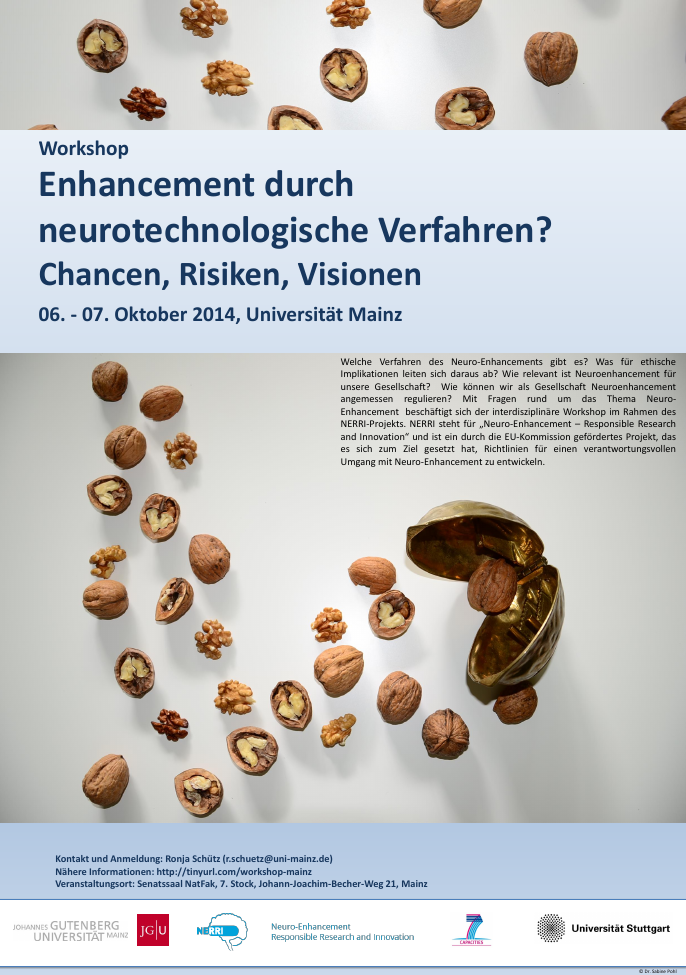

Ich bin übernächste Woche auf [einem Workshop](http://www.blogs.uni-mainz.de/fb05philosophie/forschungsstellen-und-weitere-einrichtungen/fs_neuroethik_neurophilosophie/).

> Welche Verfahren des Neuro-Enhancements gibt es? Was für ethische Implikationen leiten sich daraus ab? Wie relevant ist Neuroenhancement für unsere Gesellschaft? Wie können wir als Gesellschaft Neuroenhancement angemessen regulieren? Mit Fragen rund um das Thema Neuro-Enhancement beschäftigt sich der interdisziplinäre Workshop im Rahmen des [NERRI-Projekts](http://www.nerri.eu/eng/about.aspx). NERRI steht für „Neuro-Enhancement – Responsible Research and Innovation“ und ist ein durch die EU-Kommission gefördertes Projekt, das es sich zum Ziel gesetzt hat, Richtlinien für einen verantwortungsvollen  
> Umgang mit Neuro-Enhancement zu entwickeln.

Dazu ist bisher dieser Blogartikel „[Neuromodulation und Neuro-Enhancement: Verschmelzung“](https://scilogs.spektrum.de/graue-substanz/neuromodulation-und-neuro-enhancement-verschmelzung/) veröffentlicht, der um eins von drei Themenfelder kreist, zu denen ich etwas zu diesem Workshop beitragen will. Das Programm ist [hier](http://www.blogs.uni-mainz.de/fb05philosophie/files/2013/04/Workshop-Neuroenhancement-Mainz.pdf).
