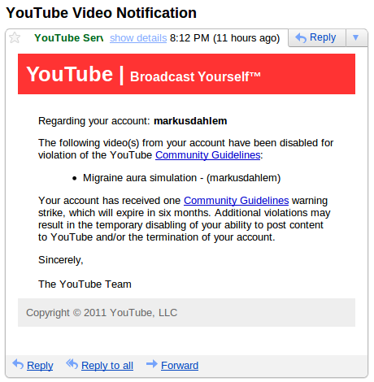
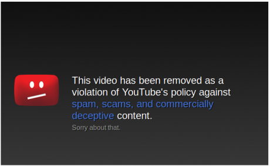
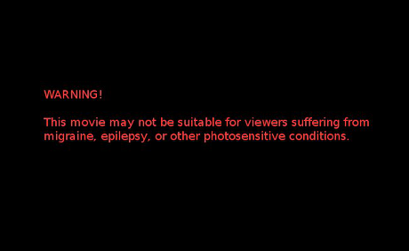
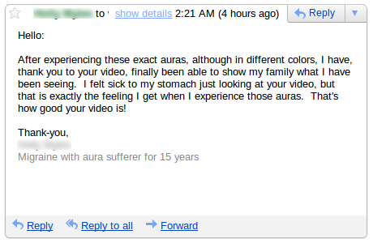
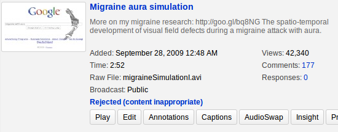
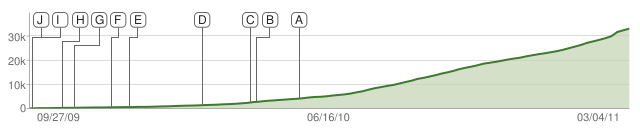

Vor einer Stunde las ich folgende Email:

SPAM, das war mein erster Gedanke. Gut gemacht, aber diese Email ist SPAM. Warum sollte YouTube mein Video, das bisher über 40 000 Besucher sahen, sperren? Ich gucke besser mal nach.

OK, YouTube hat [mein Video gesperrt](http://www.youtube.com/watch?v=XLJ00o-vmh0). Warum? Ich habe am 8. April 2010 in „[Simulation einer Sehstörung bei Migräne](http://www.brainlogs.de/blogs/blog/graue-substanz/2010-04-08/simulation-einer-sehstoerung-bei-migraene)“ hier in meinem Blog darüber geschrieben. Sehstörungen können bei Migräne auftreten und folgen dann oftmals einem charakteristischen Verlauf im Gesichtsfeld. Basierend auf einer Simulation der neuronalen Netzwerkaktivität in der Sehrinde [1], erstellte ich ein Video zur Demonstration dieser Sehstörung – Migräneaura genannt – und ich stellte es auf YouTube.

Bisher fällt mir nur ein Grunde ein, warum es nun gesperrt wurde und der ist zumindest sehr fragwürdig. YouTube könnte die Gefahr sehen, dass die dort gezeigte Simulation einer Sehstörung bei Migräne eben genau so eine Attacke auslösen kann. Ich hatte einen entsprechenden Warnhinweis gezeigt.

Allerdings wäre der eigentliche Auslöser das Flickern und in diesem Fall müssten viele Video auf YouTube gesperrt werden, die nicht mal einen Warnhinweis haben. Mein Video klärt auf, dass dies ein möglicher Auslöser ist.

Heute morgen bekam noch eine zweite Email, die gerade mal 7 Stunden nach der von YouTube kam und perfekt in diesen Kontext passt.

> Hallo:
>
> Nachdem ich genau diese Aura, obwohl in verschiedenen Farben, erlebe, danke ich Ihnen für Ihr Video, endlich bin ich in der Lage meiner Familie zu zeigen was ich sah. Mir wurde schlecht allein vom zusehen, aber das ist eben genau das Gefühl, das ich bekomme, wenn ich diese Auren erlebe. So gut ist Ihr Video!
>
> Vielen Dank,  
> XXXXX XXXXXX  
> Migräne mitAura-Leidender seit 15 Jahre

Das war nun kein so großer Zufall. Ich bekomme fast täglich solche Emails mit Danksagung für meine Arbeit, da ich [seit über 10 Jahren meine Migräneforschung auch öffentlichkeitswirksam vertrete](http://www.brainlogs.de/blogs/blog/graue-substanz/2010-08-11/wissenschaft-und-gesellschaft). Wobei viele Emails sich auch auf andere Darstellungen der Migräneaura beziehen, die auf den mehreren hundert Unterseiten der [Migraine-Aura-Foundation](http://www.migraine-aura.org/content/index_en.html) Website, die ich zusammen mit Dr. med Klaus Podoll betreibe, aufgeführt und detailliert erklärt werden.

Solche Kommentare fanden sind auch zahlreich auf YouTube selbst.

Das Video wurde im Schnitt all 3 Tage kommentiert, insgesamt 177 mal, und fast ausschließlich positiv bewertet. Seit September 2009 wurde es insgesamt 42 340 mal von Besuchern gesehen. Einen Kommentar, denn ich retten konnte, weil ich einen neuen Post zum Anlass der ersten 50 000 Besucher plante, ist folgender:

> hello, this video is eerie to watch because I’ve only ever seen these in my mind 🙂 I have had migraine aura for about 12 years, after being a frequent (2x per week) migraine sufferer throughout childhood. My phenomena are in color and look like those crystal growth videos where polarized light brings out rainbows in the material. There are some other videos that do a decent job evoking the color version. but THIS video nails the look of angular lines and the ridged texture. Great job!  
> [*hallo, dieses Video ist unheimlich* *anzusehen**, weil ich dies immer nur in meinem Kopf gesehen habe:) Ich habe Migräne Aura etwa 12 Jahre gehabt, nachdem ich häufig (2x pro Woche) an Migräne während der Kindheit litt. Meine Phänomene sind in Farbe und sehen wie die in den Kristallwachstum-Videos aus wo polarisiertes Licht Regenbögen im dem Material hervorbringt. Es gibt einige andere Videos, die recht anständig die farbige Version hervorbringen. aber DIESES Video trifft mit dem Aussehen der eckigen Linien und der geriffelten Struktur den Nagel auf den Kopf. Great job!*]

Auch die folgende Statistik hat überlebt, sie zeigt die Besucherzahlen seit September 2009 und endet bei 33 622 Besuchern im März diesen Jahres (die Ereignisse A-J sind in einem Anhang zusammengestellt). Tendenz steigen, bis zum heutigen Ende des Videos, was ich hoffentlich rückgängig machen kann.

Das Video habe ich natürlich noch, aber all die Kommentare, die auch einen wissenschaftlichen Wert hatten, sind zur Zeit nicht aufrufbar, auch für mich nicht. Ich habe YouTube geschrieben und werden berichten, was der Hintergrund dieser Sperrung ist.

Das besondere an dem Video war, dass es eine Sehstörung bei Migräne sehr realistisch zeigte. Ich arbeite und treffe regelmäßig mit den weltweit führenden Wissenschaftlern (z.B. Frances Wilkinson oder Alex Shepherd [2,3]) zusammen, die genau an diesem Thema arbeiten, ob und mit welchen Frequenzen Flickerreize Migräne  auslösen können. Wir arbeiten auch daran, ob bestimmt Frequenzen vielleicht die Attackenhäufigkeit heruntersetzen und eine Attacke vielleicht verhindern können. Ich weiß also recht genau, was ich in YouTube stellen kann und was nicht. Dieses Video war ungefährlich, mal abgesehen davon, dass es sicher sehr unangenehm anzusehen war für Betroffene.

Ich habe das Video nun ~~in der Außenstelle der Grauen Substanz~~ in einem neuen Design (ohne Google-Hintergrund) erstellt und [erneut geposted](https://scilogs.spektrum.de/graue-substanz/sehstoerung-bei-migraene/).

**Nachtrag**

[Lesen wie es weiter ging.](http://www.brainlogs.de/blogs/blog/graue-substanz/2011-05-06/ein-aktuelles-musikvideo-migraine-im-vergleich)

**Literatur**

[1] [Dahlem et al. (2000) Does the migraine aura reflect cortical organization? European Journal of Neuroscience, **12**: 767 – 770](http://dx.doi.org/10.1046/j.1460-9568.2000.00995.x)

[2] [Harle DE, Shepherd AJ, Evans BJ. Visual stimuli are common triggers of migraine and are associated with pattern glare. Headache. 2006 Oct;46(9):1431-40.](http://onlinelibrary.wiley.com/doi/10.1111/j.1526-4610.2006.00585.x/abstract;jsessionid=604552E6A0B2F462B7B00D0F70C7B068.d02t01)

[3] Karanovic O, Thabet M, Wilson HR, Wilkinson F. Detection and discrimination of flicker contrast in migraine. Cephalalgia. 2011 Apr;31(6):723-36.

**Anhang**

|  |  |  |  |
| --- | --- | --- | --- |
| **A** | 05/19/10 | Verweis – [en.wikipedia.org](http://www.youtube.com/watch?v=XLJ00o-vmh0#) | 8,845 |
| **B** | 04/12/10 | Verweis ähnliches Video – [Optical Migraine](http://www.youtube.com/watch?v=ihgXA0nXmhU) | 489 |
| **C** | 04/ 8/10 | Eingebunden auf – [www.brainlogs.de](http://www.youtube.com/watch?v=XLJ00o-vmh0#) | 615 |
| **D** | 02/22/10 | Verweis – [www.google.com](http://www.youtube.com/watch?v=XLJ00o-vmh0#) | 979 |
| **E** | 12/21/09 | Verweis ähnliches Video [Migraine Aura](http://www.youtube.com/watch?v=q1sXbdaIB-g) | 929 |
| **F** | 12/10/09 | Verweis von Google search – [migraine aura](http://www.google.com/search?q=migraine%20aura) | 773 |
| **G** | 11/ 4/09 | Verweis von YouTube search – [migraine with aura](http://www.youtube.com/results?search_query=migraine%20with%20aura) | 668 |
| **H** | 10/25/09 | Verweis ähnliches Video – [Migraine Aura Simulation](http://www.youtube.com/watch?v=ZrrviW0Od-w) | 1,510 |
| **I** | 09/28/09 | Ansicht von einem mobilen Gerät | 2,134 |
| **J** | 09/28/09 | Verweis von YouTube search – [migraine aura](http://www.youtube.com/results?search_query=migraine%20aura) | 1,729 |
