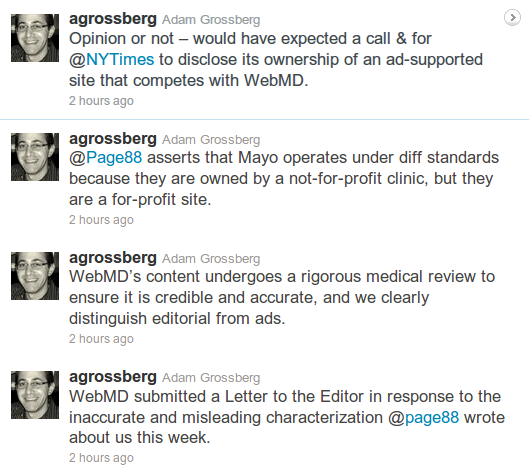

Das Internet beschleunigt die Wissenschaft, kann aber auch schlicht Zeitfresser sein. Ich fasse mich also kurz. Diesmal.

  
[„Hypochonder: Wenn Sie SCHON Ihre Symptome googlen, tun Sie es auf der Mayo Clinic-Website“ getwittert von @page88 (Virginia Heffernan)]

Letzten Freitag verglich Virginia Heffernan, Kolumnistin des New York Times Magazine, in ihrem Beitrag „[A Prescription for Fear](http://www.nytimes.com/2011/02/06/magazine/06FOB-Medium-t.html)“ medizinische Informationen im Web. Deren Bedeutung für die Medizin beschreibt sie in klaren Worten:

> Health sites are hugely influential in how Americans think about their health and may even play a part in public debates over health care, as they aggressively shape how would-be patients consume medical information and envision treatment.

[Gesundheits-Websites beeinflussen enorm wie Amerikaner über ihre Gesundheit denken und können sogar in der öffentlichen Debatte über Gesundheitsvorsorge eine Rolle spielen, da sie aggressiv bestimmen wie angehende Patienten medizinische Informationen aufnehmen und sich ihre Behandlung vorstellen.]

Am Beispiel von Seiten über Kopfschmerzen vergleicht sie insbesondere WebMD und die Seiten der Mayo Clinic. WebMD ist eine Website mit Verbindungen zur Pharmaindustrie, die Mayo Clinic ist eine US-amerikanische Non-Profit-Organisation die Kliniken betreibt.

Während WebMD harsch beurteilt wird („*I now recommend that anyone […] actually* block *WebMD*„\*), das Angbot sei als Zeitfresser für Hypochonder bekannt, werden die Webseiten der Mayo Clinic fast durchweg gelobt  („*Mostly it just didn’t rush me to hysteria, or to drugs*„\*\*).

[\*Ich empfehlen jetzt, dass jeder wirklich […] WebMD *blockiert*.  
\*\*Vorwiegend weil es mich nicht in Hysterie oder zu Medikamenten treibt.]

  
*Drei Giganten auf dem Online-Markt für Medizin-Informationen.*

Es gibt fundamentale Unterschiede bei medizinischen Webseiten. Nur soviel, ich fasse mich kurz. Aber wer mehr über Migräne lesen will, ist [hier](http://www.brainlogs.de/blogs/blog/graue-substanz/migrane) im Blog richtig.

Weiterhin empfehle ich für Migräne die Seiten:

* [Deutsche Migräne- und Kopfschmerzgesellschaft e.V.](http://www.dmkg.de/),
* [Schmerzklinik Kiel](http://www.schmerzklinik.de/),
* [Deutsche Ausgabe der Website der Migraine Aura Foundation](http://www.migraine-aura.org/de/index.html),

das Forum

* [Migräne und Kopfschmerznetz](http://netz.schmerzklinik.de/)

und natürlich die [Sportseiten der New York Times](http://www.brainlogs.de/blogs/blog/graue-substanz/2011-01-29/superheleden-bekaempfen-migraene).

**Nachtrag von 20:30**

WebMD kontert. Adam Grossberg, Senior Vice President, Unternehmenskommunikation von WebMD twittert gerade:

Übersetzung:

Meinungsbeitrag oder nicht – hätte Anruf erwarte & von @NYTimes Offenlegung ihres Besitzes einer werbefinanzierten Website, die mit WebMD konkurriert.

@Page88 behauptet, dass Mayo mit anderen Standards arbeitet, weil sie im Besitz einer gemeinnützigen Klinik sind, aber sie sind eine gewinnorientierte Website.

Inhalte von WebMD durchlaufen strikte medizinische Überprüfung, um die Glaubwürdigkeit und Richtigkeit sicherzustellen, und wir haben eine klare Unterscheidung von redaktionellen Teil und Anzeigen.

WebMD wandte sich in dieser Woche mit einen Brief an den Herausgeber gegen die falsche und irreführende Charakterisierung von @page88 über uns.

Diese vier Twitter-Kommentare erschienen um ca. 18:30. Ich war mit meinen Blogbeitrag heute schneller als WebMD. Diese Kommentare sollten daher der Fairness halber nachgetragen werden. Die konkurrierende und auch werbefinanzierte Website, von der Grossberg spricht, ist *about.com*.

Außerdem: Gerade fand ich ein Interview im Stern vom 3. Feb. 2011: „[Hypochonder im Cyberspace](http://www.stern.de/wissen/mensch/angst-vor-krankheit-hypochonder-im-cyberspace-1649841.html#utm_source=standard&utm_medium=rssfeed&utm_campaign=wissen)„, anscheinend nun *Cyberchondrie* genannt. Das Thema wird sicher noch öfter auftauchen.

Furthernmore, a blog post in english is [here](http://www.scilogs.eu/en/blog/gray-matters/2011-02-07/webmd-mayo-clinic-and-who-else).

**Link**

Kurze URL zu diesem Beitrag:

http://goo.gl/RRUL5
