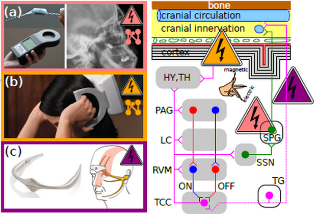

Ein Implantat (a) und zwei tragbare elektromagnetische Neuromodulatoren (b)-(c) zu Kopfschmerzbehandlung und ihre Wirkungsorte im Gehirn (schematisch).

**Es tut sich was. Die ersten zwei tragbaren Geräte sind innerhalb der letzen drei Monate **in den USA**zugelassen worden. Das setzt einen neuen Akzent in der zukünftigen Migränebehandlung.**

Migränetherapie mit einem silbernen Haareif oder einer kleinen grauen Kiste, die man bis zum nächsten Anfall im Schuhschrank aufbewahrt – sind wir im 21. Jahrhundert angekommen oder sehen wir einen Rückschritt ins 18. Jh.?

Wenn sich Methoden über Jahrhunderte nicht weiterentwickeln, ist das ein untrügliches Zeichen für einen pseudowissenschaftlichen Ansatz. Man denke an Homöopathie.

## Beginn der modernen Neuromodulation

Daher ist es erwähnenswert, dass schon 18. Jahrhunderte versucht wurde, kaum konnte man elektrische Ladung in Leidender Flaschen speichern, mit Elektrizität Migräne wegzukribbeln. Auch der mittlerweile zum Glück weitgehend verschwundenen Mesmerismus, die Lehre vom animalischen Magnetismus und die davon abgeleiteten Heilmethoden, stammt aus dieser Zeit.

Die neuen tragbaren Geräte, die einmal elektrischen Strom einmal magnetische Felder nutzen, könnte man einerseits als eine Renaissance sehen. Diese Methoden wurden jedoch nicht schlicht wieder belebt sondern basieren auf einer mittlerweile voran geschrittenen Entwicklung mit elektrischen Strom und magnetischen Feldern physiologische Funktionen zu beeinflussen.

Diese Weiterentwicklung betrifft zwei Bereiche, [die Miniaturisierung und das Stimulationsprotokoll](https://scilogs.spektrum.de/graue-substanz/faradisch-war-und-bleibt-die-frage/).1  Die Miniaturisierung hat zum einen praktische Gründe, wie die Heimanwendung, aber auch ein anderes, um Fortschritt zu bewerten wichtigeres Ziel, nämlich punktgenau eine Region in *Angriff* zu nehmen.

Das moderne Zeitalter der Anwendung elektromagnetischer Felder auf das Gehirn begann mit der Schmerzbehandlung. In den 1960er Jahren wurden Methoden wie die tiefe Hirnstimulation und Rückenmarkstimulation getestet. Die Triebfeder dieser Entwicklung war die Erkenntnis, das chirurgische *Eingriffe* mit denen Schmerzbahnen einfach durchtrennt wurden selbst wieder Schäden am Nervensystem verursachen und so neue chronische Schmerzen verursachen können. Dies führte zur Erkenntnis, dass es reversibel modulierende Maßnahmen bedarf; so entstand der Name Neuromodulation.

## Zwei tragbare Neuromodulatoren gegen Migräne

Letzte Woche, am 11. März, wurde von der US-amerikanischen Arzneimittelzulassungsbehörde (FDA) ein Gerät zur Migränebehandlung zugelassen das “[nichtinvasiv](https://scilogs.spektrum.de/graue-substanz/doch-nicht-nichtinvasive-hirnstimulation/)” ist.

> [FDA allows marketing of first medical device to prevent migraine headaches](http://www.fda.gov/NewsEvents/Newsroom/PressAnnouncements/ucm388765.htm)

Das Gerät sieht wie ein auf der Stirn sitzender metallener Haarreif aus (s. Abb. (c)). Dieser heruntergerutschte Haarreif soll speziell den Nervus trigeminus mit Strom beeinflussen. Eine größere Studie wurde 2013 [veröffentlicht](http://dx.doi.org/doi:10.1186/1129-2377-14-95) und zeigt positive Ergebnisse. Ich würde gerne noch mehr dazu sehen, denn vereinzelte Studien können noch keinen tragfähigen wissenschaftlichen Konsens über die Wirksamkeit liefern. Als Grundlagenforscher maße ich mir auch nicht an, diese Studien kompetent bewerten zu können.

Dieser Haarreif nennt sich Cefaly® und ist in Deutschland (oder auch in Kanada) schon seit längerem bei Amazon für 295,00€ erhältlich – bisher noch ohne deutsche Kundenrezensionen. Auf *amazon.com* stehen sieben englische Rezensionen, allerdings war das Set dort bisher nicht erhältlich und das wird sich durch die Zulassung der FDA vorerst nicht ändern. In den USA besteht nämlich zunächst eine Rezeptpflicht. Was mir sinnvoll erscheint. Weitere Kosten entstehen übrigens, wenn ich es richtig sehe ca. 1€ pro Anwendung, da mit jeder Anwendung sich die Elektroden etwas abnutzen und nach einiger Zeit ersetzt werden müssen.

Vor fast genau drei Monaten, am 13. Dezember, gab es eine nahezu gleichlautende Meldung der FDA zu einem alternativen Gerät.

> [FDA allows marketing of first device to relieve migraine headache pain](http://www.fda.gov/NewsEvents/Newsroom/PressAnnouncements/ucm378608.htm)

Während Cefaly® elektrische Ströme durch die Haut schickt, wird bei diesem Spring-TMS™ Gerät (Abb. (b)) ein magnetisches Feld durch die Schädeldecke gesendet. Auch hierzu ist eine wissenschaftliche Studie [veröffentlicht](http://dx.doi.org/doi:10.1016/S1474-4422(10)70054-5). Und auch hier müssen wir mehr Studien abwarten. Die Zulassung der FDA bezieht sich auf eine Vorgängergeneration des Geräts, die nicht vertrieben wird. Die Zulassung der aktuellen Generation wird in diesem Jahr erwartet.

Es tut sich also was und das ist sicher erst der Anfang. Ich denke diese Geräte sind *game changer*, sie haben das Potential, die Spielregeln der Migränetherapie fundamental zu verändern.

## Fußnoten

1 Hier gibt es übrigens eine gewissen Analogie zur Pharmakokinetik und Pharmakodynamik.
