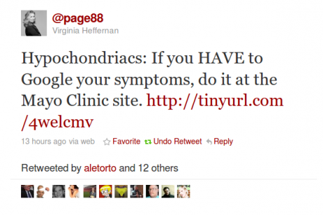
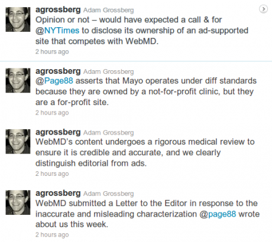
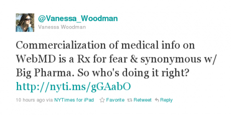

The internet has significant impact on healthcare services. By providing access to medical information and advice it is possible for patients to assume much greater responsibility for their healthcare. In fact, many patients firstly prefer to investigate their health concerns in privacy before seeing a doctor. This pose significant conceptual, practical, and ethical challenges. Providing useful and reliable medical and health information, and ensuring its appropriate and efficient use should be the supreme concerns for every public website in this field. Who is pursuant to this standard? To what standard actually?

# Dr Web – Clear to Auscultation?

Virginia Heffernan, columnist at The New York Times Magazine, attacked yesterday in "[A Prescription for Fear](http://www.nytimes.com/2011/02/06/magazine/06FOB-Medium-t.html?_r=1&emc=tnt&tntemail0=y)" WebMD as a  hypochondria time suck. It rushes visitors in hysteria, or, even worth, to drugs that may not be needed.

## Clear to Auscultation Bilaterally?

Heffernan was mildly applauded on Twitter before a few hours later, Adam Grossberg picked up the gauntlet. The SVP of Corporate Communications at WebMD fired four tweets

His first three tweets secured the usual defense line. With the last one he fired back.

"_Opinion or not – would have expected a call & for @NYTimes to disclose its ownership of an ad-supported site that competes with WebMD._"

Is hypocrisy the problem not  hypochondriacs? The site Adam Grossberg did not mentioned explicitly is About.com, a part of The New York Times Company. We will certainly reed more about this the next days.

Heffernan, to say the least, started an important discussion. She has good reasons to do so.

"_Health sites are hugely influential in how Americans think about their health and may even play a part in public debates over health care, as they aggressively shape how would-be patients consume medical information and envision treatment._"

On this, I guess, nobody will challenge her. So who is doing it right? An obvious question also asked on Twitter.

## Migraine websites used as example

To support her view, Heffernan exaimined health information for headaches searching in Google for this term with one addtional keyword being either "WebMD" or "Mayo Clinic". Since I frequently write about migraines here in my blog, let me answer the twittered question above.

Bloggers often are watchdogs (though they need being watched, too). Ben Goldacre's Bad Science blog is a good example (though migraine is a rather infrequent topic). Bad science ...

"_... specialises in unpicking dodgy scientific claims made by scaremongering journalists, dodgy government reports, evil pharmaceutical corporations, PR companies and quacks._"
[From the about page of Bad Science.]

Moreover, independent websites from individual researches can do it right. At least some are truely independent, like, for instance, the Migraine Aura Foundation (which I run together with Klaus Podoll, MD). It is, however, not always clear how independent such sites are.

Above all, MedlinePlus, the National Institutes of Health's Web site for patients and their families and friends, provides an independent source. For the section on migraines see here, or repeat Heffernan's Google search on headache and MedlinePlus—and compare results to others (headache and WebMD and headache and Mayo Clinic), if you like. To complete the example, here are the headache pages from about.com.

Well, to my mind, it needs all of these sites, including profit-driven sites that certainly have to adhere to some standards, and yes, these standards should be discussed. As you might know, my research work is not only on migraine, but also on self-organisation of complex systems. What Virginia Heffernan just did, was one step towards change in a complex network. This may be the way to go.

## Addendum

Feb 8: Thomas Sullivan, founder of Rockpointe, posted in his blog Policy & Medicine  "NY Times Magazine: A Prescription for Fear".

Feb 22: The NTY published two letters, one from Adam Grossberg and another from Linda M.G. Katz (Drexel University Health Sciences Libraries
Philadelphi). The latter mentions MedlinePlus as an "excellent site for health information".
