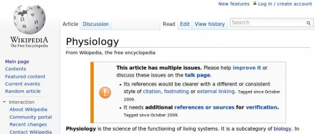

Actually, I am a physicist—by training. I am a physiologist by heart.

Beginning with this posts, I will explain what physiology is. This and the subsequent posts are based on the first lecture that will be given in a new course called "Dynamical Diseases", which I am developing right now for the winter semester 2010 at the TU Berlin. I will start the course with the question:

## What is physiology?

Of course I have a good idea what physiology is and I had it before I decided to develop this course. But once you teach, you need a thorough understanding of what you are talking about, even about short remarks within the introductory part of the first lecture. You never know what students might ask.

So I began a journey to  better understand what others think physiology is.

From the meaning of the word physiology in ancient Greek we deduce that it is the study of nature. But so is physics. And clearly physics and physiology are different disciplines.

Here is a simple answer from Wikipedia [1]:

"_Physiology is the science of the functioning of living systems._"

As such it is a branch of biology. Biology includes also other things of living systems like their structure, growth, origin, evolution, distribution, and taxonomy. Yet, if you read on on Wikipedia, you are not learning much more than this, except for some—incomplete—history of physiology.

(Of course, I should complete the Wikipedia entry and not complain about it. I will do so, but one thing is writing for Wikipedia, another is writing my blog post. The latter goes first because I have to prepare my classes.)

Physiology is a major discipline in science. There is even a Nobel Prize in Physiology. Actually it is the Nobel Prize in Physiology or Medicine. And, of course,  there is one in Physics. And in Chemistry, Literature, Economic Sciences, and Peace.

Well, I checked all these disciplines in Wikipedia and guess what, two articles have issues. Peace and Physiology. Peace? Ok, forget about it. But physiology? Why can't we have a decent Wikipedia article on physiology (as of August 2010)?

I looked into the Brockhaus, a German-language encyclopedia. Only a sixth part of a page is devoted to Physiology. I did not get more information than is given in the first sentence in Wikipedia citet above. Then I looked for the Physics entry: over 6 pages.

Really? There is 36 times more to say about physics than about physiology? I don't think so. Now I was really curious. There is the Encyclopædia Britannica. My favorite encyclopedia. Unfortunately, it is located only in our main library of the TU Berlin. I had to walk there 15min one way, but it was worth it. (Now I wonder whether I can effort the monthly membership of €8.99 to get the online version?)

I only checked the Micropædia, i.e., the short (fewer than 750 words) articles within the Britannica. I looked for physiology and physics. This time physiology clearly won by the amount of words. More important, I got confirmed what my intuition was in the first place. Physiological processes are dynamic processes that aim at preserving a constant physical and chemical internal environment. This is an important point. Physiology is much about regulation, that is, closed-loop control systems.

This matched what I learned in 1992 when I bought my first book on Physiology. Actually my first book that dealt with life sciences. It was called "Physiologie" and was edited by Peter Deetjen and Erwin-Josef Speckmann. The zeroth chapter was written by the editors, and introduced physiology as a science of biological regulation. A perfect introduction, if you ask me. Unfortunately somewhere on its way to the fourth edition, this introduction got exchanged for a rather meaningless chapter "Physiology – ein heißes Thema" (Physiology—a hot topic). Its is all bla bla bla now. Nice to read, but no information. Sorry to say this.

Before I can come back to physiology as a science of biological regulation (third post),  in my next post, we will learn about current tendencies to harmonize the physiology curriculum at European universities. There, we will take a closer look at what major body systems actually need to be self-regulated.

For now, I invite you to comment here on what you think physiology is.

[Read on](/physiology-organized-by-major-body-systems)
